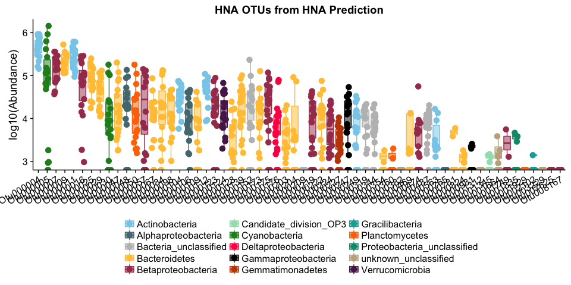
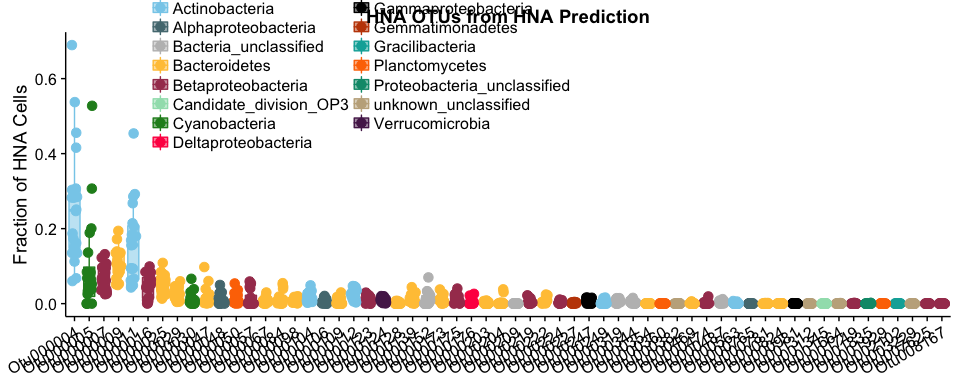
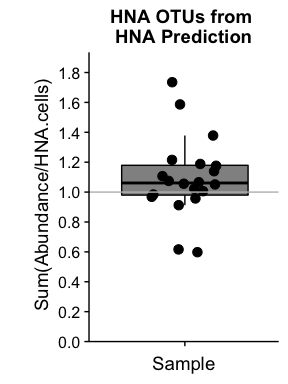
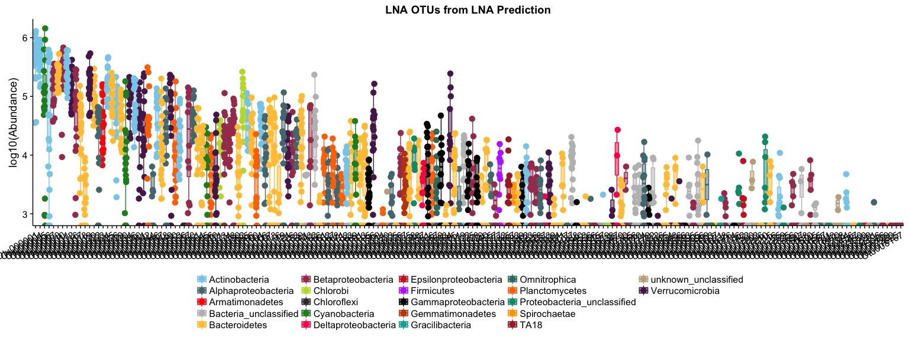
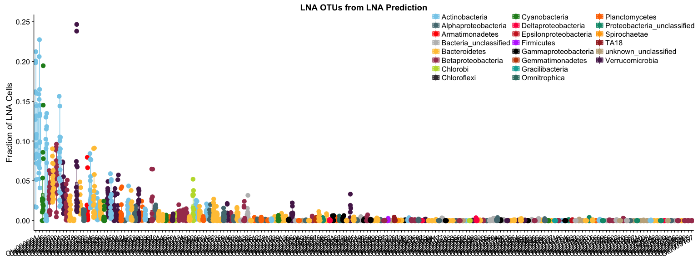
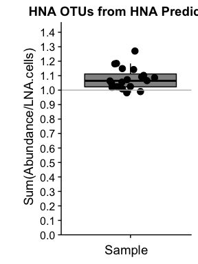
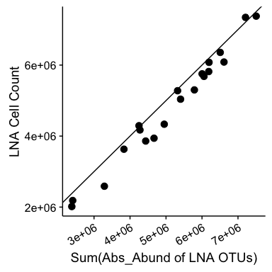

-   [Load the necessary libraries and set colors](#load-the-necessary-libraries-and-set-colors)
-   [Load in the data](#load-in-the-data)
-   [HNA](#hna)
    -   [HNA Pool: 0.1% Filtering](#hna-pool-0.1-filtering)
    -   [Proportion of HNA Pool?](#proportion-of-hna-pool)
    -   [Sum OTUs vs HNA](#sum-otus-vs-hna)
-   [LNA](#lna)
-   [LNA Pool: 0.1% Filtering](#lna-pool-0.1-filtering)
    -   [Proportion of LNA Pool?](#proportion-of-lna-pool)
    -   [Sum OTUs vs LNA](#sum-otus-vs-lna)

### Load the necessary libraries and set colors

``` r
################################# LOAD LIBRARIES ############################################
library(tidyverse)
library(cowplot)
source("../OutliersRemoved/set_colors.R")
source("../OutliersRemoved/Functions.R")
```

### Load in the data

``` r
#################################### LOAD DATA ##############################################

# Read in the absolute abundance data 
absolute_otu <- read.table(file="../../data/Chloroplasts_removed/nochloro_absolute_otu.tsv", header = TRUE) # Absolute OTU abundance table 

# Read in the taxonomy data 
tax <- read.table(file="../../data/Chloroplasts_removed/nochloro_taxonomy_otu.tsv", header = TRUE) %>%
  tibble::rownames_to_column() %>%
  dplyr::rename(Kingdom = Rank1,
         Phylum = Rank2, 
         Class = Rank3,
         Order = Rank4,
         Family = Rank5,
         Genus = Rank6,
         Species = Rank7,
         OTU = rowname) # Fix the Taxonomy

# Replace the phylum Proteobacteria with the class level
Phylum <- as.character(tax$Phylum)
Class <- as.character(tax$Class)

for  (i in 1:length(Phylum)){ 
  if (Phylum[i] == "Proteobacteria"){
    Phylum[i] <- Class[i]
  } 
}

# Overwrite the Phylum level with the new phylum classification
tax$Phylum <- Phylum # Add the new phylum level data back to phy

# Read in the productivity and flow cytometry data 
productivity <- read.table(file = "../../data/Chloroplasts_removed/productivity_data.tsv", header = TRUE) # Metadata file
```

HNA
===

HNA Pool: 0.1% Filtering
------------------------

@prubbens performed an analysis where initial filtering was 0.1% (results in `Final/HNA_OutliersRemoved/hna_scores_abun0.001.csv`). The pipeline is found in `Final/HNA_OutliersRemoved/analysis_final_HNA_LNA_outliersremoved.ipynb`.

``` r
# Vector of 3 OTUs pulled out by Peter's model in the above file 
hna_otus <- read.csv("hna_scores_abun0.001.csv", header = FALSE) %>%   # Gather the 26 OTUs that peter pulled out in his analysis 
  dplyr::rename(OTU = V1, Corr = V2)                                                               # Rename columns to be more intuitive

# Make a vector of OTU names to pull them out of the larger dataset
hna_otu_names <- as.character(hna_otus$OTU)

# How many otus are there in the HNA pool?
length(hna_otu_names)
```

    ## [1] 60

``` r
# What is the taxonomy of these 3 OTUs?
tax %>% dplyr::filter(OTU %in% hna_otu_names)
```

    ##          OTU  Kingdom                      Phylum                               Class                               Order                              Family                Genus      Species
    ## 1  Otu000004 Bacteria              Actinobacteria                      Actinobacteria                     Actinomycetales                                 acI                acI-A       acI-A6
    ## 2  Otu000005 Bacteria               Cyanobacteria                       Cyanobacteria                         SubsectionI                             FamilyI         Unclassified Unclassified
    ## 3  Otu000007 Bacteria          Betaproteobacteria                  Betaproteobacteria                     Burkholderiales                                betI               betI-A      Lhab-A1
    ## 4  Otu000009 Bacteria               Bacteroidetes                       [Saprospirae]                     [Saprospirales]                                bacI               bacI-A      bacI-A1
    ## 5  Otu000011 Bacteria              Actinobacteria                      Actinobacteria                     Actinomycetales                                 acI                acI-A       acI-A1
    ## 6  Otu000016 Bacteria          Betaproteobacteria                  Betaproteobacteria                     Burkholderiales                               betII                 Pnec        PnecB
    ## 7  Otu000025 Bacteria               Bacteroidetes                          Cytophagia                        Cytophagales                              bacIII             bacIII-A Unclassified
    ## 8  Otu000029 Bacteria               Bacteroidetes                          Cytophagia                        Cytophagales                              bacIII             bacIII-B        Algor
    ## 9  Otu000030 Bacteria               Cyanobacteria                       Cyanobacteria                         SubsectionI                             FamilyI        Synechococcus Unclassified
    ## 10 Otu000047 Bacteria               Bacteroidetes                    Sphingobacteriia                  Sphingobacteriales                          env.OPS_17         Unclassified Unclassified
    ## 11 Otu000048 Bacteria         Alphaproteobacteria                 Alphaproteobacteria                    Rhodospirillales                             alfVIII alfVIII_unclassified Unclassified
    ## 12 Otu000050 Bacteria              Planctomycetes                       Phycisphaerae                     Phycisphaerales                    Phycisphaeraceae              CL500-3 Unclassified
    ## 13 Otu000057 Bacteria          Betaproteobacteria                  Betaproteobacteria                     Methylophilales                               betIV              betIV-A Unclassified
    ## 14 Otu000067 Bacteria               Bacteroidetes                      Flavobacteriia                    Flavobacteriales                               bacII              bacII-A Unclassified
    ## 15 Otu000084 Bacteria               Bacteroidetes                      Flavobacteriia                    Flavobacteriales                               bacII              bacII-A     Flavo-A3
    ## 16 Otu000098 Bacteria               Bacteroidetes                      Flavobacteriia                    Flavobacteriales                                bacV    bacV_unclassified Unclassified
    ## 17 Otu000104 Bacteria              Actinobacteria                      Actinobacteria                     Actinomycetales                               Luna1              Luna1-A     Luna1-A4
    ## 18 Otu000106 Bacteria         Alphaproteobacteria                 Alphaproteobacteria                     Rhodobacterales                               alfVI   alfVI_unclassified Unclassified
    ## 19 Otu000109 Bacteria               Bacteroidetes                    Sphingobacteriia                  Sphingobacteriales                    Chitinophagaceae      Flavisolibacter Unclassified
    ## 20 Otu000112 Bacteria              Actinobacteria                      Actinobacteria                     Actinomycetales                                 acI                acI-C       acI-C1
    ## 21 Otu000123 Bacteria          Betaproteobacteria                  Betaproteobacteria                     Burkholderiales                              betVII             betVII-B    betVII-B1
    ## 22 Otu000124 Bacteria             Verrucomicrobia                            Opitutae                          Opitutales                         Opitutaceae             Opitutus Unclassified
    ## 23 Otu000128 Bacteria               Bacteroidetes                      Flavobacteriia                    Flavobacteriales                               bacII              bacII-A     Flavo-A1
    ## 24 Otu000139 Bacteria               Bacteroidetes                      Flavobacteriia                    Flavobacteriales                               bacII              bacII-A Unclassified
    ## 25 Otu000152 Bacteria       Bacteria_unclassified               Bacteria_unclassified               Bacteria_unclassified               Bacteria_unclassified         Unclassified Unclassified
    ## 26 Otu000173 Bacteria               Bacteroidetes                      Flavobacteriia                    Flavobacteriales                               bacII              bacII-A Unclassified
    ## 27 Otu000175 Bacteria          Betaproteobacteria                  Betaproteobacteria                     Burkholderiales                               betII                 Pnec        PnecD
    ## 28 Otu000176 Bacteria         Deltaproteobacteria                 Deltaproteobacteria                   Bdellovibrionales                  Bacteriovoracaceae         Peredibacter Unclassified
    ## 29 Otu000203 Bacteria               Bacteroidetes                    Sphingobacteriia                  Sphingobacteriales                NS11-12_marine_group         Unclassified Unclassified
    ## 30 Otu000204 Bacteria               Bacteroidetes                    Sphingobacteriia                  Sphingobacteriales                NS11-12_marine_group         Unclassified Unclassified
    ## 31 Otu000209 Bacteria       Bacteria_unclassified               Bacteria_unclassified               Bacteria_unclassified               Bacteria_unclassified         Unclassified Unclassified
    ## 32 Otu000219 Bacteria          Betaproteobacteria                  Betaproteobacteria                     Burkholderiales                              betIII             betIII-A    betIII-A1
    ## 33 Otu000222 Bacteria               Bacteroidetes                      Flavobacteriia                    Flavobacteriales                               bacII              bacII-A Unclassified
    ## 34 Otu000224 Bacteria          Betaproteobacteria                  Betaproteobacteria                     Burkholderiales                              betVII             betVII-B    betVII-B1
    ## 35 Otu000227 Bacteria            Gemmatimonadetes                    Gemmatimonadetes                    Gemmatimonadales                   Gemmatimonadaceae         Gemmatimonas Unclassified
    ## 36 Otu000247 Bacteria         Gammaproteobacteria                 Gammaproteobacteria    Gammaproteobacteria_unclassified    Gammaproteobacteria_unclassified         Unclassified Unclassified
    ## 37 Otu000249 Bacteria              Actinobacteria                      Acidimicrobiia                    Acidimicrobiales                                acIV               acIV-B     Iluma-B1
    ## 38 Otu000319 Bacteria       Bacteria_unclassified               Bacteria_unclassified               Bacteria_unclassified               Bacteria_unclassified         Unclassified Unclassified
    ## 39 Otu000344 Bacteria       Bacteria_unclassified               Bacteria_unclassified               Bacteria_unclassified               Bacteria_unclassified         Unclassified Unclassified
    ## 40 Otu000354 Bacteria               Bacteroidetes                    Sphingobacteriia                  Sphingobacteriales                    Chitinophagaceae      Ferruginibacter Unclassified
    ## 41 Otu000360 Bacteria              Planctomycetes                    Planctomycetacia                    Planctomycetales                   Planctomycetaceae      Blastopirellula Unclassified
    ## 42 Otu000382  unknown        unknown_unclassified                unknown_unclassified                unknown_unclassified                unknown_unclassified         Unclassified Unclassified
    ## 43 Otu000469 Bacteria               Bacteroidetes                    Sphingobacteriia                  Sphingobacteriales                          env.OPS_17         Unclassified Unclassified
    ## 44 Otu000474 Bacteria          Betaproteobacteria                  Betaproteobacteria                     Burkholderiales                                betI               betI-A      Lhab-A3
    ## 45 Otu000487 Bacteria       Bacteria_unclassified               Bacteria_unclassified               Bacteria_unclassified               Bacteria_unclassified         Unclassified Unclassified
    ## 46 Otu000563 Bacteria              Actinobacteria                      Actinobacteria                     Actinomycetales                               acIII              acIII-A        Luna2
    ## 47 Otu000765 Bacteria         Alphaproteobacteria                 Alphaproteobacteria                       Rickettsiales        Rickettsiales_Incertae_Sedis  Candidatus_Captivus Unclassified
    ## 48 Otu000781 Bacteria               Bacteroidetes                    Sphingobacteriia                  Sphingobacteriales                 Sphingobacteriaceae            Solitalea Unclassified
    ## 49 Otu000824 Bacteria               Bacteroidetes                    Sphingobacteriia                  Sphingobacteriales                NS11-12_marine_group         Unclassified Unclassified
    ## 50 Otu000981 Bacteria         Gammaproteobacteria                 Gammaproteobacteria                   Oceanospirillales                  Oceanospirillaceae      Pseudospirillum Unclassified
    ## 51 Otu001312  unknown        unknown_unclassified                unknown_unclassified                unknown_unclassified                unknown_unclassified         Unclassified Unclassified
    ## 52 Otu001345 Bacteria      Candidate_division_OP3 Candidate_division_OP3_unclassified Candidate_division_OP3_unclassified Candidate_division_OP3_unclassified         Unclassified Unclassified
    ## 53 Otu001664  unknown        unknown_unclassified                unknown_unclassified                unknown_unclassified                unknown_unclassified         Unclassified Unclassified
    ## 54 Otu001749 Bacteria          Betaproteobacteria                  Betaproteobacteria                     Burkholderiales                              betIII             betIII-A    betIII-A1
    ## 55 Otu001835 Bacteria Proteobacteria_unclassified         Proteobacteria_unclassified         Proteobacteria_unclassified         Proteobacteria_unclassified         Unclassified Unclassified
    ## 56 Otu001929 Bacteria              Planctomycetes                    Planctomycetacia                    Planctomycetales                   Planctomycetaceae         Unclassified Unclassified
    ## 57 Otu002102 Bacteria             Gracilibacteria        Gracilibacteria_unclassified        Gracilibacteria_unclassified        Gracilibacteria_unclassified         Unclassified Unclassified
    ## 58 Otu003229  unknown        unknown_unclassified                unknown_unclassified                unknown_unclassified                unknown_unclassified         Unclassified Unclassified
    ## 59 Otu007625 Bacteria          Betaproteobacteria                  Betaproteobacteria                     Burkholderiales                              betIII             betIII-A    betIII-A1
    ## 60 Otu008167 Bacteria          Betaproteobacteria                  Betaproteobacteria                     Burkholderiales                                betI               betI-A      Lhab-A2

``` r
# Make it more reproducble below
pick_columns <- length(hna_otu_names) + 1

# Put all the data together into one dataframe with only the important OTUs
AbsAbund_hna_otus <-  absolute_otu %>%                                           # Start with the OTU table with absolute abundance counts 
  dplyr::select(one_of(hna_otu_names)) %>%                                       # Pull out only the relevant OTUs from the above OTU table
  tibble::rownames_to_column() %>%                                               # Change the sample names to be a column
  dplyr::rename(Sample_16S = rowname) %>%                                        # Rename the sample names column to match up with other data frames
  dplyr::left_join(productivity, by = "Sample_16S") %>%                          # Join 26 OTU absolute abundance counts with rest of metadata 
  dplyr::filter(Lake == "Muskegon" & Depth == "Surface") %>%                     # Filter out samples that have productivity data (Muskegon & Surface)
  dplyr::select(-c(Platform, samples, Lake)) %>%                                 # Remove unnecessary columns 
  mutate(Site = factor(Site, levels = c("MOT", "MDP", "MBR", "MIN"))) %>%        # Fix order of factor for lake station
  gather("OTU", "Abs_Abund", 2:pick_columns) %>%                                 # Gather only columns which represent OTU abs abundance counts, and put it in *long* format
  dplyr::left_join(tax, by = "OTU") %>%                                          # Add the taxonomic information for each OTU
  dplyr::filter(tot_bacprod < 90) %>%                                            # Remove outliers to match peter's analysis
  mutate(OTU_fraction_HNA = Abs_Abund/HNA.cells)                                 # Calculate the fraction that each individual OTU takes up within the HNA pool for each sample


# Plot the absolute abundance data for each OTU
ggplot(AbsAbund_hna_otus, aes(x = reorder(OTU, Phylum), y = log10(Abs_Abund), fill = Phylum, color = Phylum)) +
  geom_boxplot(alpha = 0.5, outlier.shape = NA) +
  geom_jitter(width = 0.2, size = 3) +
  scale_color_manual(values = phylum_colors) +
  scale_fill_manual(values = phylum_colors) +
  ylab("log10(Abundance)") +
  #facet_grid(.~Phylum, scale = "free") +
  ggtitle("HNA OTUs from HNA Prediction") + 
  guides(fill = guide_legend(ncol=3),
         color = guide_legend(ncol=3)) +
  theme(legend.position = "bottom", #c(0.33, 0.85),
        legend.direction = "horizontal",
        legend.title = element_blank(),
        axis.title.x = element_blank(),
        axis.text.x = element_text(angle = 30, hjust = 1, vjust = 1))
```



``` r
# Plot the fraction of the HNA pool for each OTU
ggplot(AbsAbund_hna_otus, aes(x = reorder(OTU, Phylum), y = OTU_fraction_HNA, fill = Phylum, color = Phylum)) +
  geom_boxplot(alpha = 0.5, outlier.shape = NA) +
  geom_jitter(width = 0.2, size = 3) +
  scale_color_manual(values = phylum_colors) +
  scale_fill_manual(values = phylum_colors) +
  ylab("Fraction of HNA Cells") +
  ggtitle("HNA OTUs from HNA Prediction") + 
  guides(fill = guide_legend(ncol=2),
         color = guide_legend(ncol=2)) +
  theme(legend.position = c(0.33, 0.85),
        legend.direction = "horizontal",
        legend.title = element_blank(),
        axis.title.x = element_blank(),
        axis.text.x = element_text(angle = 30, hjust = 1, vjust = 1))
```



Proportion of HNA Pool?
-----------------------

#### What proportion of the HNA pool is taken up by the 60 OTUs?

``` r
# Calculate the sum of the HNA pool, the max of the HNA pool, and the median/mean
frac_HNA_stats_AbsAbund_hna_otus <- AbsAbund_hna_otus %>%                        # Take the dataframe from above
  dplyr::select(Sample_16S, OTU, OTU_fraction_HNA, Abs_Abund, HNA.cells) %>%   # Select only relevant columns
  group_by(Sample_16S) %>%                                                     # Make a data frame for each of the individual samples
  summarise(sum_fracHNA = sum(OTU_fraction_HNA),                               # Calculate the sum of the fraction of each OTU from the HNA pool (total HNA pool represented by each OTU)
            max_fracHNA = max(OTU_fraction_HNA),                               # Calculate the max the the line above
            median_fracHNA = median(OTU_fraction_HNA),                         # Calculate the median of 2 lines above
            mean_fracHNA = mean(OTU_fraction_HNA),                             # Calculate the mean of 3 lines above
            sum_abs_abund = sum(Abs_Abund)) %>%                                # What's the sum of the absolute abundance of the 26 OTUs within each sample? 
  mutate(All_Samples = "AllSamps_26_OTUs")


# Plot the variation in the sum of the HNA fraction with points/boxplot
ggplot(frac_HNA_stats_AbsAbund_hna_otus, 
       aes(y = sum_fracHNA, x = All_Samples, color = "All_Samples", fill = "All_Samples")) +
  geom_boxplot(alpha = 0.5, outlier.shape = NA) + 
  geom_point(size = 3, position = position_jitterdodge()) +
  ggtitle("HNA OTUs from HNA Prediction") + 
  xlab("All Samples") + scale_color_manual(values = "black") +
  scale_fill_manual(values = "black") +
  geom_abline(intercept = 1, slope = 0, color = "grey") +                                   # Draw a line at 1 
  scale_y_continuous(expand = c(0,0),
                     limits = c(0, max(frac_HNA_stats_AbsAbund_hna_otus$sum_fracHNA) + 0.2), 
                     breaks = seq(0,  max(frac_HNA_stats_AbsAbund_hna_otus$sum_fracHNA) + 0.2, by = 0.1)) +
  ylab("\n Sum(Abundance/HNA.cells)") + xlab("Sample") +
  theme(legend.position = "none", axis.text.x = element_blank())
```



Sum OTUs vs HNA
---------------

``` r
all_data <- inner_join(frac_HNA_stats_AbsAbund_hna_otus, productivity, by = "Sample_16S") %>%    # Combine calculated stats above with rest of metadata
  dplyr::select(-c(Platform, All_Samples, samples, Lake, Fraction, Depth)) %>%                  # Remove futile columns
  mutate(pred_totHNA_counts = sum_fracHNA*HNA.cells)                                            # Sanity Check:  Back calculate the number of HNA cells 

# Plot the correlation between the HNA counts from the flow cytometer and the sum of the counts from the HNA OTUs
ggplot(all_data, aes(x = sum_abs_abund, y= HNA.cells)) +
  geom_point(size = 3) + ylab("HNA Cell Count") + 
  xlab("Sum(Abs_Abund of HNA OTUs)") + 
  geom_abline(intercept = 0, slope = 1) +                                   # Draw a 1:1 line 
  theme(axis.text.x = element_text(angle = 30, hjust = 1, vjust = 1))
```


LNA
===

LNA Pool: 0.1% Filtering
========================

@prubbens performed an analysis where initial filtering was 0.1% (results in `Final/HNA_OutliersRemoved/lna_scores_abun0.001.csv`). The pipeline is found in `Final/HNA_OutliersRemoved/analysis_final_HNA_LNA_outliersremoved.ipynb`.

``` r
# Vector of LNA OTUs 
lna_otus <- read.csv("lna_scores_abun0.001.csv", header = FALSE) %>%   # Gather the LNA OTUs that peter pulled out in his analysis 
  dplyr::rename(OTU = V1, Corr = V2)                                                               # Rename columns to be more intuitive

# Make a vector of OTU names to pull them out of the larger dataset
lna_otu_names <- as.character(lna_otus$OTU)

# How many otus are there in the LNA pool?
length(lna_otu_names)
```

    ## [1] 193

``` r
# What is the taxonomy of these LNA OTUs?
tax %>% dplyr::filter(OTU %in% lna_otu_names)
```

    ##           OTU  Kingdom                      Phylum                        Class                            Order                           Family                                   Genus      Species
    ## 1   Otu000001 Bacteria              Actinobacteria               Actinobacteria                  Actinomycetales                              acI                                   acI-B       acI-B1
    ## 2   Otu000004 Bacteria              Actinobacteria               Actinobacteria                  Actinomycetales                              acI                                   acI-A       acI-A6
    ## 3   Otu000005 Bacteria               Cyanobacteria                Cyanobacteria                      SubsectionI                          FamilyI                            Unclassified Unclassified
    ## 4   Otu000006 Bacteria              Actinobacteria               Actinobacteria                  Actinomycetales                              acI                                   acI-C       acI-C2
    ## 5   Otu000007 Bacteria          Betaproteobacteria           Betaproteobacteria                  Burkholderiales                             betI                                  betI-A      Lhab-A1
    ## 6   Otu000009 Bacteria               Bacteroidetes                [Saprospirae]                  [Saprospirales]                             bacI                                  bacI-A      bacI-A1
    ## 7   Otu000010 Bacteria          Betaproteobacteria           Betaproteobacteria                  Methylophilales                            betIV                                 betIV-A         LD28
    ## 8   Otu000011 Bacteria              Actinobacteria               Actinobacteria                  Actinomycetales                              acI                                   acI-A       acI-A1
    ## 9   Otu000012 Bacteria             Verrucomicrobia             OPB35_soil_group    OPB35_soil_group_unclassified    OPB35_soil_group_unclassified                            Unclassified Unclassified
    ## 10  Otu000016 Bacteria          Betaproteobacteria           Betaproteobacteria                  Burkholderiales                            betII                                    Pnec        PnecB
    ## 11  Otu000017 Bacteria               Bacteroidetes               Flavobacteriia                 Flavobacteriales                             bacV                       bacV_unclassified Unclassified
    ## 12  Otu000018 Bacteria               Bacteroidetes                [Saprospirae]                  [Saprospirales]                            bacIV                                 bacIV-B        Aquir
    ## 13  Otu000019 Bacteria             Verrucomicrobia                     Opitutae               Opitutae_vadinHA64  Opitutae_vadinHA64_unclassified                            Unclassified Unclassified
    ## 14  Otu000020 Bacteria               Bacteroidetes             Sphingobacteriia               Sphingobacteriales                            bacVI                      bacVI_unclassified Unclassified
    ## 15  Otu000022 Bacteria         Alphaproteobacteria          Alphaproteobacteria                    Rickettsiales                             alfV                                  alfV-A         LD12
    ## 16  Otu000023 Bacteria             Armatimonadetes                Armatimonadia                  Armatimonadales                 Armatimonadaceae                             Armatimonas Unclassified
    ## 17  Otu000024 Bacteria              Actinobacteria               Actinobacteria                  Actinomycetales                              acI                                   acI-A        Phila
    ## 18  Otu000025 Bacteria               Bacteroidetes                   Cytophagia                     Cytophagales                           bacIII                                bacIII-A Unclassified
    ## 19  Otu000026 Bacteria              Actinobacteria               Actinobacteria                  Actinomycetales                            acTH1                                 acTH1-A     acTH1-A1
    ## 20  Otu000029 Bacteria               Bacteroidetes                   Cytophagia                     Cytophagales                           bacIII                                bacIII-B        Algor
    ## 21  Otu000030 Bacteria               Cyanobacteria                Cyanobacteria                      SubsectionI                          FamilyI                           Synechococcus Unclassified
    ## 22  Otu000034 Bacteria             Verrucomicrobia                     Opitutae               Opitutae_vadinHA64  Opitutae_vadinHA64_unclassified                            Unclassified Unclassified
    ## 23  Otu000036 Bacteria              Actinobacteria               Actinobacteria                  Actinomycetales                              acI                                   acI-A       acI-A4
    ## 24  Otu000040 Bacteria             Verrucomicrobia Verrucomicrobia_unclassified     Verrucomicrobia_unclassified     Verrucomicrobia_unclassified            Verrucomicrobia_unclassified Unclassified
    ## 25  Otu000041 Bacteria             Verrucomicrobia             [Spartobacteria]             [Chthoniobacterales]                           verI-B                                  Xip-B1 Unclassified
    ## 26  Otu000042 Bacteria              Planctomycetes                Phycisphaerae                  Phycisphaerales                 Phycisphaeraceae                                 CL500-3 Unclassified
    ## 27  Otu000044 Bacteria         Alphaproteobacteria          Alphaproteobacteria                  Caulobacterales                            alfII                                 alfII-A         Brev
    ## 28  Otu000046 Bacteria              Actinobacteria               Acidimicrobiia                 Acidimicrobiales                             acIV                                  acIV-A     Iluma-A2
    ## 29  Otu000047 Bacteria               Bacteroidetes             Sphingobacteriia               Sphingobacteriales                       env.OPS_17                            Unclassified Unclassified
    ## 30  Otu000048 Bacteria         Alphaproteobacteria          Alphaproteobacteria                 Rhodospirillales                          alfVIII                    alfVIII_unclassified Unclassified
    ## 31  Otu000049 Bacteria             Verrucomicrobia Verrucomicrobia_unclassified     Verrucomicrobia_unclassified     Verrucomicrobia_unclassified            Verrucomicrobia_unclassified Unclassified
    ## 32  Otu000050 Bacteria              Planctomycetes                Phycisphaerae                  Phycisphaerales                 Phycisphaeraceae                                 CL500-3 Unclassified
    ## 33  Otu000053 Bacteria              Actinobacteria               Actinobacteria                  Actinomycetales                            Luna1                                 Luna1-A     Luna1-A2
    ## 34  Otu000056 Bacteria                 Chloroflexi     Chloroflexi_unclassified         Chloroflexi_unclassified         Chloroflexi_unclassified                            Unclassified Unclassified
    ## 35  Otu000057 Bacteria          Betaproteobacteria           Betaproteobacteria                  Methylophilales                            betIV                                 betIV-A Unclassified
    ## 36  Otu000060 Bacteria         Alphaproteobacteria          Alphaproteobacteria                 Sphingomonadales                            alfIV                      alfIV_unclassified Unclassified
    ## 37  Otu000061 Bacteria               Bacteroidetes                [Saprospirae]                  [Saprospirales]                             bacI                       bacI_unclassified Unclassified
    ## 38  Otu000064 Bacteria               Bacteroidetes                [Saprospirae]                  [Saprospirales]                             bacI                       bacI_unclassified Unclassified
    ## 39  Otu000065 Bacteria               Cyanobacteria                Cyanobacteria                    SubsectionIII                          FamilyI                           Pseudanabaena Unclassified
    ## 40  Otu000066 Bacteria              Planctomycetes             Planctomycetacia                 Planctomycetales                Planctomycetaceae                               Pirellula Unclassified
    ## 41  Otu000070 Bacteria             Verrucomicrobia          [Methylacidiphilae]              Methylacidiphilales                             LD19                       LD19_unclassified Unclassified
    ## 42  Otu000071 Bacteria                    Chlorobi                    Chlorobia                     Chlorobiales                            OPB56                            Unclassified Unclassified
    ## 43  Otu000073 Bacteria          Betaproteobacteria           Betaproteobacteria                  Burkholderiales                             betI                                  betI-A Unclassified
    ## 44  Otu000074 Bacteria          Betaproteobacteria           Betaproteobacteria                  Burkholderiales                             betI                                  betI-A      Lhab-A2
    ## 45  Otu000078 Bacteria          Betaproteobacteria           Betaproteobacteria                  Burkholderiales                        MWH-UniP1                                   betVI Unclassified
    ## 46  Otu000080 Bacteria               Bacteroidetes                [Saprospirae]                  [Saprospirales]                             bacI                       bacI_unclassified Unclassified
    ## 47  Otu000082 Bacteria                    Chlorobi                    Chlorobia                     Chlorobiales                            OPB56                            Unclassified Unclassified
    ## 48  Otu000085 Bacteria              Actinobacteria               Actinobacteria                  Actinomycetales                              acI                                   acI-A       acI-A5
    ## 49  Otu000096 Bacteria               Bacteroidetes               Flavobacteriia                 Flavobacteriales    Flavobacteriales_unclassified           Flavobacteriales_unclassified Unclassified
    ## 50  Otu000100 Bacteria              Planctomycetes             Planctomycetacia                 Planctomycetales                Planctomycetaceae                            Planctomyces Unclassified
    ## 51  Otu000104 Bacteria              Actinobacteria               Actinobacteria                  Actinomycetales                            Luna1                                 Luna1-A     Luna1-A4
    ## 52  Otu000106 Bacteria         Alphaproteobacteria          Alphaproteobacteria                  Rhodobacterales                            alfVI                      alfVI_unclassified Unclassified
    ## 53  Otu000107 Bacteria               Bacteroidetes             Sphingobacteriia               Sphingobacteriales                       env.OPS_17                            Unclassified Unclassified
    ## 54  Otu000113 Bacteria               Bacteroidetes               Flavobacteriia                 Flavobacteriales                   Cryomorphaceae                              Fluviicola Unclassified
    ## 55  Otu000116 Bacteria               Bacteroidetes                   Cytophagia                     Cytophagales                    Cytophagaceae                            Unclassified Unclassified
    ## 56  Otu000119 Bacteria         Alphaproteobacteria          Alphaproteobacteria                      Rhizobiales         Rhizobiales_unclassified                Rhizobiales_unclassified Unclassified
    ## 57  Otu000124 Bacteria             Verrucomicrobia                     Opitutae                       Opitutales                      Opitutaceae                                Opitutus Unclassified
    ## 58  Otu000126 Bacteria          Betaproteobacteria           Betaproteobacteria                  Burkholderiales                             betI                                  betI-A Unclassified
    ## 59  Otu000133 Bacteria         Alphaproteobacteria          Alphaproteobacteria                  Rhodobacterales                            alfVI                      alfVI_unclassified Unclassified
    ## 60  Otu000139 Bacteria               Bacteroidetes               Flavobacteriia                 Flavobacteriales                            bacII                                 bacII-A Unclassified
    ## 61  Otu000141 Bacteria       Bacteria_unclassified        Bacteria_unclassified            Bacteria_unclassified            Bacteria_unclassified                            Unclassified Unclassified
    ## 62  Otu000143 Bacteria          Betaproteobacteria           Betaproteobacteria                  Burkholderiales                            betII                                    Pnec        PnecB
    ## 63  Otu000152 Bacteria       Bacteria_unclassified        Bacteria_unclassified            Bacteria_unclassified            Bacteria_unclassified                            Unclassified Unclassified
    ## 64  Otu000156 Bacteria               Bacteroidetes                [Saprospirae]                  [Saprospirales]                            bacIV                                 bacIV-B        Aquir
    ## 65  Otu000161 Bacteria              Planctomycetes                        OM190               OM190_unclassified               OM190_unclassified                            Unclassified Unclassified
    ## 66  Otu000162 Bacteria         Alphaproteobacteria          Alphaproteobacteria Alphaproteobacteria_unclassified Alphaproteobacteria_unclassified        Alphaproteobacteria_unclassified Unclassified
    ## 67  Otu000167 Bacteria              Planctomycetes             Planctomycetacia                 Planctomycetales                Planctomycetaceae                            Planctomyces Unclassified
    ## 68  Otu000168 Bacteria         Alphaproteobacteria          Alphaproteobacteria                      Rhizobiales                           alfVII                     alfVII_unclassified Unclassified
    ## 69  Otu000171 Bacteria              Planctomycetes             Planctomycetacia                 Planctomycetales                Planctomycetaceae                            Unclassified Unclassified
    ## 70  Otu000182 Bacteria              Actinobacteria               Acidimicrobiia                 Acidimicrobiales                             acIV                                  acIV-D        Iamia
    ## 71  Otu000183 Bacteria               Bacteroidetes             Sphingobacteriia               Sphingobacteriales                            bacVI                      bacVI_unclassified Unclassified
    ## 72  Otu000189 Bacteria               Cyanobacteria                Cyanobacteria                      SubsectionI                          FamilyI                           Synechococcus Unclassified
    ## 73  Otu000191 Bacteria               Bacteroidetes             Sphingobacteriia               Sphingobacteriales                            bacVI                                 bacVI-B         Pedo
    ## 74  Otu000193 Bacteria               Bacteroidetes               Flavobacteriia                 Flavobacteriales                            bacII                                 bacII-A Unclassified
    ## 75  Otu000195 Bacteria         Gammaproteobacteria          Gammaproteobacteria                  Cellvibrionales               Spongiibacteraceae                             BD1-7_clade Unclassified
    ## 76  Otu000196 Bacteria             Verrucomicrobia                     Opitutae                       Opitutales                      Opitutaceae                                Opitutus Unclassified
    ## 77  Otu000209 Bacteria       Bacteria_unclassified        Bacteria_unclassified            Bacteria_unclassified            Bacteria_unclassified                            Unclassified Unclassified
    ## 78  Otu000214 Bacteria              Planctomycetes             Planctomycetacia                 Planctomycetales                Planctomycetaceae                               Pirellula Unclassified
    ## 79  Otu000220  unknown        unknown_unclassified         unknown_unclassified             unknown_unclassified             unknown_unclassified                            Unclassified Unclassified
    ## 80  Otu000223 Bacteria         Alphaproteobacteria          Alphaproteobacteria                 Sphingomonadales                           alfIII                     alfIII_unclassified Unclassified
    ## 81  Otu000225 Bacteria               Bacteroidetes                   Cytophagia                     Cytophagales                        MWH-CFBk5                            Unclassified Unclassified
    ## 82  Otu000226 Bacteria          Betaproteobacteria           Betaproteobacteria                  Methylophilales                            betIV                      betIV_unclassified Unclassified
    ## 83  Otu000227 Bacteria            Gemmatimonadetes             Gemmatimonadetes                 Gemmatimonadales                Gemmatimonadaceae                            Gemmatimonas Unclassified
    ## 84  Otu000235 Bacteria               Bacteroidetes               Flavobacteriia                 Flavobacteriales                   Cryomorphaceae                              Fluviicola Unclassified
    ## 85  Otu000238 Bacteria Proteobacteria_unclassified  Proteobacteria_unclassified      Proteobacteria_unclassified      Proteobacteria_unclassified                            Unclassified Unclassified
    ## 86  Otu000248 Bacteria               Bacteroidetes                   Cytophagia                     Cytophagales                    Cytophagaceae                               Emticicia Unclassified
    ## 87  Otu000257 Bacteria         Deltaproteobacteria          Deltaproteobacteria                Bdellovibrionales               Bdellovibrionaceae                              OM27_clade Unclassified
    ## 88  Otu000261 Bacteria         Gammaproteobacteria          Gammaproteobacteria                Oceanospirillales               Oceanospirillaceae                         Pseudospirillum Unclassified
    ## 89  Otu000266 Bacteria              Planctomycetes             Planctomycetacia                 Planctomycetales                Planctomycetaceae                            Pir4_lineage Unclassified
    ## 90  Otu000267 Bacteria                Omnitrophica                     NPL-UPA2            NPL-UPA2_unclassified            NPL-UPA2_unclassified                            Unclassified Unclassified
    ## 91  Otu000269 Bacteria         Gammaproteobacteria          Gammaproteobacteria Gammaproteobacteria_unclassified Gammaproteobacteria_unclassified                            Unclassified Unclassified
    ## 92  Otu000283 Bacteria               Bacteroidetes             Sphingobacteriia               Sphingobacteriales             NS11-12_marine_group                            Unclassified Unclassified
    ## 93  Otu000284 Bacteria             Verrucomicrobia             OPB35_soil_group    OPB35_soil_group_unclassified    OPB35_soil_group_unclassified                            Unclassified Unclassified
    ## 94  Otu000285 Bacteria               Bacteroidetes               Flavobacteriia                 Flavobacteriales                             bacV                       bacV_unclassified Unclassified
    ## 95  Otu000311 Bacteria         Alphaproteobacteria          Alphaproteobacteria                   undefinedAlpha                     f__undefined g__Candidatus_Phycosocius_bacilliformis Unclassified
    ## 96  Otu000319 Bacteria       Bacteria_unclassified        Bacteria_unclassified            Bacteria_unclassified            Bacteria_unclassified                            Unclassified Unclassified
    ## 97  Otu000322 Bacteria         Gammaproteobacteria          Gammaproteobacteria                    Aeromonadales                   Aeromonadaceae                               Aeromonas Unclassified
    ## 98  Otu000325 Bacteria          Betaproteobacteria           Betaproteobacteria                  Burkholderiales                             betI                                  betI-A      Lhab-A3
    ## 99  Otu000328 Bacteria         Gammaproteobacteria          Gammaproteobacteria                     Chromatiales                    Chromatiaceae                            Rheinheimera Unclassified
    ## 100 Otu000329 Bacteria               Bacteroidetes                [Saprospirae]                  [Saprospirales]                             bacI                       bacI_unclassified Unclassified
    ## 101 Otu000340 Bacteria               Bacteroidetes               Flavobacteriia                 Flavobacteriales                 NS9_marine_group                            Unclassified Unclassified
    ## 102 Otu000355 Bacteria         Alphaproteobacteria          Alphaproteobacteria                      Rhizobiales                             alfI                                  alfI-B      alfI-B1
    ## 103 Otu000357 Bacteria          Betaproteobacteria           Betaproteobacteria                  Burkholderiales                             betI                                  betI-B        Rhodo
    ## 104 Otu000377 Bacteria                  Firmicutes      Firmicutes_unclassified          Firmicutes_unclassified          Firmicutes_unclassified                            Unclassified Unclassified
    ## 105 Otu000382  unknown        unknown_unclassified         unknown_unclassified             unknown_unclassified             unknown_unclassified                            Unclassified Unclassified
    ## 106 Otu000385 Bacteria                        TA18                         TA18                TA18_unclassified                TA18_unclassified                            Unclassified Unclassified
    ## 107 Otu000387 Bacteria                Spirochaetae                 Spirochaetes                   Spirochaetales                   Leptospiraceae                              Leptospira Unclassified
    ## 108 Otu000392 Bacteria               Bacteroidetes   Bacteroidetes_unclassified       Bacteroidetes_unclassified       Bacteroidetes_unclassified              Bacteroidetes_unclassified Unclassified
    ## 109 Otu000399 Bacteria         Gammaproteobacteria          Gammaproteobacteria Gammaproteobacteria_unclassified Gammaproteobacteria_unclassified                            Unclassified Unclassified
    ## 110 Otu000402 Bacteria              Actinobacteria               Acidimicrobiia                 Acidimicrobiales                             acIV                                  acIV-C Unclassified
    ## 111 Otu000423 Bacteria          Betaproteobacteria           Betaproteobacteria                  Burkholderiales                             betI                                  betI-A      Lhab-A3
    ## 112 Otu000426 Bacteria          Betaproteobacteria           Betaproteobacteria  Betaproteobacteria_unclassified  Betaproteobacteria_unclassified         Betaproteobacteria_unclassified Unclassified
    ## 113 Otu000428 Bacteria         Alphaproteobacteria          Alphaproteobacteria                 Rhodospirillales                 Acetobacteraceae                              Acidocella Unclassified
    ## 114 Otu000437 Bacteria         Deltaproteobacteria          Deltaproteobacteria                Bdellovibrionales               Bacteriovoracaceae                            Peredibacter Unclassified
    ## 115 Otu000453 Bacteria             Verrucomicrobia             OPB35_soil_group    OPB35_soil_group_unclassified    OPB35_soil_group_unclassified                            Unclassified Unclassified
    ## 116 Otu000459 Bacteria               Bacteroidetes                  Bacteroidia                    Bacteroidales               Porphyromonadaceae                            Paludibacter Unclassified
    ## 117 Otu000464 Bacteria               Bacteroidetes               Flavobacteriia                 Flavobacteriales    Flavobacteriales_unclassified           Flavobacteriales_unclassified Unclassified
    ## 118 Otu000471 Bacteria               Bacteroidetes               Flavobacteriia                 Flavobacteriales                 NS9_marine_group                            Unclassified Unclassified
    ## 119 Otu000477 Bacteria         Alphaproteobacteria          Alphaproteobacteria                 Rhodospirillales                 Acetobacteraceae                            Unclassified Unclassified
    ## 120 Otu000487 Bacteria       Bacteria_unclassified        Bacteria_unclassified            Bacteria_unclassified            Bacteria_unclassified                            Unclassified Unclassified
    ## 121 Otu000488 Bacteria         Gammaproteobacteria          Gammaproteobacteria                  Pseudomonadales                           gamIII                                gamIII-A         Acin
    ## 122 Otu000540 Bacteria               Bacteroidetes   Bacteroidetes_unclassified       Bacteroidetes_unclassified       Bacteroidetes_unclassified                            Unclassified Unclassified
    ## 123 Otu000553 Bacteria               Bacteroidetes               Flavobacteriia                 Flavobacteriales    Flavobacteriales_unclassified           Flavobacteriales_unclassified Unclassified
    ## 124 Otu000556 Bacteria         Alphaproteobacteria          Alphaproteobacteria                 Rhodospirillales                 Acetobacteraceae                              Roseomonas Unclassified
    ## 125 Otu000566 Bacteria          Betaproteobacteria           Betaproteobacteria                  Burkholderiales                           betVII                                betVII-A    betVII-A1
    ## 126 Otu000575  unknown        unknown_unclassified         unknown_unclassified             unknown_unclassified             unknown_unclassified                            Unclassified Unclassified
    ## 127 Otu000597 Bacteria              Actinobacteria               Actinobacteria                  Actinomycetales                            acTH2                                    Myco Unclassified
    ## 128 Otu000619 Bacteria                    Chlorobi                    Chlorobia                     Chlorobiales                    Chlorobiaceae                              Chlorobium Unclassified
    ## 129 Otu000638 Bacteria             Verrucomicrobia                     Opitutae                       Opitutales                      Opitutaceae                                Opitutus Unclassified
    ## 130 Otu000647 Bacteria         Deltaproteobacteria          Deltaproteobacteria                    Oligoflexales       Oligoflexales_unclassified                            Unclassified Unclassified
    ## 131 Otu000670 Bacteria               Bacteroidetes                   Cytophagia                     Cytophagales                           bacIII                                bacIII-B        Algor
    ## 132 Otu000720 Bacteria          Betaproteobacteria           Betaproteobacteria                  Burkholderiales                             betI                                  betI-A      Lhab-A4
    ## 133 Otu000765 Bacteria         Alphaproteobacteria          Alphaproteobacteria                    Rickettsiales     Rickettsiales_Incertae_Sedis                     Candidatus_Captivus Unclassified
    ## 134 Otu000766 Bacteria       Bacteria_unclassified        Bacteria_unclassified            Bacteria_unclassified            Bacteria_unclassified                            Unclassified Unclassified
    ## 135 Otu000770 Bacteria       Bacteria_unclassified        Bacteria_unclassified            Bacteria_unclassified            Bacteria_unclassified                            Unclassified Unclassified
    ## 136 Otu000774 Bacteria         Alphaproteobacteria          Alphaproteobacteria                 Rhodospirillales  Rhodospirillales_Incertae_Sedis                              Reyranella Unclassified
    ## 137 Otu000779 Bacteria         Gammaproteobacteria          Gammaproteobacteria                Enterobacteriales                            gamII                                 gamII-A     gamII-A2
    ## 138 Otu000782 Bacteria       Bacteria_unclassified        Bacteria_unclassified            Bacteria_unclassified            Bacteria_unclassified                            Unclassified Unclassified
    ## 139 Otu000812 Bacteria             Verrucomicrobia             Verrucomicrobiae               Verrucomicrobiales  Verrucomicrobiales_unclassified                            Unclassified Unclassified
    ## 140 Otu000816 Bacteria               Bacteroidetes             Sphingobacteriia               Sphingobacteriales             NS11-12_marine_group                            Unclassified Unclassified
    ## 141 Otu000825 Bacteria               Bacteroidetes               Flavobacteriia                 Flavobacteriales                   Cryomorphaceae                              Fluviicola Unclassified
    ## 142 Otu000834 Bacteria             Verrucomicrobia             Verrucomicrobiae               Verrucomicrobiales  Verrucomicrobiales_unclassified                            Unclassified Unclassified
    ## 143 Otu000848 Bacteria               Bacteroidetes               Flavobacteriia                 Flavobacteriales                             bacV                       bacV_unclassified Unclassified
    ## 144 Otu000856 Bacteria             Verrucomicrobia             Verrucomicrobiae               Verrucomicrobiales              Verrucomicrobiaceae                           Luteolibacter Unclassified
    ## 145 Otu000886 Bacteria         Gammaproteobacteria          Gammaproteobacteria                  Methylococcales                 Methylococcaceae                         Methyloglobulus Unclassified
    ## 146 Otu000893 Bacteria       Bacteria_unclassified        Bacteria_unclassified            Bacteria_unclassified            Bacteria_unclassified                            Unclassified Unclassified
    ## 147 Otu000895 Bacteria          Betaproteobacteria           Betaproteobacteria                        undefined                             betV                       betV_unclassified Unclassified
    ## 148 Otu000905 Bacteria       Bacteria_unclassified        Bacteria_unclassified            Bacteria_unclassified            Bacteria_unclassified                            Unclassified Unclassified
    ## 149 Otu000996 Bacteria               Bacteroidetes   Bacteroidetes_unclassified       Bacteroidetes_unclassified       Bacteroidetes_unclassified                            Unclassified Unclassified
    ## 150 Otu000999 Bacteria         Alphaproteobacteria          Alphaproteobacteria                 Rhodospirillales    Rhodospirillales_unclassified                            Unclassified Unclassified
    ## 151 Otu001003 Bacteria               Cyanobacteria              Melainabacteria              Gastranaerophilales Gastranaerophilales_unclassified                            Unclassified Unclassified
    ## 152 Otu001007 Bacteria               Bacteroidetes                   Cytophagia                     Cytophagales        Cytophagales_unclassified                            Unclassified Unclassified
    ## 153 Otu001021 Bacteria             Gracilibacteria Gracilibacteria_unclassified     Gracilibacteria_unclassified     Gracilibacteria_unclassified                            Unclassified Unclassified
    ## 154 Otu001038 Bacteria          Betaproteobacteria           Betaproteobacteria  Betaproteobacteria_unclassified  Betaproteobacteria_unclassified                            Unclassified Unclassified
    ## 155 Otu001076 Bacteria              Actinobacteria               Acidimicrobiia                 Acidimicrobiales                Acidimicrobiaceae                   CL500-29_marine_group Unclassified
    ## 156 Otu001114 Bacteria         Gammaproteobacteria          Gammaproteobacteria                     Chromatiales                    Chromatiaceae                            Rheinheimera Unclassified
    ## 157 Otu001136 Bacteria Proteobacteria_unclassified  Proteobacteria_unclassified      Proteobacteria_unclassified      Proteobacteria_unclassified                            Unclassified Unclassified
    ## 158 Otu001142 Bacteria       Epsilonproteobacteria        Epsilonproteobacteria                Campylobacterales               Campylobacteraceae                              Arcobacter Unclassified
    ## 159 Otu001152 Bacteria       Bacteria_unclassified        Bacteria_unclassified            Bacteria_unclassified            Bacteria_unclassified                            Unclassified Unclassified
    ## 160 Otu001200  unknown        unknown_unclassified         unknown_unclassified             unknown_unclassified             unknown_unclassified                            Unclassified Unclassified
    ## 161 Otu001202  unknown        unknown_unclassified         unknown_unclassified             unknown_unclassified             unknown_unclassified                            Unclassified Unclassified
    ## 162 Otu001206 Bacteria               Bacteroidetes             Sphingobacteriia               Sphingobacteriales              Sphingobacteriaceae                              Pedobacter Unclassified
    ## 163 Otu001210 Bacteria Proteobacteria_unclassified  Proteobacteria_unclassified      Proteobacteria_unclassified      Proteobacteria_unclassified                            Unclassified Unclassified
    ## 164 Otu001215 Bacteria               Bacteroidetes               Flavobacteriia                 Flavobacteriales                   Cryomorphaceae                             Owenweeksia Unclassified
    ## 165 Otu001216 Bacteria              Planctomycetes             Planctomycetacia                 Planctomycetales                Planctomycetaceae                            Unclassified Unclassified
    ## 166 Otu001225 Bacteria              Actinobacteria               Actinobacteria                  Actinomycetales                              acI                                   acI-A Unclassified
    ## 167 Otu001289 Bacteria Proteobacteria_unclassified  Proteobacteria_unclassified      Proteobacteria_unclassified      Proteobacteria_unclassified                            Unclassified Unclassified
    ## 168 Otu001325 Bacteria       Bacteria_unclassified        Bacteria_unclassified            Bacteria_unclassified            Bacteria_unclassified                            Unclassified Unclassified
    ## 169 Otu001366 Bacteria          Betaproteobacteria           Betaproteobacteria                  Burkholderiales                             betI                                  betI-A      Lhab-A2
    ## 170 Otu001390 Bacteria          Betaproteobacteria           Betaproteobacteria                 Nitrosomonadales                Nitrosomonadaceae                            Nitrosospira Unclassified
    ## 171 Otu001547 Bacteria       Bacteria_unclassified        Bacteria_unclassified            Bacteria_unclassified            Bacteria_unclassified                            Unclassified Unclassified
    ## 172 Otu001568  unknown        unknown_unclassified         unknown_unclassified             unknown_unclassified             unknown_unclassified                            Unclassified Unclassified
    ## 173 Otu001570 Bacteria          Betaproteobacteria           Betaproteobacteria                          TRA3-20             TRA3-20_unclassified                            Unclassified Unclassified
    ## 174 Otu001645 Bacteria       Bacteria_unclassified        Bacteria_unclassified            Bacteria_unclassified            Bacteria_unclassified                            Unclassified Unclassified
    ## 175 Otu001655 Bacteria         Alphaproteobacteria          Alphaproteobacteria                 Rhodospirillales    Rhodospirillales_unclassified                            Unclassified Unclassified
    ## 176 Otu001687  unknown        unknown_unclassified         unknown_unclassified             unknown_unclassified             unknown_unclassified                            Unclassified Unclassified
    ## 177 Otu001701 Bacteria Proteobacteria_unclassified  Proteobacteria_unclassified      Proteobacteria_unclassified      Proteobacteria_unclassified                            Unclassified Unclassified
    ## 178 Otu001840  unknown        unknown_unclassified         unknown_unclassified             unknown_unclassified             unknown_unclassified                            Unclassified Unclassified
    ## 179 Otu001970  unknown        unknown_unclassified         unknown_unclassified             unknown_unclassified             unknown_unclassified                            Unclassified Unclassified
    ## 180 Otu002268  unknown        unknown_unclassified         unknown_unclassified             unknown_unclassified             unknown_unclassified                            Unclassified Unclassified
    ## 181 Otu002374 Bacteria              Actinobacteria               Actinobacteria                  Actinomycetales                              acI                                   acI-B Unclassified
    ## 182 Otu002456 Bacteria               Bacteroidetes             Sphingobacteriia               Sphingobacteriales             NS11-12_marine_group                            Unclassified Unclassified
    ## 183 Otu002747 Bacteria               Bacteroidetes               Flavobacteriia                 Flavobacteriales                Flavobacteriaceae                        Chryseobacterium Unclassified
    ## 184 Otu002950 Bacteria Proteobacteria_unclassified  Proteobacteria_unclassified      Proteobacteria_unclassified      Proteobacteria_unclassified                            Unclassified Unclassified
    ## 185 Otu003020 Bacteria         Deltaproteobacteria          Deltaproteobacteria                    Oligoflexales                   Oligoflexaceae                            Unclassified Unclassified
    ## 186 Otu003229  unknown        unknown_unclassified         unknown_unclassified             unknown_unclassified             unknown_unclassified                            Unclassified Unclassified
    ## 187 Otu003751 Bacteria         Alphaproteobacteria          Alphaproteobacteria                    Rickettsiales     Rickettsiales_Incertae_Sedis                  Candidatus_Hepatincola Unclassified
    ## 188 Otu004196 Bacteria       Bacteria_unclassified        Bacteria_unclassified            Bacteria_unclassified            Bacteria_unclassified                            Unclassified Unclassified
    ## 189 Otu005026 Bacteria          Betaproteobacteria           Betaproteobacteria                  Burkholderiales                             betI                                  betI-A      Lhab-A3
    ## 190 Otu006129 Bacteria               Bacteroidetes               Flavobacteriia                 Flavobacteriales                   Cryomorphaceae                              Fluviicola Unclassified
    ## 191 Otu007280 Bacteria          Betaproteobacteria           Betaproteobacteria                  Burkholderiales                           betIII                                betIII-A    betIII-A1
    ## 192 Otu007625 Bacteria          Betaproteobacteria           Betaproteobacteria                  Burkholderiales                           betIII                                betIII-A    betIII-A1
    ## 193 Otu008167 Bacteria          Betaproteobacteria           Betaproteobacteria                  Burkholderiales                             betI                                  betI-A      Lhab-A2

``` r
# Make it more reproducble below
lna_pick_columns <- length(lna_otu_names) + 1

# Put all the data together into one dataframe with only the important OTUs
AbsAbund_lna_otus <-  absolute_otu %>%                                           # Start with the OTU table with absolute abundance counts 
  dplyr::select(one_of(lna_otu_names)) %>%                                       # Pull out only the relevant OTUs from the above OTU table
  tibble::rownames_to_column() %>%                                               # Change the sample names to be a column
  dplyr::rename(Sample_16S = rowname) %>%                                        # Rename the sample names column to match up with other data frames
  dplyr::left_join(productivity, by = "Sample_16S") %>%                          # Join LNA OTU absolute abundance counts with rest of metadata 
  dplyr::filter(Lake == "Muskegon" & Depth == "Surface") %>%                     # Filter out samples that have productivity data (Muskegon & Surface)
  dplyr::select(-c(Platform, samples, Lake)) %>%                                 # Remove unnecessary columns 
  mutate(Site = factor(Site, levels = c("MOT", "MDP", "MBR", "MIN"))) %>%        # Fix order of factor for lake station
  gather("OTU", "Abs_Abund", 2:lna_pick_columns) %>%                             # Gather only columns which represent OTU abs abundance counts, and put it in *long* format
  dplyr::left_join(tax, by = "OTU") %>%                                          # Add the taxonomic information for each OTU
  dplyr::filter(tot_bacprod < 90) %>%                                            # Remove outliers to match peter's analysis
  mutate(OTU_fraction_LNA = Abs_Abund/LNA.cells)                                 # Calculate the fraction that each individual OTU takes up within the HNA pool for each sample


# Plot the absolute abundance data for each OTU
ggplot(AbsAbund_lna_otus, aes(x = reorder(OTU, Phylum), y = log10(Abs_Abund), fill = Phylum, color = Phylum)) +
  geom_boxplot(alpha = 0.5, outlier.shape = NA) +
  geom_jitter(width = 0.2, size = 3) +
  scale_color_manual(values = phylum_colors) +
  scale_fill_manual(values = phylum_colors) +
  ylab("log10(Abundance)") +
 # facet_grid(.~Phylum, scale = "free") +
  ggtitle("LNA OTUs from LNA Prediction") + 
  guides(fill = guide_legend(ncol=3),
         color = guide_legend(ncol=3)) +
  theme(legend.position = "bottom", #c(0.33, 0.85),
        legend.direction = "horizontal",
        legend.title = element_blank(),
        axis.title.x = element_blank(),
        axis.text.x = element_text(angle = 30, hjust = 1, vjust = 1))
```



``` r
# Plot the fraction of the LNA pool for each OTU
ggplot(AbsAbund_lna_otus, aes(x = reorder(OTU, Phylum), y = OTU_fraction_LNA, fill = Phylum, color = Phylum)) +
  geom_boxplot(alpha = 0.5, outlier.shape = NA) +
  geom_jitter(width = 0.2, size = 3) +
  scale_color_manual(values = phylum_colors) +
  scale_fill_manual(values = phylum_colors) +
  ylab("Fraction of LNA Cells") +
  ggtitle("LNA OTUs from LNA Prediction") + 
  guides(fill = guide_legend(ncol=3),
         color = guide_legend(ncol=3)) +
  theme(legend.position = c(0.5, 0.85),
        legend.direction = "horizontal",
        legend.title = element_blank(),
        axis.title.x = element_blank(),
        axis.text.x = element_text(angle = 30, hjust = 1, vjust = 1))
```



Proportion of LNA Pool?
-----------------------

#### What proportion of the LNA pool is taken up by the `{r length(lna_otu_names)}` LNA OTUs?

``` r
# Calculate the sum of the HNA pool, the max of the HNA pool, and the median/mean
frac_HNA_stats_AbsAbund_lna_otus <- AbsAbund_lna_otus %>%                        # Take the dataframe from above
  dplyr::select(Sample_16S, OTU, OTU_fraction_LNA, Abs_Abund, LNA.cells) %>%   # Select only relevant columns
  group_by(Sample_16S) %>%                                                     # Make a data frame for each of the individual samples
  summarise(sum_fracLNA = sum(OTU_fraction_LNA),                               # Calculate the sum of the fraction of each OTU from the HNA pool (total HNA pool represented by each OTU)
            max_fracLNA = max(OTU_fraction_LNA),                               # Calculate the max the the line above
            median_fracLNA = median(OTU_fraction_LNA),                         # Calculate the median of 2 lines above
            mean_fracLNA = mean(OTU_fraction_LNA),                             # Calculate the mean of 3 lines above
            sum_abs_abund = sum(Abs_Abund)) %>%                                # What's the sum of the absolute abundance of the 26 OTUs within each sample? 
  mutate(All_Samples = "AllSamps_OTUs")


# Plot the variation in the sum of the HNA fraction with points/boxplot
ggplot(frac_HNA_stats_AbsAbund_lna_otus, 
       aes(y = sum_fracLNA, x = All_Samples, color = "All_Samples", fill = "All_Samples")) +
  geom_boxplot(alpha = 0.5, outlier.shape = NA) + 
  geom_point(size = 3, position = position_jitterdodge()) +
  ggtitle("HNA OTUs from HNA Prediction") + 
  xlab("All Samples") + scale_color_manual(values = "black") +
  scale_fill_manual(values = "black") +
  geom_abline(intercept = 1, slope = 0, color = "grey") +                                   # Draw a line at 1 
  scale_y_continuous(expand = c(0,0),
                     limits = c(0, max(frac_HNA_stats_AbsAbund_lna_otus$sum_fracLNA) + 0.2), 
                     breaks = seq(0,  max(frac_HNA_stats_AbsAbund_lna_otus$sum_fracLNA) + 0.2, by = 0.1)) +
  ylab("\n Sum(Abundance/LNA.cells)") + xlab("Sample") +
  theme(legend.position = "none", axis.text.x = element_blank())
```



Sum OTUs vs LNA
---------------

``` r
all_lna_data <- inner_join(frac_HNA_stats_AbsAbund_lna_otus, productivity, by = "Sample_16S") %>%    # Combine calculated stats above with rest of metadata
  dplyr::select(-c(Platform, All_Samples, samples, Lake, Fraction, Depth)) %>%                  # Remove futile columns
  mutate(pred_totLNA_counts = sum_fracLNA*LNA.cells)                                            # Sanity Check:  Back calculate the number of HNA cells 

# Plot the correlation between the HNA counts from the flow cytometer and the sum of the counts from the LNA OTUs
ggplot(all_lna_data, aes(x = sum_abs_abund, y= LNA.cells)) +
  geom_point(size = 3) + ylab("LNA Cell Count") + 
  xlab("Sum(Abs_Abund of LNA OTUs)") + 
  geom_abline(intercept = 0, slope = 1) +                                   # Draw a 1:1 line 
  theme(axis.text.x = element_text(angle = 30, hjust = 1, vjust = 1))
```



Quite a nice correlation with the LNA OTUS!

**Note that All samples with an absolute abundance of 0 were left out of the above OLS linear model calculations.**
