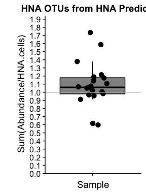

-   [Load the necessary libraries and set colors](#load-the-necessary-libraries-and-set-colors)
-   [Load in the data](#load-in-the-data)
-   [HNA Pool: 0.1% Filtering](#hna-pool-0.1-filtering)
-   [Proportion of HNA Pool?](#proportion-of-hna-pool)
    -   [What proportion of the HNA pool is taken up by the 26 OTUs?](#what-proportion-of-the-hna-pool-is-taken-up-by-the-26-otus)
-   [Sum OTUs vs HNA](#sum-otus-vs-hna)

### Load the necessary libraries and set colors

``` r
################################# LOAD LIBRARIES ############################################
library(tidyverse)
library(cowplot)
source("../OutliersRemoved/set_colors.R")
source("../OutliersRemoved/Functions.R")
```

### Load in the data

``` r
#################################### LOAD DATA ##############################################

# Read in the absolute abundance data 
absolute_otu <- read.table(file="../../data/Chloroplasts_removed/nochloro_absolute_otu.tsv", header = TRUE) # Absolute OTU abundance table 

# Read in the taxonomy data 
tax <- read.table(file="../../data/Chloroplasts_removed/nochloro_taxonomy_otu.tsv", header = TRUE) %>%
  tibble::rownames_to_column() %>%
  dplyr::rename(Kingdom = Rank1,
         Phylum = Rank2, 
         Class = Rank3,
         Order = Rank4,
         Family = Rank5,
         Genus = Rank6,
         Species = Rank7,
         OTU = rowname) # Fix the Taxonomy

# Replace the phylum Proteobacteria with the class level
Phylum <- as.character(tax$Phylum)
Class <- as.character(tax$Class)

for  (i in 1:length(Phylum)){ 
  if (Phylum[i] == "Proteobacteria"){
    Phylum[i] <- Class[i]
  } 
}

# Overwrite the Phylum level with the new phylum classification
tax$Phylum <- Phylum # Add the new phylum level data back to phy

# Read in the productivity and flow cytometry data 
productivity <- read.table(file = "../../data/Chloroplasts_removed/productivity_data.tsv", header = TRUE) # Metadata file
```

HNA Pool: 0.1% Filtering
========================

@prubbens performed an analysis where initial filtering was 0.1% (results in `Final/HNA_OutliersRemoved/hna_scores_abun0.001.csv`). The pipeline is found in `Final/HNA_OutliersRemoved/analysis_final_HNA_LNA_outliersremoved.ipynb`.

``` r
# Vector of 3 OTUs pulled out by Peter's model in the above file 
hna_otus <- read.csv("hna_scores_abun0.001.csv", header = FALSE) %>%   # Gather the 26 OTUs that peter pulled out in his analysis 
  dplyr::rename(OTU = V1, Corr = V2)                                                               # Rename columns to be more intuitive

# Make a vector of OTU names to pull them out of the larger dataset
hna_otu_names <- as.character(hna_otus$OTU)

# How many otus are there in the HNA pool?
length(hna_otu_names)
```

    ## [1] 60

``` r
# What is the taxonomy of these 3 OTUs?
tax %>% dplyr::filter(OTU %in% hna_otu_names)
```

    ##          OTU  Kingdom                      Phylum                               Class                               Order                              Family                Genus      Species
    ## 1  Otu000004 Bacteria              Actinobacteria                      Actinobacteria                     Actinomycetales                                 acI                acI-A       acI-A6
    ## 2  Otu000005 Bacteria               Cyanobacteria                       Cyanobacteria                         SubsectionI                             FamilyI         Unclassified Unclassified
    ## 3  Otu000007 Bacteria          Betaproteobacteria                  Betaproteobacteria                     Burkholderiales                                betI               betI-A      Lhab-A1
    ## 4  Otu000009 Bacteria               Bacteroidetes                       [Saprospirae]                     [Saprospirales]                                bacI               bacI-A      bacI-A1
    ## 5  Otu000011 Bacteria              Actinobacteria                      Actinobacteria                     Actinomycetales                                 acI                acI-A       acI-A1
    ## 6  Otu000016 Bacteria          Betaproteobacteria                  Betaproteobacteria                     Burkholderiales                               betII                 Pnec        PnecB
    ## 7  Otu000025 Bacteria               Bacteroidetes                          Cytophagia                        Cytophagales                              bacIII             bacIII-A Unclassified
    ## 8  Otu000029 Bacteria               Bacteroidetes                          Cytophagia                        Cytophagales                              bacIII             bacIII-B        Algor
    ## 9  Otu000030 Bacteria               Cyanobacteria                       Cyanobacteria                         SubsectionI                             FamilyI        Synechococcus Unclassified
    ## 10 Otu000047 Bacteria               Bacteroidetes                    Sphingobacteriia                  Sphingobacteriales                          env.OPS_17         Unclassified Unclassified
    ## 11 Otu000048 Bacteria         Alphaproteobacteria                 Alphaproteobacteria                    Rhodospirillales                             alfVIII alfVIII_unclassified Unclassified
    ## 12 Otu000050 Bacteria              Planctomycetes                       Phycisphaerae                     Phycisphaerales                    Phycisphaeraceae              CL500-3 Unclassified
    ## 13 Otu000057 Bacteria          Betaproteobacteria                  Betaproteobacteria                     Methylophilales                               betIV              betIV-A Unclassified
    ## 14 Otu000067 Bacteria               Bacteroidetes                      Flavobacteriia                    Flavobacteriales                               bacII              bacII-A Unclassified
    ## 15 Otu000084 Bacteria               Bacteroidetes                      Flavobacteriia                    Flavobacteriales                               bacII              bacII-A     Flavo-A3
    ## 16 Otu000098 Bacteria               Bacteroidetes                      Flavobacteriia                    Flavobacteriales                                bacV    bacV_unclassified Unclassified
    ## 17 Otu000104 Bacteria              Actinobacteria                      Actinobacteria                     Actinomycetales                               Luna1              Luna1-A     Luna1-A4
    ## 18 Otu000106 Bacteria         Alphaproteobacteria                 Alphaproteobacteria                     Rhodobacterales                               alfVI   alfVI_unclassified Unclassified
    ## 19 Otu000109 Bacteria               Bacteroidetes                    Sphingobacteriia                  Sphingobacteriales                    Chitinophagaceae      Flavisolibacter Unclassified
    ## 20 Otu000112 Bacteria              Actinobacteria                      Actinobacteria                     Actinomycetales                                 acI                acI-C       acI-C1
    ## 21 Otu000123 Bacteria          Betaproteobacteria                  Betaproteobacteria                     Burkholderiales                              betVII             betVII-B    betVII-B1
    ## 22 Otu000124 Bacteria             Verrucomicrobia                            Opitutae                          Opitutales                         Opitutaceae             Opitutus Unclassified
    ## 23 Otu000128 Bacteria               Bacteroidetes                      Flavobacteriia                    Flavobacteriales                               bacII              bacII-A     Flavo-A1
    ## 24 Otu000139 Bacteria               Bacteroidetes                      Flavobacteriia                    Flavobacteriales                               bacII              bacII-A Unclassified
    ## 25 Otu000152 Bacteria       Bacteria_unclassified               Bacteria_unclassified               Bacteria_unclassified               Bacteria_unclassified         Unclassified Unclassified
    ## 26 Otu000173 Bacteria               Bacteroidetes                      Flavobacteriia                    Flavobacteriales                               bacII              bacII-A Unclassified
    ## 27 Otu000175 Bacteria          Betaproteobacteria                  Betaproteobacteria                     Burkholderiales                               betII                 Pnec        PnecD
    ## 28 Otu000176 Bacteria         Deltaproteobacteria                 Deltaproteobacteria                   Bdellovibrionales                  Bacteriovoracaceae         Peredibacter Unclassified
    ## 29 Otu000203 Bacteria               Bacteroidetes                    Sphingobacteriia                  Sphingobacteriales                NS11-12_marine_group         Unclassified Unclassified
    ## 30 Otu000204 Bacteria               Bacteroidetes                    Sphingobacteriia                  Sphingobacteriales                NS11-12_marine_group         Unclassified Unclassified
    ## 31 Otu000209 Bacteria       Bacteria_unclassified               Bacteria_unclassified               Bacteria_unclassified               Bacteria_unclassified         Unclassified Unclassified
    ## 32 Otu000219 Bacteria          Betaproteobacteria                  Betaproteobacteria                     Burkholderiales                              betIII             betIII-A    betIII-A1
    ## 33 Otu000222 Bacteria               Bacteroidetes                      Flavobacteriia                    Flavobacteriales                               bacII              bacII-A Unclassified
    ## 34 Otu000224 Bacteria          Betaproteobacteria                  Betaproteobacteria                     Burkholderiales                              betVII             betVII-B    betVII-B1
    ## 35 Otu000227 Bacteria            Gemmatimonadetes                    Gemmatimonadetes                    Gemmatimonadales                   Gemmatimonadaceae         Gemmatimonas Unclassified
    ## 36 Otu000247 Bacteria         Gammaproteobacteria                 Gammaproteobacteria    Gammaproteobacteria_unclassified    Gammaproteobacteria_unclassified         Unclassified Unclassified
    ## 37 Otu000249 Bacteria              Actinobacteria                      Acidimicrobiia                    Acidimicrobiales                                acIV               acIV-B     Iluma-B1
    ## 38 Otu000319 Bacteria       Bacteria_unclassified               Bacteria_unclassified               Bacteria_unclassified               Bacteria_unclassified         Unclassified Unclassified
    ## 39 Otu000344 Bacteria       Bacteria_unclassified               Bacteria_unclassified               Bacteria_unclassified               Bacteria_unclassified         Unclassified Unclassified
    ## 40 Otu000354 Bacteria               Bacteroidetes                    Sphingobacteriia                  Sphingobacteriales                    Chitinophagaceae      Ferruginibacter Unclassified
    ## 41 Otu000360 Bacteria              Planctomycetes                    Planctomycetacia                    Planctomycetales                   Planctomycetaceae      Blastopirellula Unclassified
    ## 42 Otu000382  unknown        unknown_unclassified                unknown_unclassified                unknown_unclassified                unknown_unclassified         Unclassified Unclassified
    ## 43 Otu000469 Bacteria               Bacteroidetes                    Sphingobacteriia                  Sphingobacteriales                          env.OPS_17         Unclassified Unclassified
    ## 44 Otu000474 Bacteria          Betaproteobacteria                  Betaproteobacteria                     Burkholderiales                                betI               betI-A      Lhab-A3
    ## 45 Otu000487 Bacteria       Bacteria_unclassified               Bacteria_unclassified               Bacteria_unclassified               Bacteria_unclassified         Unclassified Unclassified
    ## 46 Otu000563 Bacteria              Actinobacteria                      Actinobacteria                     Actinomycetales                               acIII              acIII-A        Luna2
    ## 47 Otu000765 Bacteria         Alphaproteobacteria                 Alphaproteobacteria                       Rickettsiales        Rickettsiales_Incertae_Sedis  Candidatus_Captivus Unclassified
    ## 48 Otu000781 Bacteria               Bacteroidetes                    Sphingobacteriia                  Sphingobacteriales                 Sphingobacteriaceae            Solitalea Unclassified
    ## 49 Otu000824 Bacteria               Bacteroidetes                    Sphingobacteriia                  Sphingobacteriales                NS11-12_marine_group         Unclassified Unclassified
    ## 50 Otu000981 Bacteria         Gammaproteobacteria                 Gammaproteobacteria                   Oceanospirillales                  Oceanospirillaceae      Pseudospirillum Unclassified
    ## 51 Otu001312  unknown        unknown_unclassified                unknown_unclassified                unknown_unclassified                unknown_unclassified         Unclassified Unclassified
    ## 52 Otu001345 Bacteria      Candidate_division_OP3 Candidate_division_OP3_unclassified Candidate_division_OP3_unclassified Candidate_division_OP3_unclassified         Unclassified Unclassified
    ## 53 Otu001664  unknown        unknown_unclassified                unknown_unclassified                unknown_unclassified                unknown_unclassified         Unclassified Unclassified
    ## 54 Otu001749 Bacteria          Betaproteobacteria                  Betaproteobacteria                     Burkholderiales                              betIII             betIII-A    betIII-A1
    ## 55 Otu001835 Bacteria Proteobacteria_unclassified         Proteobacteria_unclassified         Proteobacteria_unclassified         Proteobacteria_unclassified         Unclassified Unclassified
    ## 56 Otu001929 Bacteria              Planctomycetes                    Planctomycetacia                    Planctomycetales                   Planctomycetaceae         Unclassified Unclassified
    ## 57 Otu002102 Bacteria             Gracilibacteria        Gracilibacteria_unclassified        Gracilibacteria_unclassified        Gracilibacteria_unclassified         Unclassified Unclassified
    ## 58 Otu003229  unknown        unknown_unclassified                unknown_unclassified                unknown_unclassified                unknown_unclassified         Unclassified Unclassified
    ## 59 Otu007625 Bacteria          Betaproteobacteria                  Betaproteobacteria                     Burkholderiales                              betIII             betIII-A    betIII-A1
    ## 60 Otu008167 Bacteria          Betaproteobacteria                  Betaproteobacteria                     Burkholderiales                                betI               betI-A      Lhab-A2

``` r
# Make it more reproducble below
pick_columns <- length(hna_otu_names) + 1

# Put all the data together into one dataframe with only the important OTUs
AbsAbund_hna_otus <-  absolute_otu %>%                                           # Start with the OTU table with absolute abundance counts 
  dplyr::select(one_of(hna_otu_names)) %>%                                       # Pull out only the relevant OTUs from the above OTU table
  tibble::rownames_to_column() %>%                                               # Change the sample names to be a column
  dplyr::rename(Sample_16S = rowname) %>%                                        # Rename the sample names column to match up with other data frames
  dplyr::left_join(productivity, by = "Sample_16S") %>%                          # Join 26 OTU absolute abundance counts with rest of metadata 
  dplyr::filter(Lake == "Muskegon" & Depth == "Surface") %>%                     # Filter out samples that have productivity data (Muskegon & Surface)
  dplyr::select(-c(Platform, samples, Lake)) %>%                                 # Remove unnecessary columns 
  mutate(Site = factor(Site, levels = c("MOT", "MDP", "MBR", "MIN"))) %>%        # Fix order of factor for lake station
  gather("OTU", "Abs_Abund", 2:pick_columns) %>%                                 # Gather only columns which represent OTU abs abundance counts, and put it in *long* format
  dplyr::left_join(tax, by = "OTU") %>%                                          # Add the taxonomic information for each OTU
  dplyr::filter(tot_bacprod < 90) %>%                                            # Remove outliers to match peter's analysis
  mutate(OTU_fraction_HNA = Abs_Abund/HNA.cells)                                 # Calculate the fraction that each individual OTU takes up within the HNA pool for each sample


# Plot the absolute abundance data for each OTU
ggplot(AbsAbund_hna_otus, aes(x = reorder(OTU, Phylum), y = log10(Abs_Abund), fill = Phylum, color = Phylum)) +
  geom_boxplot(alpha = 0.5, outlier.shape = NA) +
  geom_jitter(width = 0.2, size = 3) +
  scale_color_manual(values = phylum_colors) +
  scale_fill_manual(values = phylum_colors) +
  ylab("log10(Abundance)") +
  #facet_grid(.~Phylum, scale = "free") +
  ggtitle("HNA OTUs from HNA Prediction") + 
  guides(fill = guide_legend(ncol=3),
         color = guide_legend(ncol=3)) +
  theme(legend.position = "bottom", #c(0.33, 0.85),
        legend.direction = "horizontal",
        legend.title = element_blank(),
        axis.title.x = element_blank(),
        axis.text.x = element_text(angle = 30, hjust = 1, vjust = 1))
```


``` r
# Plot the fraction of the HNA pool for each OTU
ggplot(AbsAbund_hna_otus, aes(x = reorder(OTU, Phylum), y = OTU_fraction_HNA, fill = Phylum, color = Phylum)) +
  geom_boxplot(alpha = 0.5, outlier.shape = NA) +
  geom_jitter(width = 0.2, size = 3) +
  scale_color_manual(values = phylum_colors) +
  scale_fill_manual(values = phylum_colors) +
  ylab("Fraction of HNA Cells") +
  ggtitle("HNA OTUs from HNA Prediction") + 
  guides(fill = guide_legend(ncol=2),
         color = guide_legend(ncol=2)) +
  theme(legend.position = c(0.33, 0.85),
        legend.direction = "horizontal",
        legend.title = element_blank(),
        axis.title.x = element_blank(),
        axis.text.x = element_text(angle = 30, hjust = 1, vjust = 1))
```


Proportion of HNA Pool?
=======================

### What proportion of the HNA pool is taken up by the 26 OTUs?

``` r
# Calculate the sum of the HNA pool, the max of the HNA pool, and the median/mean
frac_HNA_stats_AbsAbund_hna_otus <- AbsAbund_hna_otus %>%                        # Take the dataframe from above
  dplyr::select(Sample_16S, OTU, OTU_fraction_HNA, Abs_Abund, HNA.cells) %>%   # Select only relevant columns
  group_by(Sample_16S) %>%                                                     # Make a data frame for each of the individual samples
  summarise(sum_fracHNA = sum(OTU_fraction_HNA),                               # Calculate the sum of the fraction of each OTU from the HNA pool (total HNA pool represented by each OTU)
            max_fracHNA = max(OTU_fraction_HNA),                               # Calculate the max the the line above
            median_fracHNA = median(OTU_fraction_HNA),                         # Calculate the median of 2 lines above
            mean_fracHNA = mean(OTU_fraction_HNA),                             # Calculate the mean of 3 lines above
            sum_abs_abund = sum(Abs_Abund)) %>%                                # What's the sum of the absolute abundance of the 26 OTUs within each sample? 
  mutate(All_Samples = "AllSamps_26_OTUs")


# Plot the variation in the sum of the HNA fraction with points/boxplot
ggplot(frac_HNA_stats_AbsAbund_hna_otus, 
       aes(y = sum_fracHNA, x = All_Samples, color = "All_Samples", fill = "All_Samples")) +
  geom_boxplot(alpha = 0.5, outlier.shape = NA) + 
  geom_point(size = 3, position = position_jitterdodge()) +
  ggtitle("HNA OTUs from HNA Prediction") + 
  xlab("All Samples") + scale_color_manual(values = "black") +
  scale_fill_manual(values = "black") +
  geom_abline(intercept = 1, slope = 0, color = "grey") +                                   # Draw a line at 1 
  scale_y_continuous(expand = c(0,0),
                     limits = c(0, max(frac_HNA_stats_AbsAbund_hna_otus$sum_fracHNA) + 0.2), 
                     breaks = seq(0,  max(frac_HNA_stats_AbsAbund_hna_otus$sum_fracHNA) + 0.2, by = 0.1)) +
  ylab("\n Sum(Abundance/HNA.cells)") + xlab("Sample") +
  theme(legend.position = "none", axis.text.x = element_blank())
```



Sum OTUs vs HNA
===============

``` r
all_data <- inner_join(frac_HNA_stats_AbsAbund_hna_otus, productivity, by = "Sample_16S") %>%    # Combine calculated stats above with rest of metadata
  dplyr::select(-c(Platform, All_Samples, samples, Lake, Fraction, Depth)) %>%                  # Remove futile columns
  mutate(pred_totHNA_counts = sum_fracHNA*HNA.cells)                                            # Sanity Check:  Back calculate the number of HNA cells 

# Plot the correlation between the HNA counts from the flow cytometer and the sum of the counts from the 26 OTUs
ggplot(all_data, aes(x = sum_abs_abund, y= HNA.cells)) +
  geom_point(size = 3) + ylab("HNA Cell Count") + 
  xlab("Sum(Abs_Abund of 26 OTUs)") + 
  geom_abline(intercept = 0, slope = 1) +                                   # Draw a 1:1 line 
  theme(axis.text.x = element_text(angle = 30, hjust = 1, vjust = 1))
```


**Note that All samples with an absolute abundance of 0 were left out of the above OLS linear model calculations.**
