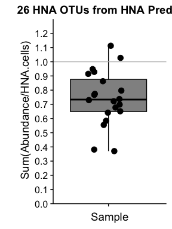
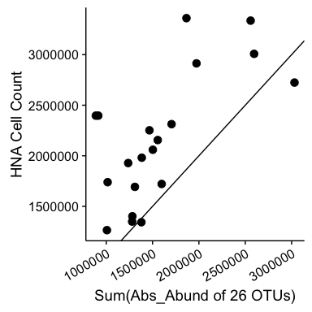
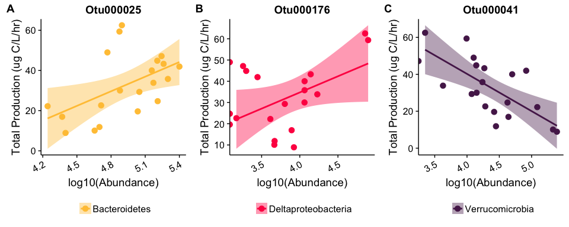

-   [Load the necessary libraries and set colors](#load-the-necessary-libraries-and-set-colors)
-   [Load in the data](#load-in-the-data)
-   [Based on 1):](#based-on-1)
-   [Proportion of HNA Pool?](#proportion-of-hna-pool)
    -   [WHAT PROPORTION OF THE HNA POOL IS MADE UP BY THE 26 OTUs?](#what-proportion-of-the-hna-pool-is-made-up-by-the-26-otus)
-   [Sum OTUs vs HNA](#sum-otus-vs-hna)

### Load the necessary libraries and set colors

``` r
################################# LOAD LIBRARIES ############################################
library(tidyverse)
library(cowplot)

# Set Phylum colors for plotting
colors <- c(
  Actinobacteria = "skyblue",
  Alphaproteobacteria = "#547980",  
  Bacteroidetes = "#FFC543", 
  Betaproteobacteria = "#A73E5C", 
  Chlorobi = "#BEDB39",
  Cyanobacteria = "forestgreen", 
  Deltaproteobacteria = "#FF2151", 
  Gammaproteobacteria = "black", 
  Planctomycetes = "#FD7400",
  Proteobacteria_unclassified = "#019879",
  Verrucomicrobia = "#562258")
```

### Load in the data

``` r
#################################### LOAD DATA ##############################################

# Read in the absolute abundance data 
absolute_otu <- read.table(file="../../data/Chloroplasts_removed/nochloro_absolute_otu.tsv", header = TRUE) # Absolute OTU abundance table 

# Read in the taxonomy data 
tax <- read.table(file="../../data/Chloroplasts_removed/nochloro_taxonomy_otu.tsv", header = TRUE) %>%
  tibble::rownames_to_column() %>%
  dplyr::rename(Kingdom = Rank1,
         Phylum = Rank2, 
         Class = Rank3,
         Order = Rank4,
         Family = Rank5,
         Genus = Rank6,
         Species = Rank7,
         OTU = rowname) # Fix the Taxonomy

# Replace the phylum Proteobacteria with the class level
Phylum <- as.character(tax$Phylum)
Class <- as.character(tax$Class)

for  (i in 1:length(Phylum)){ 
  if (Phylum[i] == "Proteobacteria"){
    Phylum[i] <- Class[i]
  } 
}

# Overwrite the Phylum level with the new phylum classification
tax$Phylum <- Phylum # Add the new phylum level data back to phy

# Read in the productivity and flow cytometry data 
productivity <- read.table(file = "../../data/Chloroplasts_removed/productivity_data.tsv", header = TRUE) # Metadata file
```

Based on 1):
============

@prubbens performed an analysis where he removed three outliers from the productivity data on April 5th (*see `Final/OutliersRemoved/analysis_final_prod_outliersremoved.ipynb`*), which pulled out **19** otus, **3** OTUs which matched both pipelines.

``` r
# Vector of 3 OTUs pulled out by Peter's model in the above file 
OTUs_26 <- read.csv("HNAscores_prod_outliersremoved_abun0.0075_Thr0.63.csv", header = FALSE) %>%
  dplyr::rename(OTU = V1,
                Corr = V2)

otu_names_26 <- as.character(OTUs_26$OTU)

# What is the taxonomy of these 3 OTUs?
tax %>%
  dplyr::filter(OTU %in% otu_names_26)
```

    ##          OTU  Kingdom                      Phylum                        Class                        Order                       Family                        Genus      Species
    ## 1  Otu000004 Bacteria              Actinobacteria               Actinobacteria              Actinomycetales                          acI                        acI-A       acI-A6
    ## 2  Otu000005 Bacteria               Cyanobacteria                Cyanobacteria                  SubsectionI                      FamilyI                 Unclassified Unclassified
    ## 3  Otu000016 Bacteria          Betaproteobacteria           Betaproteobacteria              Burkholderiales                        betII                         Pnec        PnecB
    ## 4  Otu000017 Bacteria               Bacteroidetes               Flavobacteriia             Flavobacteriales                         bacV            bacV_unclassified Unclassified
    ## 5  Otu000025 Bacteria               Bacteroidetes                   Cytophagia                 Cytophagales                       bacIII                     bacIII-A Unclassified
    ## 6  Otu000027 Bacteria          Betaproteobacteria           Betaproteobacteria              Burkholderiales                         betI                       betI-B        Rhodo
    ## 7  Otu000029 Bacteria               Bacteroidetes                   Cytophagia                 Cytophagales                       bacIII                     bacIII-B        Algor
    ## 8  Otu000040 Bacteria             Verrucomicrobia Verrucomicrobia_unclassified Verrucomicrobia_unclassified Verrucomicrobia_unclassified Verrucomicrobia_unclassified Unclassified
    ## 9  Otu000041 Bacteria             Verrucomicrobia             [Spartobacteria]         [Chthoniobacterales]                       verI-B                       Xip-B1 Unclassified
    ## 10 Otu000042 Bacteria              Planctomycetes                Phycisphaerae              Phycisphaerales             Phycisphaeraceae                      CL500-3 Unclassified
    ## 11 Otu000043 Bacteria          Betaproteobacteria           Betaproteobacteria              Burkholderiales                         betI                       betI-A      Lhab-A2
    ## 12 Otu000048 Bacteria         Alphaproteobacteria          Alphaproteobacteria             Rhodospirillales                      alfVIII         alfVIII_unclassified Unclassified
    ## 13 Otu000050 Bacteria              Planctomycetes                Phycisphaerae              Phycisphaerales             Phycisphaeraceae                      CL500-3 Unclassified
    ## 14 Otu000057 Bacteria          Betaproteobacteria           Betaproteobacteria              Methylophilales                        betIV                      betIV-A Unclassified
    ## 15 Otu000058 Bacteria         Gammaproteobacteria          Gammaproteobacteria              Methylococcales                         gamI            gamI_unclassified Unclassified
    ## 16 Otu000067 Bacteria               Bacteroidetes               Flavobacteriia             Flavobacteriales                        bacII                      bacII-A Unclassified
    ## 17 Otu000084 Bacteria               Bacteroidetes               Flavobacteriia             Flavobacteriales                        bacII                      bacII-A     Flavo-A3
    ## 18 Otu000095 Bacteria         Gammaproteobacteria          Gammaproteobacteria              Methylococcales                     CABC2E06                 Unclassified Unclassified
    ## 19 Otu000106 Bacteria         Alphaproteobacteria          Alphaproteobacteria              Rhodobacterales                        alfVI           alfVI_unclassified Unclassified
    ## 20 Otu000112 Bacteria              Actinobacteria               Actinobacteria              Actinomycetales                          acI                        acI-C       acI-C1
    ## 21 Otu000123 Bacteria          Betaproteobacteria           Betaproteobacteria              Burkholderiales                       betVII                     betVII-B    betVII-B1
    ## 22 Otu000173 Bacteria               Bacteroidetes               Flavobacteriia             Flavobacteriales                        bacII                      bacII-A Unclassified
    ## 23 Otu000176 Bacteria         Deltaproteobacteria          Deltaproteobacteria            Bdellovibrionales           Bacteriovoracaceae                 Peredibacter Unclassified
    ## 24 Otu000219 Bacteria          Betaproteobacteria           Betaproteobacteria              Burkholderiales                       betIII                     betIII-A    betIII-A1
    ## 25 Otu000290 Bacteria             Verrucomicrobia             Verrucomicrobiae           Verrucomicrobiales          Verrucomicrobiaceae              Prosthecobacter Unclassified
    ## 26 Otu000330 Bacteria Proteobacteria_unclassified  Proteobacteria_unclassified  Proteobacteria_unclassified  Proteobacteria_unclassified                 Unclassified Unclassified

``` r
# Put all the data together into one dataframe with only the important OTUs
AbsAbund_OTUs_26 <-  absolute_otu %>%
  dplyr::select(one_of(otu_names_26)) %>%     ### Use only 26 OTUs
  tibble::rownames_to_column() %>%
  dplyr::rename(Sample_16S = rowname) %>%  
  dplyr::left_join(productivity, by = "Sample_16S") %>%
  dplyr::filter(Lake == "Muskegon" & Depth == "Surface") %>%
  dplyr::select(-c(Platform, samples, Lake)) %>%
  mutate(Site = factor(Site, levels = c("MOT", "MDP", "MBR", "MIN"))) %>%
  gather("OTU", "Abs_Abund", 2:27) %>%     #### Gather only columns 2:12
  dplyr::left_join(tax, by = "OTU") %>%
  filter(!is.na(Sample_16S)) %>%
  mutate(OTU_fraction_HNA = Abs_Abund/HNA.cells,
         OTU = factor(OTU, levels = OTU[order(Phylum)])) %>%
  dplyr::filter(tot_bacprod < 90) # REMOVE OUTLIERS TO MATCH PETER'S ANALYSIS


# Plot the absolute abundance data 
ggplot(abs_abund_OTUs_26, aes(x = reorder(OTU, Phylum), y = Abs_Abund, fill = Phylum, color = Phylum)) +
  geom_boxplot(alpha = 0.5, outlier.shape = NA) +
  geom_jitter(width = 0.2, size = 3) +
  #scale_y_continuous(expand = c(0,0), limits = c(0, 2.5e+5)) +
  scale_color_manual(values = colors) +
  scale_fill_manual(values = colors) +
  ylab("log10(Abundance)") +
  ggtitle("26 HNA OTUs from HNA Prediction") + 
  guides(fill = guide_legend(ncol=2),
         color = guide_legend(ncol=2)) +
  theme(legend.position = c(0.33, 0.85),
        legend.direction = "horizontal",
        legend.title = element_blank(),
        axis.title.x = element_blank(),
        axis.text.x = element_text(angle = 30, hjust = 1, vjust = 1))
```

    ## Error in ggplot(abs_abund_OTUs_26, aes(x = reorder(OTU, Phylum), y = Abs_Abund, : object 'abs_abund_OTUs_26' not found

``` r
ggplot(abs_abund_OTUs_26, aes(x = reorder(OTU, Phylum), y = OTU_fraction_HNA, fill = Phylum, color = Phylum)) +
  geom_boxplot(alpha = 0.5, outlier.shape = NA) +
  geom_jitter(width = 0.2, size = 3) +
  #scale_y_continuous(expand = c(0,0), limits = c(0, 2.5e+5)) +
  scale_color_manual(values = colors) +
  scale_fill_manual(values = colors) +
  ylab("Fraction of HNA Cells") +
  ggtitle("26 HNA OTUs from HNA Prediction") + 
  guides(fill = guide_legend(ncol=2),
         color = guide_legend(ncol=2)) +
  theme(legend.position = c(0.33, 0.85),
        legend.direction = "horizontal",
        legend.title = element_blank(),
        axis.title.x = element_blank(),
        axis.text.x = element_text(angle = 30, hjust = 1, vjust = 1))
```

    ## Error in ggplot(abs_abund_OTUs_26, aes(x = reorder(OTU, Phylum), y = OTU_fraction_HNA, : object 'abs_abund_OTUs_26' not found

Proportion of HNA Pool?
=======================

### WHAT PROPORTION OF THE HNA POOL IS MADE UP BY THE 26 OTUs?

``` r
# Calculate the sum of the HNA pool, the max of the HNA pool, and the median/mean
frac_HNA_stats_AbsAbund_OTUs_26 <- AbsAbund_OTUs_26 %>%
  dplyr::select(Sample_16S, OTU, OTU_fraction_HNA, Abs_Abund, HNA.cells) %>%
  group_by(Sample_16S) %>%
  summarise(sum_fracHNA = sum(OTU_fraction_HNA), 
            max_fracHNA = max(OTU_fraction_HNA), 
            median_fracHNA = median(OTU_fraction_HNA), 
            mean_fracHNA = mean(OTU_fraction_HNA),
            sum_abs_abund = sum(Abs_Abund)) %>%
  mutate(All_Samples = "AllSamps")

# Plot it
ggplot(frac_HNA_stats_AbsAbund_OTUs_26, aes(y = sum_fracHNA, x = All_Samples, 
                                            color = "All_Samples", fill = "All_Samples")) +
  geom_boxplot(alpha = 0.5) +   geom_point(size = 3, position = position_jitterdodge()) +
  ggtitle("26 HNA OTUs from HNA Prediction") + 
  xlab("All Samples") + scale_color_manual(values = "black") +
  scale_fill_manual(values = "black") +
  scale_y_continuous(expand = c(0,0),limits = c(0, 1.3), 
                     breaks = seq(0, 1.2, by = 0.1)) +
  ylab("\n Sum(Abundance/HNA.cells)") + xlab("Sample") +
  theme(legend.position = "none", axis.text.x = element_blank())
```



Sum OTUs vs HNA
===============

``` r
all_data <- inner_join(frac_HNA_stats_AbsAbund_OTUs_26, productivity, by = "Sample_16S") %>%
  mutate(pred_totHNA_counts = sum_fracHNA*HNA.cells)
  

dplyr::select(all_data, Sample_16S, HNA.cells, pred_totHNA_counts, sum_fracHNA)
```

    ## # A tibble: 20 × 4
    ##    Sample_16S HNA.cells pred_totHNA_counts sum_fracHNA
    ##         <chr>     <dbl>              <dbl>       <dbl>
    ## 1   MBRE1F714   2724102          3031219.8   1.1127408
    ## 2   MBRE1F715   1343202          1379725.9   1.0271919
    ## 3   MBRE1F914   1928397          1236911.0   0.6414193
    ## 4   MBRE2F515   1739097          1015380.1   0.5838549
    ## 5   MBRE2F915   1264624          1007841.0   0.7969492
    ## 6   MDPE1F514   2396948           888109.8   0.3705170
    ## 7   MDPE1F714   3007826          2595225.1   0.8628243
    ## 8   MDPE1F715   1721379          1598269.7   0.9284823
    ## 9   MDPE1F914   2059672          1503100.9   0.7297768
    ## 10  MDPE2F515   2155515          1555922.5   0.7218335
    ## 11  MDPE2F915   1349635          1279776.0   0.9482383
    ## 12  MINE1F715   2913854          1973889.3   0.6774154
    ## 13  MINE1F914   3360732          1865603.8   0.5551183
    ## 14  MINE2F915   2312989          1705201.3   0.7372286
    ## 15  MOTE1F514   2396939           914463.8   0.3815132
    ## 16  MOTE1F714   3336428          2557913.1   0.7666621
    ## 17  MOTE1F715   1692624          1309430.2   0.7736098
    ## 18  MOTE1F914   1981122          1383486.4   0.6983348
    ## 19  MOTE2F515   2251854          1466453.3   0.6512205
    ## 20  MOTE2F915   1401867          1282401.3   0.9147807

``` r
ggplot(all_data, aes(x = sum_abs_abund, y= HNA.cells)) +
  geom_point(size = 3) + ylab("HNA Cell Count") + 
  xlab("Sum(Abs_Abund of 26 OTUs)") + 
  geom_abline(intercept = 0, slope = 1)
```



``` r
plot_OTU25 <- ggplot(dplyr::filter(AbsAbund_OTUs_26, OTU == "Otu000025"), 
       aes(y = tot_bacprod,x = log10(Abs_Abund), fill = Phylum, color = Phylum)) +
  geom_point(size = 3) + ggtitle("Otu000025") +
  scale_color_manual(values = colors) +
  scale_fill_manual(values = colors) +
  xlab("log10(Abundance)") +
  geom_smooth(method = "lm", color = "#FFC543") +
  ylab("Total Production (ug C/L/hr)") + 
  theme(legend.position = "bottom",
        legend.title = element_blank(),
        axis.text.x = element_text(angle = 30, hjust = 1, vjust = 1))


plot_OTU41 <- ggplot(dplyr::filter(AbsAbund_OTUs_26, OTU == "Otu000041"), 
       aes(y = tot_bacprod,x = log10(Abs_Abund), fill = Phylum, color = Phylum)) +
  geom_point(size = 3) +  ggtitle("Otu000041") +
  scale_color_manual(values = colors) +
  scale_fill_manual(values = colors) +
  xlab("log10(Abundance)") +
  geom_smooth(method = "lm", color = "#562258") +
  ylab("Total Production (ug C/L/hr)") + 
  theme(legend.position = "bottom",
        legend.title = element_blank(),
        axis.text.x = element_text(angle = 30, hjust = 1, vjust = 1))


plot_OTU176 <- ggplot(dplyr::filter(AbsAbund_OTUs_26, OTU == "Otu000176"), 
       aes(y = tot_bacprod,x = log10(Abs_Abund), fill = Phylum, color = Phylum)) +
  geom_point(size = 3) + ggtitle("Otu000176") +
  scale_color_manual(values = colors) +
  scale_fill_manual(values = colors) +
  xlab("log10(Abundance)") +
  geom_smooth(method = "lm", color = "#FF2151") +
  ylab("Total Production (ug C/L/hr)") + 
  theme(legend.position = "bottom",
        legend.title = element_blank(),
        axis.text.x = element_text(angle = 30, hjust = 1, vjust = 1))


plot_grid(plot_OTU25, plot_OTU176, plot_OTU41, nrow = 1, ncol = 3,
          labels = c("A", "B", "C"))
```


