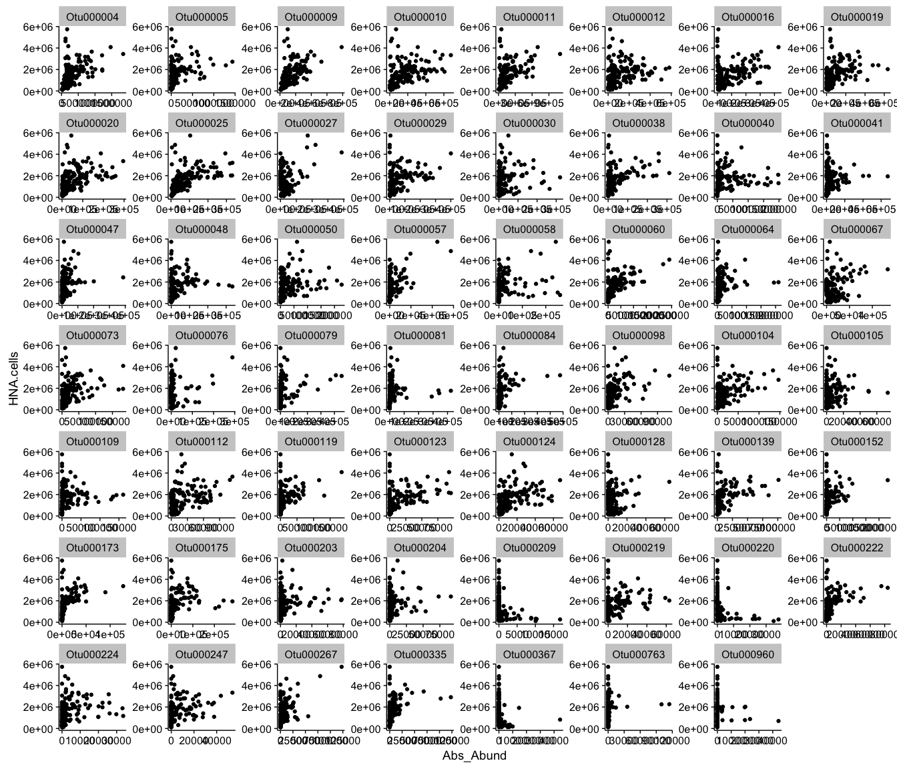
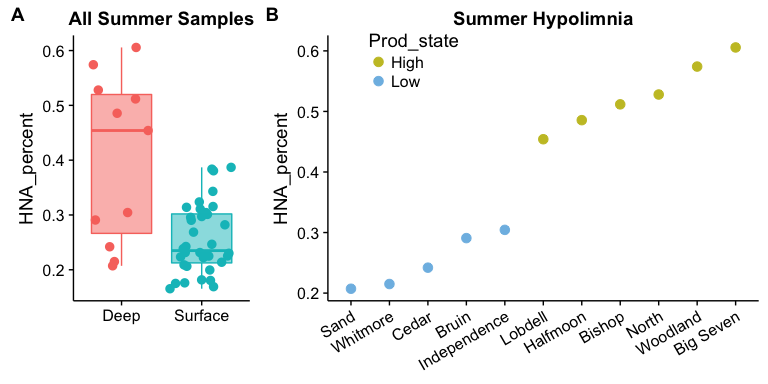
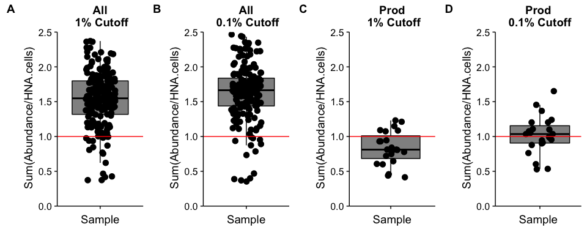

-   [Load the necessary libraries and set colors](#load-the-necessary-libraries-and-set-colors)
-   [Load in the data](#load-in-the-data)
-   [Load in selected OTUs](#load-in-selected-otus)
    -   [How many OTUs are present in all each of the analyses?](#how-many-otus-are-present-in-all-each-of-the-analyses)
    -   [How many are present in the different types of analyses?](#how-many-are-present-in-the-different-types-of-analyses)
-   [Analysis of HNA OTUs that are found within **BOTH** of the models](#analysis-of-hna-otus-that-are-found-within-both-of-the-models)
-   [1% Cutoff from ALL samples](#cutoff-from-all-samples)
-   [0.1% Cutoff from ALL samples](#cutoff-from-all-samples-1)
-   [Is the HNA percent higher/lower in the hypolimnion of productvite stratified inland lakes?](#is-the-hna-percent-higherlower-in-the-hypolimnion-of-productvite-stratified-inland-lakes)
    -   [The HNA percent is much higher in the hypolimnion of productvite stratified lakes!](#the-hna-percent-is-much-higher-in-the-hypolimnion-of-productvite-stratified-lakes)
-   [1% Cutoff from Productivity samples only](#cutoff-from-productivity-samples-only)
-   [0.1% Cutoff from Productivity samples only](#cutoff-from-productivity-samples-only-1)
-   [All Plots](#all-plots)

### Load the necessary libraries and set colors

``` r
################################# LOAD LIBRARIES ############################################
library(tidyverse)
library(cowplot)
source("../set_colors.R")
source("../Functions.R")
```

### Load in the data

``` r
#################################### LOAD DATA ##############################################
# Read in the absolute abundance data 
absolute_otu <- read.table(file="../../../data/Chloroplasts_removed/nochloro_absolute_otu.tsv", header = TRUE) # Absolute OTU abundance table 

# Read in the taxonomy data 
tax <- read.table(file="../../../data/Chloroplasts_removed/nochloro_taxonomy_otu.tsv", header = TRUE) %>%
  tibble::rownames_to_column() %>%
  dplyr::rename(Kingdom = Rank1, Phylum = Rank2, Class = Rank3, Order = Rank4, 
                Family = Rank5, Genus = Rank6, Species = Rank7, OTU = rowname) # Fix the Taxonomy

# Replace the phylum Proteobacteria with the class level
Phylum <- as.character(tax$Phylum)
Class <- as.character(tax$Class)

for  (i in 1:length(Phylum)){ 
  if (Phylum[i] == "Proteobacteria"){
    Phylum[i] <- Class[i]
  } 
}

# Overwrite the Phylum level with the new phylum classification
tax$Phylum <- Phylum # Add the new phylum level data back to phy

# Read in the productivity and flow cytometry data 
prod_fcm_data <- read.table(file = "../../../data/Chloroplasts_removed/productivity_data.tsv", header = TRUE) # Metadata file


# Read in the metadata for the 
inland_fcm_data <- read.csv2("../../../data/inland.sam.csv", stringsAsFactors = FALSE) %>%
  mutate(Sample_16S = paste(substr(SampleID, 1,3), substr(SampleID, 5,7), substr(SampleID, 9,9), sep = "")) %>%
  dplyr::filter(Fraction == "Free")
```

Load in selected OTUs
=====================

How many OTUs are present in all each of the analyses?
------------------------------------------------------

``` r
# Load in the 4 files of OTUs

# Abundance filtering based on All of the sample  data 
## Abundance cutoff = 1%
otus_stand_0.01 <- read.csv("HNA_selectedOTUs_stand_abun0.01_R20.959411030714.csv", header = FALSE) %>% rename(OTU = V1, score = V2)
## How many OTUs are in this dataset?
nrow(otus_stand_0.01)
```

    ## [1] 81

``` r
## Abundance cutoff = 0.1%
otus_stand_0.001 <- read.csv("HNA_selectedOTUs_stand_abun0.001_R20.969251756656.csv", header = FALSE) %>% rename(OTU = V1, score = V2)
## How many OTUs are in this dataset?
nrow(otus_stand_0.001)
```

    ## [1] 149

``` r
# Abundance filtering based on the Productivity data
## Abundance cutoff = 1%
otus_prod_0.001 <- read.csv("HNA_selectedOTUs_prod_stand_abun0.001_R20.928038799058.csv", header = FALSE) %>% rename(OTU = V1, score = V2) 
## How many OTUs are in this dataset?
nrow(otus_prod_0.001)
```

    ## [1] 51

``` r
## Abundance cutoff = 0.1%
otus_prod_0.01 <- read.csv("HNA_selectedOTUs_prod_stand_abun0.01_R20.87968307489.csv", header = FALSE) %>% rename(OTU = V1, score = V2)
## How many OTUs are in this dataset?
nrow(otus_prod_0.01)
```

    ## [1] 28

How many are present in the different types of analyses?
--------------------------------------------------------

``` r
## Standardized analysis with all samples?
length(intersect(otus_stand_0.001$OTU, otus_stand_0.01$OTU))
```

    ## [1] 55

``` r
## Standardized analysis with only productivity samples?
length(intersect(otus_prod_0.001$OTU, otus_prod_0.01$OTU))
```

    ## [1] 18

``` r
# How many OTUs are shared between all 4 approaches?
otus_in_all_4 <- Reduce(intersect, list(otus_stand_0.001$OTU, otus_stand_0.01$OTU, otus_prod_0.001$OTU, otus_prod_0.01$OTU))
length(otus_in_all_4)
```

    ## [1] 17

``` r
# What is the taxonomy of the OTUs that are shared between all 4 approaches?
tax %>% dplyr::filter(OTU %in% otus_in_all_4)
```

    ##          OTU  Kingdom              Phylum                        Class                        Order                       Family                        Genus      Species
    ## 1  Otu000004 Bacteria      Actinobacteria               Actinobacteria              Actinomycetales                          acI                        acI-A       acI-A6
    ## 2  Otu000005 Bacteria       Cyanobacteria                Cyanobacteria                  SubsectionI                      FamilyI                 Unclassified Unclassified
    ## 3  Otu000016 Bacteria  Betaproteobacteria           Betaproteobacteria              Burkholderiales                        betII                         Pnec        PnecB
    ## 4  Otu000025 Bacteria       Bacteroidetes                   Cytophagia                 Cytophagales                       bacIII                     bacIII-A Unclassified
    ## 5  Otu000027 Bacteria  Betaproteobacteria           Betaproteobacteria              Burkholderiales                         betI                       betI-B        Rhodo
    ## 6  Otu000029 Bacteria       Bacteroidetes                   Cytophagia                 Cytophagales                       bacIII                     bacIII-B        Algor
    ## 7  Otu000040 Bacteria     Verrucomicrobia Verrucomicrobia_unclassified Verrucomicrobia_unclassified Verrucomicrobia_unclassified Verrucomicrobia_unclassified Unclassified
    ## 8  Otu000041 Bacteria     Verrucomicrobia             [Spartobacteria]         [Chthoniobacterales]                       verI-B                       Xip-B1 Unclassified
    ## 9  Otu000048 Bacteria Alphaproteobacteria          Alphaproteobacteria             Rhodospirillales                      alfVIII         alfVIII_unclassified Unclassified
    ## 10 Otu000050 Bacteria      Planctomycetes                Phycisphaerae              Phycisphaerales             Phycisphaeraceae                      CL500-3 Unclassified
    ## 11 Otu000057 Bacteria  Betaproteobacteria           Betaproteobacteria              Methylophilales                        betIV                      betIV-A Unclassified
    ## 12 Otu000058 Bacteria Gammaproteobacteria          Gammaproteobacteria              Methylococcales                         gamI            gamI_unclassified Unclassified
    ## 13 Otu000067 Bacteria       Bacteroidetes               Flavobacteriia             Flavobacteriales                        bacII                      bacII-A Unclassified
    ## 14 Otu000084 Bacteria       Bacteroidetes               Flavobacteriia             Flavobacteriales                        bacII                      bacII-A     Flavo-A3
    ## 15 Otu000098 Bacteria       Bacteroidetes               Flavobacteriia             Flavobacteriales                         bacV            bacV_unclassified Unclassified
    ## 16 Otu000112 Bacteria      Actinobacteria               Actinobacteria              Actinomycetales                          acI                        acI-C       acI-C1
    ## 17 Otu000173 Bacteria       Bacteroidetes               Flavobacteriia             Flavobacteriales                        bacII                      bacII-A Unclassified

Analysis of HNA OTUs that are found within **BOTH** of the models
=================================================================

``` r
## Standardized analysis with all samples?
stand_OTUs <- intersect(otus_stand_0.001$OTU, otus_stand_0.01$OTU)

# Put all the data together into one dataframe with only the important OTUs
AbsAbund_otus_stand_intersect <- combine_OTU_data(absolute_otu_table = absolute_otu, otu_vector_names = stand_OTUs, 
                                             productivity_fcm_data = prod_fcm_data, taxonomy_table = tax)

length(unique(AbsAbund_otus_stand_intersect$OTU))
```

    ## [1] 55

``` r
ggplot(AbsAbund_otus_stand_intersect, aes(x = Abs_Abund, y = HNA.cells)) + 
  geom_point() + facet_wrap(~ OTU, scale = "free") 
```



1% Cutoff from ALL samples
==========================

``` r
# What is the taxonomy of the OTUs?
tax %>% dplyr::filter(OTU %in% otus_stand_0.01$OTU)
```

    ##          OTU  Kingdom                Phylum                        Class                            Order                           Family                           Genus      Species
    ## 1  Otu000004 Bacteria        Actinobacteria               Actinobacteria                  Actinomycetales                              acI                           acI-A       acI-A6
    ## 2  Otu000005 Bacteria         Cyanobacteria                Cyanobacteria                      SubsectionI                          FamilyI                    Unclassified Unclassified
    ## 3  Otu000009 Bacteria         Bacteroidetes                [Saprospirae]                  [Saprospirales]                             bacI                          bacI-A      bacI-A1
    ## 4  Otu000010 Bacteria    Betaproteobacteria           Betaproteobacteria                  Methylophilales                            betIV                         betIV-A         LD28
    ## 5  Otu000011 Bacteria        Actinobacteria               Actinobacteria                  Actinomycetales                              acI                           acI-A       acI-A1
    ## 6  Otu000012 Bacteria       Verrucomicrobia             OPB35_soil_group    OPB35_soil_group_unclassified    OPB35_soil_group_unclassified                    Unclassified Unclassified
    ## 7  Otu000016 Bacteria    Betaproteobacteria           Betaproteobacteria                  Burkholderiales                            betII                            Pnec        PnecB
    ## 8  Otu000019 Bacteria       Verrucomicrobia                     Opitutae               Opitutae_vadinHA64  Opitutae_vadinHA64_unclassified                    Unclassified Unclassified
    ## 9  Otu000020 Bacteria         Bacteroidetes             Sphingobacteriia               Sphingobacteriales                            bacVI              bacVI_unclassified Unclassified
    ## 10 Otu000025 Bacteria         Bacteroidetes                   Cytophagia                     Cytophagales                           bacIII                        bacIII-A Unclassified
    ## 11 Otu000027 Bacteria    Betaproteobacteria           Betaproteobacteria                  Burkholderiales                             betI                          betI-B        Rhodo
    ## 12 Otu000029 Bacteria         Bacteroidetes                   Cytophagia                     Cytophagales                           bacIII                        bacIII-B        Algor
    ## 13 Otu000030 Bacteria         Cyanobacteria                Cyanobacteria                      SubsectionI                          FamilyI                   Synechococcus Unclassified
    ## 14 Otu000038 Bacteria         Bacteroidetes               Flavobacteriia                 Flavobacteriales                             bacV               bacV_unclassified Unclassified
    ## 15 Otu000039 Bacteria         Cyanobacteria                Cyanobacteria                      SubsectionI                          FamilyI                   Synechococcus Unclassified
    ## 16 Otu000040 Bacteria       Verrucomicrobia Verrucomicrobia_unclassified     Verrucomicrobia_unclassified     Verrucomicrobia_unclassified    Verrucomicrobia_unclassified Unclassified
    ## 17 Otu000041 Bacteria       Verrucomicrobia             [Spartobacteria]             [Chthoniobacterales]                           verI-B                          Xip-B1 Unclassified
    ## 18 Otu000047 Bacteria         Bacteroidetes             Sphingobacteriia               Sphingobacteriales                       env.OPS_17                    Unclassified Unclassified
    ## 19 Otu000048 Bacteria   Alphaproteobacteria          Alphaproteobacteria                 Rhodospirillales                          alfVIII            alfVIII_unclassified Unclassified
    ## 20 Otu000049 Bacteria       Verrucomicrobia Verrucomicrobia_unclassified     Verrucomicrobia_unclassified     Verrucomicrobia_unclassified    Verrucomicrobia_unclassified Unclassified
    ## 21 Otu000050 Bacteria        Planctomycetes                Phycisphaerae                  Phycisphaerales                 Phycisphaeraceae                         CL500-3 Unclassified
    ## 22 Otu000057 Bacteria    Betaproteobacteria           Betaproteobacteria                  Methylophilales                            betIV                         betIV-A Unclassified
    ## 23 Otu000058 Bacteria   Gammaproteobacteria          Gammaproteobacteria                  Methylococcales                             gamI               gamI_unclassified Unclassified
    ## 24 Otu000060 Bacteria   Alphaproteobacteria          Alphaproteobacteria                 Sphingomonadales                            alfIV              alfIV_unclassified Unclassified
    ## 25 Otu000063 Bacteria         Bacteroidetes               Flavobacteriia                 Flavobacteriales                   Cryomorphaceae                     Owenweeksia Unclassified
    ## 26 Otu000064 Bacteria         Bacteroidetes                [Saprospirae]                  [Saprospirales]                             bacI               bacI_unclassified Unclassified
    ## 27 Otu000067 Bacteria         Bacteroidetes               Flavobacteriia                 Flavobacteriales                            bacII                         bacII-A Unclassified
    ## 28 Otu000068 Bacteria        Planctomycetes             Planctomycetacia                 Planctomycetales                Planctomycetaceae                    Planctomyces Unclassified
    ## 29 Otu000070 Bacteria       Verrucomicrobia          [Methylacidiphilae]              Methylacidiphilales                             LD19               LD19_unclassified Unclassified
    ## 30 Otu000073 Bacteria    Betaproteobacteria           Betaproteobacteria                  Burkholderiales                             betI                          betI-A Unclassified
    ## 31 Otu000076 Bacteria         Bacteroidetes               Flavobacteriia                 Flavobacteriales                            bacII                         bacII-A     Flavo-A2
    ## 32 Otu000079 Bacteria    Betaproteobacteria           Betaproteobacteria                  Burkholderiales                            betII                            Pnec        PnecC
    ## 33 Otu000081 Bacteria       Verrucomicrobia             Verrucomicrobiae               Verrucomicrobiales              Verrucomicrobiaceae                 Prosthecobacter Unclassified
    ## 34 Otu000084 Bacteria         Bacteroidetes               Flavobacteriia                 Flavobacteriales                            bacII                         bacII-A     Flavo-A3
    ## 35 Otu000098 Bacteria         Bacteroidetes               Flavobacteriia                 Flavobacteriales                             bacV               bacV_unclassified Unclassified
    ## 36 Otu000099 Bacteria       Verrucomicrobia Verrucomicrobia_unclassified     Verrucomicrobia_unclassified     Verrucomicrobia_unclassified    Verrucomicrobia_unclassified Unclassified
    ## 37 Otu000104 Bacteria        Actinobacteria               Actinobacteria                  Actinomycetales                            Luna1                         Luna1-A     Luna1-A4
    ## 38 Otu000105 Bacteria   Alphaproteobacteria          Alphaproteobacteria                  Rhodobacterales                            alfVI              alfVI_unclassified Unclassified
    ## 39 Otu000109 Bacteria         Bacteroidetes             Sphingobacteriia               Sphingobacteriales                 Chitinophagaceae                 Flavisolibacter Unclassified
    ## 40 Otu000112 Bacteria        Actinobacteria               Actinobacteria                  Actinomycetales                              acI                           acI-C       acI-C1
    ## 41 Otu000115 Bacteria    Betaproteobacteria           Betaproteobacteria                  Burkholderiales                             betI                          betI-A      Lhab-A3
    ## 42 Otu000119 Bacteria   Alphaproteobacteria          Alphaproteobacteria                      Rhizobiales         Rhizobiales_unclassified        Rhizobiales_unclassified Unclassified
    ## 43 Otu000123 Bacteria    Betaproteobacteria           Betaproteobacteria                  Burkholderiales                           betVII                        betVII-B    betVII-B1
    ## 44 Otu000124 Bacteria       Verrucomicrobia                     Opitutae                       Opitutales                      Opitutaceae                        Opitutus Unclassified
    ## 45 Otu000128 Bacteria         Bacteroidetes               Flavobacteriia                 Flavobacteriales                            bacII                         bacII-A     Flavo-A1
    ## 46 Otu000139 Bacteria         Bacteroidetes               Flavobacteriia                 Flavobacteriales                            bacII                         bacII-A Unclassified
    ## 47 Otu000150 Bacteria       Verrucomicrobia             OPB35_soil_group    OPB35_soil_group_unclassified    OPB35_soil_group_unclassified                    Unclassified Unclassified
    ## 48 Otu000152 Bacteria Bacteria_unclassified        Bacteria_unclassified            Bacteria_unclassified            Bacteria_unclassified                    Unclassified Unclassified
    ## 49 Otu000163 Bacteria   Alphaproteobacteria          Alphaproteobacteria                      Rhizobiales                             alfI                          alfI-B      alfI-B2
    ## 50 Otu000173 Bacteria         Bacteroidetes               Flavobacteriia                 Flavobacteriales                            bacII                         bacII-A Unclassified
    ## 51 Otu000175 Bacteria    Betaproteobacteria           Betaproteobacteria                  Burkholderiales                            betII                            Pnec        PnecD
    ## 52 Otu000190 Bacteria         Bacteroidetes               Flavobacteriia                 Flavobacteriales                            bacII                         bacII-A     Flavo-A3
    ## 53 Otu000203 Bacteria         Bacteroidetes             Sphingobacteriia               Sphingobacteriales             NS11-12_marine_group                    Unclassified Unclassified
    ## 54 Otu000204 Bacteria         Bacteroidetes             Sphingobacteriia               Sphingobacteriales             NS11-12_marine_group                    Unclassified Unclassified
    ## 55 Otu000206 Bacteria   Gammaproteobacteria          Gammaproteobacteria                  Methylococcales                  Crenotrichaceae                      Crenothrix Unclassified
    ## 56 Otu000209 Bacteria Bacteria_unclassified        Bacteria_unclassified            Bacteria_unclassified            Bacteria_unclassified                    Unclassified Unclassified
    ## 57 Otu000219 Bacteria    Betaproteobacteria           Betaproteobacteria                  Burkholderiales                           betIII                        betIII-A    betIII-A1
    ## 58 Otu000220  unknown  unknown_unclassified         unknown_unclassified             unknown_unclassified             unknown_unclassified                    Unclassified Unclassified
    ## 59 Otu000222 Bacteria         Bacteroidetes               Flavobacteriia                 Flavobacteriales                            bacII                         bacII-A Unclassified
    ## 60 Otu000224 Bacteria    Betaproteobacteria           Betaproteobacteria                  Burkholderiales                           betVII                        betVII-B    betVII-B1
    ## 61 Otu000240 Bacteria   Gammaproteobacteria          Gammaproteobacteria                  Methylococcales                           pLW-20                    Unclassified Unclassified
    ## 62 Otu000247 Bacteria   Gammaproteobacteria          Gammaproteobacteria Gammaproteobacteria_unclassified Gammaproteobacteria_unclassified                    Unclassified Unclassified
    ## 63 Otu000254  unknown  unknown_unclassified         unknown_unclassified             unknown_unclassified             unknown_unclassified                    Unclassified Unclassified
    ## 64 Otu000255 Bacteria   Gammaproteobacteria          Gammaproteobacteria                    Legionellales                     Coxiellaceae                   Rickettsiella Unclassified
    ## 65 Otu000264 Bacteria         Bacteroidetes               Flavobacteriia                 Flavobacteriales                            bacII                         bacII-A     Flavo-A3
    ## 66 Otu000267 Bacteria          Omnitrophica                     NPL-UPA2            NPL-UPA2_unclassified            NPL-UPA2_unclassified                    Unclassified Unclassified
    ## 67 Otu000315 Bacteria    Betaproteobacteria           Betaproteobacteria  Betaproteobacteria_unclassified  Betaproteobacteria_unclassified Betaproteobacteria_unclassified Unclassified
    ## 68 Otu000335 Bacteria        Actinobacteria               Actinobacteria                  Actinomycetales                            Luna1                         Luna1-A     Luna1-A2
    ## 69 Otu000338 Bacteria   Gammaproteobacteria          Gammaproteobacteria                  Pseudomonadales                           gamIII                        gamIII-A         Acin
    ## 70 Otu000367 Bacteria         Bacteroidetes             Sphingobacteriia               Sphingobacteriales                       env.OPS_17                    Unclassified Unclassified
    ## 71 Otu000413 Bacteria       Verrucomicrobia             OPB35_soil_group    OPB35_soil_group_unclassified    OPB35_soil_group_unclassified                    Unclassified Unclassified
    ## 72 Otu000450 Bacteria         Bacteroidetes                        BSV13               BSV13_unclassified               BSV13_unclassified                    Unclassified Unclassified
    ## 73 Otu000509 Bacteria         Acidobacteria                Acidobacteria                       Subgroup_6          Subgroup_6_unclassified                    Unclassified Unclassified
    ## 74 Otu000564 Bacteria         Bacteroidetes   Bacteroidetes_unclassified       Bacteroidetes_unclassified       Bacteroidetes_unclassified      Bacteroidetes_unclassified Unclassified
    ## 75 Otu000572 Bacteria         Bacteroidetes             Sphingobacteriia               Sphingobacteriales             NS11-12_marine_group                    Unclassified Unclassified
    ## 76 Otu000650 Bacteria       Verrucomicrobia             Verrucomicrobiae               Verrucomicrobiales              Verrucomicrobiaceae                    Unclassified Unclassified
    ## 77 Otu000763 Bacteria                   TM6             TM6_unclassified                 TM6_unclassified                 TM6_unclassified                    Unclassified Unclassified
    ## 78 Otu000787 Bacteria    Betaproteobacteria           Betaproteobacteria                 Nitrosomonadales                Nitrosomonadaceae        Candidatus_Branchiomonas Unclassified
    ## 79 Otu000914 Bacteria       Verrucomicrobia               Spartobacteria               Chthoniobacterales         FukuN18_freshwater_group                    Unclassified Unclassified
    ## 80 Otu000960 Bacteria         Bacteroidetes   Bacteroidetes_unclassified       Bacteroidetes_unclassified       Bacteroidetes_unclassified                    Unclassified Unclassified
    ## 81 Otu001049  unknown  unknown_unclassified         unknown_unclassified             unknown_unclassified             unknown_unclassified                    Unclassified Unclassified

``` r
# Put all the data together into one dataframe with only the important OTUs
AbsAbund_otus_stand_0.01 <- combine_OTU_data(absolute_otu_table = absolute_otu, otu_vector_names = as.vector(otus_stand_0.01$OTU), 
                                             productivity_fcm_data = prod_fcm_data, taxonomy_table = tax)


HNA_frac_otus_stand_0.01 <- calc_fraction_HNA(AbsAbund_OTUs = AbsAbund_otus_stand_0.01) %>%
  arrange(sum_fracHNA) %>%
  left_join(inland_fcm_data, by = "Sample_16S") %>%
  dplyr::select(Sample_16S, sum_fracHNA, sum_abs_abund, All_Samples, Station, Season, Lake, Depth)


# Plot the variation in the sum of the HNA fraction with points/boxplot
plot1 <-  ggplot(HNA_frac_otus_stand_0.01, 
       aes(y = sum_fracHNA, x = All_Samples, color = "All_Samples", fill = "All_Samples")) +
  geom_boxplot(alpha = 0.5, outlier.shape = NA) +   geom_point(size = 3, position = position_jitterdodge()) +
  ggtitle("All\n 1% Cutoff") + ylab("\n Sum(Abundance/HNA.cells)") + xlab("Sample") +
  scale_color_manual(values = "black") + scale_fill_manual(values = "black") +
  geom_abline(intercept = 1, slope = 0, color = "red") +                                   # Draw a line at 1 
  scale_y_continuous(expand = c(0,0),limits = c(0, 2.5), breaks = seq(0, 2.5, by = 0.5)) +
  theme(legend.position = "none", axis.text.x = element_blank())

# To see the samples at the bottom of the plot?
head(HNA_frac_otus_stand_0.01)
```

    ## # A tibble: 6 × 8
    ##           Sample_16S sum_fracHNA sum_abs_abund      All_Samples Station Season      Lake  Depth
    ##                <chr>       <dbl>         <dbl>            <chr>   <chr>  <chr>     <chr>  <chr>
    ## 1            Z14055F   0.3728832     1141776.0 AllSamps_26_OTUs    Hypo   Fall     Bruin Bottom
    ## 2            Z14003F   0.3735979     2145305.1 AllSamps_26_OTUs    Hypo Summer    Bishop Bottom
    ## 3            Z14007F   0.4167907     1933070.2 AllSamps_26_OTUs    Hypo Summer  Woodland Bottom
    ## 4            Z14023F   0.4265831     1779198.6 AllSamps_26_OTUs    Hypo Summer     North Bottom
    ## 5            Z14011F   0.4654888     2269587.8 AllSamps_26_OTUs    Hypo Summer Big Seven Bottom
    ## 6 Fa13.BD.MM110.DN.1   0.6212669      113079.6 AllSamps_26_OTUs    <NA>   <NA>      <NA>   <NA>

0.1% Cutoff from ALL samples
============================

``` r
# What is the taxonomy of the OTUs?
tax %>% dplyr::filter(OTU %in% otus_stand_0.001$OTU)
```

    ##           OTU  Kingdom                      Phylum                               Class                               Order                              Family                           Genus      Species
    ## 1   Otu000004 Bacteria              Actinobacteria                      Actinobacteria                     Actinomycetales                                 acI                           acI-A       acI-A6
    ## 2   Otu000005 Bacteria               Cyanobacteria                       Cyanobacteria                         SubsectionI                             FamilyI                    Unclassified Unclassified
    ## 3   Otu000007 Bacteria          Betaproteobacteria                  Betaproteobacteria                     Burkholderiales                                betI                          betI-A      Lhab-A1
    ## 4   Otu000009 Bacteria               Bacteroidetes                       [Saprospirae]                     [Saprospirales]                                bacI                          bacI-A      bacI-A1
    ## 5   Otu000010 Bacteria          Betaproteobacteria                  Betaproteobacteria                     Methylophilales                               betIV                         betIV-A         LD28
    ## 6   Otu000011 Bacteria              Actinobacteria                      Actinobacteria                     Actinomycetales                                 acI                           acI-A       acI-A1
    ## 7   Otu000012 Bacteria             Verrucomicrobia                    OPB35_soil_group       OPB35_soil_group_unclassified       OPB35_soil_group_unclassified                    Unclassified Unclassified
    ## 8   Otu000016 Bacteria          Betaproteobacteria                  Betaproteobacteria                     Burkholderiales                               betII                            Pnec        PnecB
    ## 9   Otu000019 Bacteria             Verrucomicrobia                            Opitutae                  Opitutae_vadinHA64     Opitutae_vadinHA64_unclassified                    Unclassified Unclassified
    ## 10  Otu000020 Bacteria               Bacteroidetes                    Sphingobacteriia                  Sphingobacteriales                               bacVI              bacVI_unclassified Unclassified
    ## 11  Otu000025 Bacteria               Bacteroidetes                          Cytophagia                        Cytophagales                              bacIII                        bacIII-A Unclassified
    ## 12  Otu000027 Bacteria          Betaproteobacteria                  Betaproteobacteria                     Burkholderiales                                betI                          betI-B        Rhodo
    ## 13  Otu000029 Bacteria               Bacteroidetes                          Cytophagia                        Cytophagales                              bacIII                        bacIII-B        Algor
    ## 14  Otu000030 Bacteria               Cyanobacteria                       Cyanobacteria                         SubsectionI                             FamilyI                   Synechococcus Unclassified
    ## 15  Otu000038 Bacteria               Bacteroidetes                      Flavobacteriia                    Flavobacteriales                                bacV               bacV_unclassified Unclassified
    ## 16  Otu000040 Bacteria             Verrucomicrobia        Verrucomicrobia_unclassified        Verrucomicrobia_unclassified        Verrucomicrobia_unclassified    Verrucomicrobia_unclassified Unclassified
    ## 17  Otu000041 Bacteria             Verrucomicrobia                    [Spartobacteria]                [Chthoniobacterales]                              verI-B                          Xip-B1 Unclassified
    ## 18  Otu000047 Bacteria               Bacteroidetes                    Sphingobacteriia                  Sphingobacteriales                          env.OPS_17                    Unclassified Unclassified
    ## 19  Otu000048 Bacteria         Alphaproteobacteria                 Alphaproteobacteria                    Rhodospirillales                             alfVIII            alfVIII_unclassified Unclassified
    ## 20  Otu000050 Bacteria              Planctomycetes                       Phycisphaerae                     Phycisphaerales                    Phycisphaeraceae                         CL500-3 Unclassified
    ## 21  Otu000056 Bacteria                 Chloroflexi            Chloroflexi_unclassified            Chloroflexi_unclassified            Chloroflexi_unclassified                    Unclassified Unclassified
    ## 22  Otu000057 Bacteria          Betaproteobacteria                  Betaproteobacteria                     Methylophilales                               betIV                         betIV-A Unclassified
    ## 23  Otu000058 Bacteria         Gammaproteobacteria                 Gammaproteobacteria                     Methylococcales                                gamI               gamI_unclassified Unclassified
    ## 24  Otu000060 Bacteria         Alphaproteobacteria                 Alphaproteobacteria                    Sphingomonadales                               alfIV              alfIV_unclassified Unclassified
    ## 25  Otu000064 Bacteria               Bacteroidetes                       [Saprospirae]                     [Saprospirales]                                bacI               bacI_unclassified Unclassified
    ## 26  Otu000067 Bacteria               Bacteroidetes                      Flavobacteriia                    Flavobacteriales                               bacII                         bacII-A Unclassified
    ## 27  Otu000073 Bacteria          Betaproteobacteria                  Betaproteobacteria                     Burkholderiales                                betI                          betI-A Unclassified
    ## 28  Otu000074 Bacteria          Betaproteobacteria                  Betaproteobacteria                     Burkholderiales                                betI                          betI-A      Lhab-A2
    ## 29  Otu000076 Bacteria               Bacteroidetes                      Flavobacteriia                    Flavobacteriales                               bacII                         bacII-A     Flavo-A2
    ## 30  Otu000079 Bacteria          Betaproteobacteria                  Betaproteobacteria                     Burkholderiales                               betII                            Pnec        PnecC
    ## 31  Otu000081 Bacteria             Verrucomicrobia                    Verrucomicrobiae                  Verrucomicrobiales                 Verrucomicrobiaceae                 Prosthecobacter Unclassified
    ## 32  Otu000084 Bacteria               Bacteroidetes                      Flavobacteriia                    Flavobacteriales                               bacII                         bacII-A     Flavo-A3
    ## 33  Otu000098 Bacteria               Bacteroidetes                      Flavobacteriia                    Flavobacteriales                                bacV               bacV_unclassified Unclassified
    ## 34  Otu000100 Bacteria              Planctomycetes                    Planctomycetacia                    Planctomycetales                   Planctomycetaceae                    Planctomyces Unclassified
    ## 35  Otu000104 Bacteria              Actinobacteria                      Actinobacteria                     Actinomycetales                               Luna1                         Luna1-A     Luna1-A4
    ## 36  Otu000105 Bacteria         Alphaproteobacteria                 Alphaproteobacteria                     Rhodobacterales                               alfVI              alfVI_unclassified Unclassified
    ## 37  Otu000106 Bacteria         Alphaproteobacteria                 Alphaproteobacteria                     Rhodobacterales                               alfVI              alfVI_unclassified Unclassified
    ## 38  Otu000109 Bacteria               Bacteroidetes                    Sphingobacteriia                  Sphingobacteriales                    Chitinophagaceae                 Flavisolibacter Unclassified
    ## 39  Otu000112 Bacteria              Actinobacteria                      Actinobacteria                     Actinomycetales                                 acI                           acI-C       acI-C1
    ## 40  Otu000119 Bacteria         Alphaproteobacteria                 Alphaproteobacteria                         Rhizobiales            Rhizobiales_unclassified        Rhizobiales_unclassified Unclassified
    ## 41  Otu000123 Bacteria          Betaproteobacteria                  Betaproteobacteria                     Burkholderiales                              betVII                        betVII-B    betVII-B1
    ## 42  Otu000124 Bacteria             Verrucomicrobia                            Opitutae                          Opitutales                         Opitutaceae                        Opitutus Unclassified
    ## 43  Otu000128 Bacteria               Bacteroidetes                      Flavobacteriia                    Flavobacteriales                               bacII                         bacII-A     Flavo-A1
    ## 44  Otu000139 Bacteria               Bacteroidetes                      Flavobacteriia                    Flavobacteriales                               bacII                         bacII-A Unclassified
    ## 45  Otu000143 Bacteria          Betaproteobacteria                  Betaproteobacteria                     Burkholderiales                               betII                            Pnec        PnecB
    ## 46  Otu000152 Bacteria       Bacteria_unclassified               Bacteria_unclassified               Bacteria_unclassified               Bacteria_unclassified                    Unclassified Unclassified
    ## 47  Otu000153 Bacteria               Cyanobacteria                       Cyanobacteria                        SubsectionIV                             FamilyI                        Anabaena Unclassified
    ## 48  Otu000168 Bacteria         Alphaproteobacteria                 Alphaproteobacteria                         Rhizobiales                              alfVII             alfVII_unclassified Unclassified
    ## 49  Otu000173 Bacteria               Bacteroidetes                      Flavobacteriia                    Flavobacteriales                               bacII                         bacII-A Unclassified
    ## 50  Otu000175 Bacteria          Betaproteobacteria                  Betaproteobacteria                     Burkholderiales                               betII                            Pnec        PnecD
    ## 51  Otu000176 Bacteria         Deltaproteobacteria                 Deltaproteobacteria                   Bdellovibrionales                  Bacteriovoracaceae                    Peredibacter Unclassified
    ## 52  Otu000187 Bacteria               Bacteroidetes                      Flavobacteriia                    Flavobacteriales                               bacII                         bacII-A Unclassified
    ## 53  Otu000191 Bacteria               Bacteroidetes                    Sphingobacteriia                  Sphingobacteriales                               bacVI                         bacVI-B         Pedo
    ## 54  Otu000203 Bacteria               Bacteroidetes                    Sphingobacteriia                  Sphingobacteriales                NS11-12_marine_group                    Unclassified Unclassified
    ## 55  Otu000204 Bacteria               Bacteroidetes                    Sphingobacteriia                  Sphingobacteriales                NS11-12_marine_group                    Unclassified Unclassified
    ## 56  Otu000207 Bacteria         Gammaproteobacteria                 Gammaproteobacteria                     Methylococcales                    Methylococcaceae                    Unclassified Unclassified
    ## 57  Otu000209 Bacteria       Bacteria_unclassified               Bacteria_unclassified               Bacteria_unclassified               Bacteria_unclassified                    Unclassified Unclassified
    ## 58  Otu000217 Bacteria             Verrucomicrobia                      Spartobacteria                  Chthoniobacterales                 Chthoniobacteraceae                  Chthoniobacter Unclassified
    ## 59  Otu000219 Bacteria          Betaproteobacteria                  Betaproteobacteria                     Burkholderiales                              betIII                        betIII-A    betIII-A1
    ## 60  Otu000220  unknown        unknown_unclassified                unknown_unclassified                unknown_unclassified                unknown_unclassified                    Unclassified Unclassified
    ## 61  Otu000222 Bacteria               Bacteroidetes                      Flavobacteriia                    Flavobacteriales                               bacII                         bacII-A Unclassified
    ## 62  Otu000224 Bacteria          Betaproteobacteria                  Betaproteobacteria                     Burkholderiales                              betVII                        betVII-B    betVII-B1
    ## 63  Otu000227 Bacteria            Gemmatimonadetes                    Gemmatimonadetes                    Gemmatimonadales                   Gemmatimonadaceae                    Gemmatimonas Unclassified
    ## 64  Otu000231 Bacteria             Verrucomicrobia        Verrucomicrobia_unclassified        Verrucomicrobia_unclassified        Verrucomicrobia_unclassified    Verrucomicrobia_unclassified Unclassified
    ## 65  Otu000247 Bacteria         Gammaproteobacteria                 Gammaproteobacteria    Gammaproteobacteria_unclassified    Gammaproteobacteria_unclassified                    Unclassified Unclassified
    ## 66  Otu000249 Bacteria              Actinobacteria                      Acidimicrobiia                    Acidimicrobiales                                acIV                          acIV-B     Iluma-B1
    ## 67  Otu000267 Bacteria                Omnitrophica                            NPL-UPA2               NPL-UPA2_unclassified               NPL-UPA2_unclassified                    Unclassified Unclassified
    ## 68  Otu000297 Bacteria               Bacteroidetes                    Sphingobacteriia                  Sphingobacteriales                               bacVI              bacVI_unclassified Unclassified
    ## 69  Otu000298 Bacteria          Betaproteobacteria                  Betaproteobacteria                           undefined                                betV               betV_unclassified Unclassified
    ## 70  Otu000313 Bacteria               Bacteroidetes                      Flavobacteriia                    Flavobacteriales                                bacV               bacV_unclassified Unclassified
    ## 71  Otu000319 Bacteria       Bacteria_unclassified               Bacteria_unclassified               Bacteria_unclassified               Bacteria_unclassified                    Unclassified Unclassified
    ## 72  Otu000335 Bacteria              Actinobacteria                      Actinobacteria                     Actinomycetales                               Luna1                         Luna1-A     Luna1-A2
    ## 73  Otu000337 Bacteria          Betaproteobacteria                  Betaproteobacteria     Betaproteobacteria_unclassified     Betaproteobacteria_unclassified                    Unclassified Unclassified
    ## 74  Otu000344 Bacteria       Bacteria_unclassified               Bacteria_unclassified               Bacteria_unclassified               Bacteria_unclassified                    Unclassified Unclassified
    ## 75  Otu000354 Bacteria               Bacteroidetes                    Sphingobacteriia                  Sphingobacteriales                    Chitinophagaceae                 Ferruginibacter Unclassified
    ## 76  Otu000359 Bacteria             Verrucomicrobia                            Opitutae                          Opitutales                         Opitutaceae                        Opitutus Unclassified
    ## 77  Otu000360 Bacteria              Planctomycetes                    Planctomycetacia                    Planctomycetales                   Planctomycetaceae                 Blastopirellula Unclassified
    ## 78  Otu000367 Bacteria               Bacteroidetes                    Sphingobacteriia                  Sphingobacteriales                          env.OPS_17                    Unclassified Unclassified
    ## 79  Otu000371  unknown        unknown_unclassified                unknown_unclassified                unknown_unclassified                unknown_unclassified                    Unclassified Unclassified
    ## 80  Otu000382  unknown        unknown_unclassified                unknown_unclassified                unknown_unclassified                unknown_unclassified                    Unclassified Unclassified
    ## 81  Otu000384 Bacteria         Alphaproteobacteria                 Alphaproteobacteria                    Sphingomonadales                               alfIV                         alfIV-A      Novo-A2
    ## 82  Otu000400 Bacteria         Deltaproteobacteria                 Deltaproteobacteria                   Bdellovibrionales                  Bdellovibrionaceae                      OM27_clade Unclassified
    ## 83  Otu000410 Bacteria          Betaproteobacteria                  Betaproteobacteria                     Burkholderiales                                betI                          betI-A Unclassified
    ## 84  Otu000416 Bacteria         Alphaproteobacteria                 Alphaproteobacteria                         Rhizobiales                                alfI                          alfI-B Unclassified
    ## 85  Otu000418 Bacteria               Bacteroidetes                      Flavobacteriia                    Flavobacteriales                               bacII                         bacII-A Unclassified
    ## 86  Otu000446 Bacteria          Betaproteobacteria                  Betaproteobacteria                     Burkholderiales                              betVII                        betVII-A         Janb
    ## 87  Otu000466 Bacteria          Betaproteobacteria                  Betaproteobacteria                       Rhodocyclales                      Rhodocyclaceae                   Dechloromonas Unclassified
    ## 88  Otu000469 Bacteria               Bacteroidetes                    Sphingobacteriia                  Sphingobacteriales                          env.OPS_17                    Unclassified Unclassified
    ## 89  Otu000474 Bacteria          Betaproteobacteria                  Betaproteobacteria                     Burkholderiales                                betI                          betI-A      Lhab-A3
    ## 90  Otu000487 Bacteria       Bacteria_unclassified               Bacteria_unclassified               Bacteria_unclassified               Bacteria_unclassified                    Unclassified Unclassified
    ## 91  Otu000514 Bacteria              Actinobacteria                      Actinobacteria                     Actinomycetales                               Luna3              Luna3_unclassified Unclassified
    ## 92  Otu000563 Bacteria              Actinobacteria                      Actinobacteria                     Actinomycetales                               acIII                         acIII-A        Luna2
    ## 93  Otu000590 Bacteria          Betaproteobacteria                  Betaproteobacteria                     Burkholderiales                                betI                          betI-A      Lhab-A3
    ## 94  Otu000656 Bacteria         Alphaproteobacteria                 Alphaproteobacteria                     Caulobacterales                               alfII                         alfII-A         Brev
    ## 95  Otu000669 Bacteria         Alphaproteobacteria                 Alphaproteobacteria                         Rhizobiales          Rhizobiales_Incertae_Sedis                  Rhizomicrobium Unclassified
    ## 96  Otu000686 Bacteria             Verrucomicrobia                    OPB35_soil_group       OPB35_soil_group_unclassified       OPB35_soil_group_unclassified                    Unclassified Unclassified
    ## 97  Otu000708 Bacteria               Acidobacteria                       Acidobacteria                          Subgroup_6             Subgroup_6_unclassified                    Unclassified Unclassified
    ## 98  Otu000716 Bacteria          Betaproteobacteria                  Betaproteobacteria                    Nitrosomonadales                   Nitrosomonadaceae        Candidatus_Branchiomonas Unclassified
    ## 99  Otu000725 Bacteria Proteobacteria_unclassified         Proteobacteria_unclassified         Proteobacteria_unclassified         Proteobacteria_unclassified                    Unclassified Unclassified
    ## 100 Otu000730 Bacteria               Bacteroidetes                      Flavobacteriia                    Flavobacteriales                      Cryomorphaceae               NS10_marine_group Unclassified
    ## 101 Otu000763 Bacteria                         TM6                    TM6_unclassified                    TM6_unclassified                    TM6_unclassified                    Unclassified Unclassified
    ## 102 Otu000765 Bacteria         Alphaproteobacteria                 Alphaproteobacteria                       Rickettsiales        Rickettsiales_Incertae_Sedis             Candidatus_Captivus Unclassified
    ## 103 Otu000781 Bacteria               Bacteroidetes                    Sphingobacteriia                  Sphingobacteriales                 Sphingobacteriaceae                       Solitalea Unclassified
    ## 104 Otu000824 Bacteria               Bacteroidetes                    Sphingobacteriia                  Sphingobacteriales                NS11-12_marine_group                    Unclassified Unclassified
    ## 105 Otu000829 Bacteria               Bacteroidetes          Bacteroidetes_unclassified          Bacteroidetes_unclassified          Bacteroidetes_unclassified      Bacteroidetes_unclassified Unclassified
    ## 106 Otu000839 Bacteria         Alphaproteobacteria                 Alphaproteobacteria    Alphaproteobacteria_unclassified    Alphaproteobacteria_unclassified                    Unclassified Unclassified
    ## 107 Otu000860 Bacteria         Gammaproteobacteria                 Gammaproteobacteria                     Cellvibrionales                    Cellvibrionaceae                      Cellvibrio Unclassified
    ## 108 Otu000917 Bacteria          Betaproteobacteria                  Betaproteobacteria                     Burkholderiales                                betI                          betI-A      Lhab-A3
    ## 109 Otu000960 Bacteria               Bacteroidetes          Bacteroidetes_unclassified          Bacteroidetes_unclassified          Bacteroidetes_unclassified                    Unclassified Unclassified
    ## 110 Otu000981 Bacteria         Gammaproteobacteria                 Gammaproteobacteria                   Oceanospirillales                  Oceanospirillaceae                 Pseudospirillum Unclassified
    ## 111 Otu001062 Bacteria               Bacteroidetes                    Sphingobacteriia                  Sphingobacteriales     Sphingobacteriales_unclassified                    Unclassified Unclassified
    ## 112 Otu001093 Bacteria         Deltaproteobacteria                 Deltaproteobacteria                        Myxococcales                             Blfdi19                    Unclassified Unclassified
    ## 113 Otu001097 Bacteria               Lentisphaerae                       Lentisphaeria                       Victivallales                      Victivallaceae                     Victivallis Unclassified
    ## 114 Otu001140 Bacteria       Bacteria_unclassified               Bacteria_unclassified               Bacteria_unclassified               Bacteria_unclassified                    Unclassified Unclassified
    ## 115 Otu001145 Bacteria          Betaproteobacteria                  Betaproteobacteria                     Burkholderiales                                betI                          betI-B        Rhodo
    ## 116 Otu001201 Bacteria          Betaproteobacteria                  Betaproteobacteria                       Rhodocyclales                      Rhodocyclaceae                   Dechloromonas Unclassified
    ## 117 Otu001202  unknown        unknown_unclassified                unknown_unclassified                unknown_unclassified                unknown_unclassified                    Unclassified Unclassified
    ## 118 Otu001216 Bacteria              Planctomycetes                    Planctomycetacia                    Planctomycetales                   Planctomycetaceae                    Unclassified Unclassified
    ## 119 Otu001236  unknown        unknown_unclassified                unknown_unclassified                unknown_unclassified                unknown_unclassified                    Unclassified Unclassified
    ## 120 Otu001264 Bacteria                         TM6                    TM6_unclassified                    TM6_unclassified                    TM6_unclassified                    Unclassified Unclassified
    ## 121 Otu001312  unknown        unknown_unclassified                unknown_unclassified                unknown_unclassified                unknown_unclassified                    Unclassified Unclassified
    ## 122 Otu001345 Bacteria      Candidate_division_OP3 Candidate_division_OP3_unclassified Candidate_division_OP3_unclassified Candidate_division_OP3_unclassified                    Unclassified Unclassified
    ## 123 Otu001392  unknown        unknown_unclassified                unknown_unclassified                unknown_unclassified                unknown_unclassified                    Unclassified Unclassified
    ## 124 Otu001612 Bacteria Proteobacteria_unclassified         Proteobacteria_unclassified         Proteobacteria_unclassified         Proteobacteria_unclassified                    Unclassified Unclassified
    ## 125 Otu001655 Bacteria         Alphaproteobacteria                 Alphaproteobacteria                    Rhodospirillales       Rhodospirillales_unclassified                    Unclassified Unclassified
    ## 126 Otu001661 Bacteria Proteobacteria_unclassified         Proteobacteria_unclassified         Proteobacteria_unclassified         Proteobacteria_unclassified                    Unclassified Unclassified
    ## 127 Otu001664  unknown        unknown_unclassified                unknown_unclassified                unknown_unclassified                unknown_unclassified                    Unclassified Unclassified
    ## 128 Otu001713 Bacteria                  Firmicutes             Firmicutes_unclassified             Firmicutes_unclassified             Firmicutes_unclassified                    Unclassified Unclassified
    ## 129 Otu001749 Bacteria          Betaproteobacteria                  Betaproteobacteria                     Burkholderiales                              betIII                        betIII-A    betIII-A1
    ## 130 Otu001835 Bacteria Proteobacteria_unclassified         Proteobacteria_unclassified         Proteobacteria_unclassified         Proteobacteria_unclassified                    Unclassified Unclassified
    ## 131 Otu001858 Bacteria          Betaproteobacteria                  Betaproteobacteria     Betaproteobacteria_unclassified     Betaproteobacteria_unclassified Betaproteobacteria_unclassified Unclassified
    ## 132 Otu001924 Bacteria               Bacteroidetes                    Sphingobacteriia                  Sphingobacteriales                NS11-12_marine_group                    Unclassified Unclassified
    ## 133 Otu001929 Bacteria              Planctomycetes                    Planctomycetacia                    Planctomycetales                   Planctomycetaceae                    Unclassified Unclassified
    ## 134 Otu001969 Bacteria               Bacteroidetes                    Sphingobacteriia                  Sphingobacteriales                 Sphingobacteriaceae                      Pedobacter Unclassified
    ## 135 Otu001999 Bacteria         Gammaproteobacteria                 Gammaproteobacteria    Gammaproteobacteria_unclassified    Gammaproteobacteria_unclassified                    Unclassified Unclassified
    ## 136 Otu002082 Bacteria         Alphaproteobacteria                 Alphaproteobacteria                         Rhizobiales            Rhizobiales_unclassified                    Unclassified Unclassified
    ## 137 Otu002102 Bacteria             Gracilibacteria        Gracilibacteria_unclassified        Gracilibacteria_unclassified        Gracilibacteria_unclassified                    Unclassified Unclassified
    ## 138 Otu002247 Bacteria               Bacteroidetes                    Sphingobacteriia                  Sphingobacteriales                    Chitinophagaceae                 Ferruginibacter Unclassified
    ## 139 Otu002315  unknown        unknown_unclassified                unknown_unclassified                unknown_unclassified                unknown_unclassified                    Unclassified Unclassified
    ## 140 Otu002396 Bacteria Proteobacteria_unclassified         Proteobacteria_unclassified         Proteobacteria_unclassified         Proteobacteria_unclassified                    Unclassified Unclassified
    ## 141 Otu002410  unknown        unknown_unclassified                unknown_unclassified                unknown_unclassified                unknown_unclassified                    Unclassified Unclassified
    ## 142 Otu002596 Bacteria          Betaproteobacteria                  Betaproteobacteria                     Burkholderiales                              betVII                        betVII-A Unclassified
    ## 143 Otu003229  unknown        unknown_unclassified                unknown_unclassified                unknown_unclassified                unknown_unclassified                    Unclassified Unclassified
    ## 144 Otu003574  unknown        unknown_unclassified                unknown_unclassified                unknown_unclassified                unknown_unclassified                    Unclassified Unclassified
    ## 145 Otu003869 Bacteria                Spirochaetae                        Spirochaetes                      Spirochaetales                     Spirochaetaceae                   Spirochaeta_2 Unclassified
    ## 146 Otu004032 Bacteria         Gammaproteobacteria                 Gammaproteobacteria                       Legionellales                      Legionellaceae                      Legionella Unclassified
    ## 147 Otu004678  unknown        unknown_unclassified                unknown_unclassified                unknown_unclassified                unknown_unclassified                    Unclassified Unclassified
    ## 148 Otu007625 Bacteria          Betaproteobacteria                  Betaproteobacteria                     Burkholderiales                              betIII                        betIII-A    betIII-A1
    ## 149 Otu008167 Bacteria          Betaproteobacteria                  Betaproteobacteria                     Burkholderiales                                betI                          betI-A      Lhab-A2

``` r
# Put all the data together into one dataframe with only the important OTUs
AbsAbund_otus_stand_0.001 <- combine_OTU_data(absolute_otu_table = absolute_otu, otu_vector_names = as.vector(otus_stand_0.001$OTU), 
                                             productivity_fcm_data = prod_fcm_data, taxonomy_table = tax)

# Calculate the Sum of the HNA fractions
HNA_frac_otus_stand_0.001 <- calc_fraction_HNA(AbsAbund_OTUs = AbsAbund_otus_stand_0.001) %>%
  arrange(sum_fracHNA) %>%
  left_join(inland_fcm_data, by = "Sample_16S") %>%
  dplyr::select(Sample_16S, sum_fracHNA, sum_abs_abund, All_Samples, Station, Season, Lake, Depth)

# Plot the variation in the sum of the HNA fraction with points/boxplot
plot2 <- ggplot(HNA_frac_otus_stand_0.001, 
       aes(y = sum_fracHNA, x = All_Samples, color = "All_Samples", fill = "All_Samples")) +
  geom_boxplot(alpha = 0.5, outlier.shape = NA) +   geom_point(size = 3, position = position_jitterdodge()) +
  ggtitle("All\n 0.1% Cutoff") + ylab("\n Sum(Abundance/HNA.cells)") + xlab("Sample") +
  scale_color_manual(values = "black") + scale_fill_manual(values = "black") +
  geom_abline(intercept = 1, slope = 0, color = "red") +                                   # Draw a line at 1 
  scale_y_continuous(expand = c(0,0),limits = c(0, 2.5), breaks = seq(0, 2.5, by = 0.5)) +
  theme(legend.position = "none", axis.text.x = element_blank())

# To see the samples at the bottom of the plot?
head(HNA_frac_otus_stand_0.001)
```

    ## # A tibble: 6 × 8
    ##   Sample_16S sum_fracHNA sum_abs_abund      All_Samples Station Season      Lake  Depth
    ##        <chr>       <dbl>         <dbl>            <chr>   <chr>  <chr>     <chr>  <chr>
    ## 1    Z14055F   0.3537484     1083184.8 AllSamps_26_OTUs    Hypo   Fall     Bruin Bottom
    ## 2    Z14003F   0.3694925     2121730.4 AllSamps_26_OTUs    Hypo Summer    Bishop Bottom
    ## 3    Z14007F   0.3878825     1798994.2 AllSamps_26_OTUs    Hypo Summer  Woodland Bottom
    ## 4    Z14023F   0.3991258     1664679.3 AllSamps_26_OTUs    Hypo Summer     North Bottom
    ## 5    Z14011F   0.4682637     2283117.4 AllSamps_26_OTUs    Hypo Summer Big Seven Bottom
    ## 6  110S2F915   0.7333798      655412.4 AllSamps_26_OTUs    <NA>   <NA>      <NA>   <NA>

Is the HNA percent higher/lower in the hypolimnion of productvite stratified inland lakes?
==========================================================================================

``` r
dat <- prod_fcm_data %>%
  dplyr::filter(Lake == "Inland" & Season == "Summer") %>%
  mutate(HNA_percent = HNA.cells/Total.cells)

p1 <- ggplot(dat, aes(y = HNA_percent, x = Depth, color = Depth, shape = Season, fill = Depth)) + 
  geom_jitter(size = 3) + 
  ggtitle("All Summer Samples") +
  geom_boxplot(alpha = 0.5, outlier.shape = NA) +
  theme(axis.title.x = element_blank(), 
        legend.position = "none")
  
erp <- dplyr::filter(dat, Depth == "Deep") %>% 
  dplyr::select(Site,HNA_percent, Depth) %>%
  arrange(HNA_percent) %>%
  mutate(Prod_state = ifelse(HNA_percent < 0.4, "Low", "High"))

# Fix the order of the x axis
erp$Site <- factor(erp$Site, levels=unique(as.character(erp$Site)) )

# 
p2 <- ggplot(erp, aes(x = Site, y = HNA_percent, color = Prod_state)) + 
  geom_point(size = 3) +
  ggtitle("Summer Hypolimnia") + 
  scale_color_manual(values = c("#C7C12D", "#7EBCE5")) +
  theme(axis.text.x = element_text(angle = 30, hjust = 1, vjust = 1),
        axis.title.x = element_blank(), legend.position = c(0.2, 0.9))

# Is HNA percent significantly higher in productive hypolimnia?
wilcox.test(HNA_percent ~ Prod_state, data=erp) 
```

    ## 
    ##  Wilcoxon rank sum test
    ## 
    ## data:  HNA_percent by Prod_state
    ## W = 30, p-value = 0.004329
    ## alternative hypothesis: true location shift is not equal to 0

``` r
plot_grid(p1, p2, align = "h",
          nrow = 1, ncol = 2,
          labels = c("A", "B"),
          rel_widths = c(1, 2))
```



The HNA percent is much higher in the hypolimnion of productvite stratified lakes!
----------------------------------------------------------------------------------

1% Cutoff from Productivity samples only
========================================

``` r
# What is the taxonomy of the OTUs?
tax %>% dplyr::filter(OTU %in% otus_prod_0.01$OTU)
```

    ##          OTU  Kingdom                      Phylum                        Class                         Order                        Family                        Genus      Species
    ## 1  Otu000004 Bacteria              Actinobacteria               Actinobacteria               Actinomycetales                           acI                        acI-A       acI-A6
    ## 2  Otu000005 Bacteria               Cyanobacteria                Cyanobacteria                   SubsectionI                       FamilyI                 Unclassified Unclassified
    ## 3  Otu000012 Bacteria             Verrucomicrobia             OPB35_soil_group OPB35_soil_group_unclassified OPB35_soil_group_unclassified                 Unclassified Unclassified
    ## 4  Otu000016 Bacteria          Betaproteobacteria           Betaproteobacteria               Burkholderiales                         betII                         Pnec        PnecB
    ## 5  Otu000017 Bacteria               Bacteroidetes               Flavobacteriia              Flavobacteriales                          bacV            bacV_unclassified Unclassified
    ## 6  Otu000025 Bacteria               Bacteroidetes                   Cytophagia                  Cytophagales                        bacIII                     bacIII-A Unclassified
    ## 7  Otu000027 Bacteria          Betaproteobacteria           Betaproteobacteria               Burkholderiales                          betI                       betI-B        Rhodo
    ## 8  Otu000029 Bacteria               Bacteroidetes                   Cytophagia                  Cytophagales                        bacIII                     bacIII-B        Algor
    ## 9  Otu000040 Bacteria             Verrucomicrobia Verrucomicrobia_unclassified  Verrucomicrobia_unclassified  Verrucomicrobia_unclassified Verrucomicrobia_unclassified Unclassified
    ## 10 Otu000041 Bacteria             Verrucomicrobia             [Spartobacteria]          [Chthoniobacterales]                        verI-B                       Xip-B1 Unclassified
    ## 11 Otu000042 Bacteria              Planctomycetes                Phycisphaerae               Phycisphaerales              Phycisphaeraceae                      CL500-3 Unclassified
    ## 12 Otu000048 Bacteria         Alphaproteobacteria          Alphaproteobacteria              Rhodospirillales                       alfVIII         alfVIII_unclassified Unclassified
    ## 13 Otu000050 Bacteria              Planctomycetes                Phycisphaerae               Phycisphaerales              Phycisphaeraceae                      CL500-3 Unclassified
    ## 14 Otu000057 Bacteria          Betaproteobacteria           Betaproteobacteria               Methylophilales                         betIV                      betIV-A Unclassified
    ## 15 Otu000058 Bacteria         Gammaproteobacteria          Gammaproteobacteria               Methylococcales                          gamI            gamI_unclassified Unclassified
    ## 16 Otu000059 Bacteria              Actinobacteria               Actinobacteria               Actinomycetales                         acSTL                      acSTL-A     acSTL-A1
    ## 17 Otu000067 Bacteria               Bacteroidetes               Flavobacteriia              Flavobacteriales                         bacII                      bacII-A Unclassified
    ## 18 Otu000084 Bacteria               Bacteroidetes               Flavobacteriia              Flavobacteriales                         bacII                      bacII-A     Flavo-A3
    ## 19 Otu000095 Bacteria         Gammaproteobacteria          Gammaproteobacteria               Methylococcales                      CABC2E06                 Unclassified Unclassified
    ## 20 Otu000098 Bacteria               Bacteroidetes               Flavobacteriia              Flavobacteriales                          bacV            bacV_unclassified Unclassified
    ## 21 Otu000112 Bacteria              Actinobacteria               Actinobacteria               Actinomycetales                           acI                        acI-C       acI-C1
    ## 22 Otu000119 Bacteria         Alphaproteobacteria          Alphaproteobacteria                   Rhizobiales      Rhizobiales_unclassified     Rhizobiales_unclassified Unclassified
    ## 23 Otu000173 Bacteria               Bacteroidetes               Flavobacteriia              Flavobacteriales                         bacII                      bacII-A Unclassified
    ## 24 Otu000175 Bacteria          Betaproteobacteria           Betaproteobacteria               Burkholderiales                         betII                         Pnec        PnecD
    ## 25 Otu000204 Bacteria               Bacteroidetes             Sphingobacteriia            Sphingobacteriales          NS11-12_marine_group                 Unclassified Unclassified
    ## 26 Otu000284 Bacteria             Verrucomicrobia             OPB35_soil_group OPB35_soil_group_unclassified OPB35_soil_group_unclassified                 Unclassified Unclassified
    ## 27 Otu000290 Bacteria             Verrucomicrobia             Verrucomicrobiae            Verrucomicrobiales           Verrucomicrobiaceae              Prosthecobacter Unclassified
    ## 28 Otu000330 Bacteria Proteobacteria_unclassified  Proteobacteria_unclassified   Proteobacteria_unclassified   Proteobacteria_unclassified                 Unclassified Unclassified

``` r
# Put all the data together into one dataframe with only the important OTUs
AbsAbund_otus_prod_0.01 <- combine_OTU_data(absolute_otu_table = absolute_otu, otu_vector_names = as.vector(otus_prod_0.01$OTU), 
                                             productivity_fcm_data = prod_fcm_data, taxonomy_table = tax) %>%
        dplyr::filter(Lake == "Muskegon" & Depth == "Surface")               # Filter out samples that have productivity data (Muskegon & Surface)


# Calculate the Sum of the HNA fractions
HNA_frac_otus_prod_0.01 <- calc_fraction_HNA(AbsAbund_OTUs = AbsAbund_otus_prod_0.01)

# Plot the variation in the sum of the HNA fraction with points/boxplot
plot3 <- ggplot(HNA_frac_otus_prod_0.01, 
       aes(y = sum_fracHNA, x = All_Samples, color = "All_Samples", fill = "All_Samples")) +
  geom_boxplot(alpha = 0.5, outlier.shape = NA) +   geom_point(size = 3, position = position_jitterdodge()) +
  ggtitle("Prod\n 1% Cutoff") + ylab("\n Sum(Abundance/HNA.cells)") + xlab("Sample") +
  scale_color_manual(values = "black") + scale_fill_manual(values = "black") +
  geom_abline(intercept = 1, slope = 0, color = "red") +                                   # Draw a line at 1 
  scale_y_continuous(expand = c(0,0),limits = c(0, 2.5), breaks = seq(0, 2.5, by = 0.5)) +
  theme(legend.position = "none", axis.text.x = element_blank())
```

0.1% Cutoff from Productivity samples only
==========================================

``` r
# What is the taxonomy of the OTUs?
tax %>% dplyr::filter(OTU %in% otus_prod_0.001$OTU)
```

    ##          OTU  Kingdom                Phylum                        Class                           Order                          Family                        Genus      Species
    ## 1  Otu000004 Bacteria        Actinobacteria               Actinobacteria                 Actinomycetales                             acI                        acI-A       acI-A6
    ## 2  Otu000005 Bacteria         Cyanobacteria                Cyanobacteria                     SubsectionI                         FamilyI                 Unclassified Unclassified
    ## 3  Otu000009 Bacteria         Bacteroidetes                [Saprospirae]                 [Saprospirales]                            bacI                       bacI-A      bacI-A1
    ## 4  Otu000011 Bacteria        Actinobacteria               Actinobacteria                 Actinomycetales                             acI                        acI-A       acI-A1
    ## 5  Otu000016 Bacteria    Betaproteobacteria           Betaproteobacteria                 Burkholderiales                           betII                         Pnec        PnecB
    ## 6  Otu000017 Bacteria         Bacteroidetes               Flavobacteriia                Flavobacteriales                            bacV            bacV_unclassified Unclassified
    ## 7  Otu000025 Bacteria         Bacteroidetes                   Cytophagia                    Cytophagales                          bacIII                     bacIII-A Unclassified
    ## 8  Otu000027 Bacteria    Betaproteobacteria           Betaproteobacteria                 Burkholderiales                            betI                       betI-B        Rhodo
    ## 9  Otu000029 Bacteria         Bacteroidetes                   Cytophagia                    Cytophagales                          bacIII                     bacIII-B        Algor
    ## 10 Otu000030 Bacteria         Cyanobacteria                Cyanobacteria                     SubsectionI                         FamilyI                Synechococcus Unclassified
    ## 11 Otu000040 Bacteria       Verrucomicrobia Verrucomicrobia_unclassified    Verrucomicrobia_unclassified    Verrucomicrobia_unclassified Verrucomicrobia_unclassified Unclassified
    ## 12 Otu000041 Bacteria       Verrucomicrobia             [Spartobacteria]            [Chthoniobacterales]                          verI-B                       Xip-B1 Unclassified
    ## 13 Otu000043 Bacteria    Betaproteobacteria           Betaproteobacteria                 Burkholderiales                            betI                       betI-A      Lhab-A2
    ## 14 Otu000047 Bacteria         Bacteroidetes             Sphingobacteriia              Sphingobacteriales                      env.OPS_17                 Unclassified Unclassified
    ## 15 Otu000048 Bacteria   Alphaproteobacteria          Alphaproteobacteria                Rhodospirillales                         alfVIII         alfVIII_unclassified Unclassified
    ## 16 Otu000050 Bacteria        Planctomycetes                Phycisphaerae                 Phycisphaerales                Phycisphaeraceae                      CL500-3 Unclassified
    ## 17 Otu000057 Bacteria    Betaproteobacteria           Betaproteobacteria                 Methylophilales                           betIV                      betIV-A Unclassified
    ## 18 Otu000058 Bacteria   Gammaproteobacteria          Gammaproteobacteria                 Methylococcales                            gamI            gamI_unclassified Unclassified
    ## 19 Otu000067 Bacteria         Bacteroidetes               Flavobacteriia                Flavobacteriales                           bacII                      bacII-A Unclassified
    ## 20 Otu000084 Bacteria         Bacteroidetes               Flavobacteriia                Flavobacteriales                           bacII                      bacII-A     Flavo-A3
    ## 21 Otu000098 Bacteria         Bacteroidetes               Flavobacteriia                Flavobacteriales                            bacV            bacV_unclassified Unclassified
    ## 22 Otu000101 Bacteria    Betaproteobacteria           Betaproteobacteria                 Burkholderiales                            betI                       betI-A      Lhab-A3
    ## 23 Otu000109 Bacteria         Bacteroidetes             Sphingobacteriia              Sphingobacteriales                Chitinophagaceae              Flavisolibacter Unclassified
    ## 24 Otu000112 Bacteria        Actinobacteria               Actinobacteria                 Actinomycetales                             acI                        acI-C       acI-C1
    ## 25 Otu000123 Bacteria    Betaproteobacteria           Betaproteobacteria                 Burkholderiales                          betVII                     betVII-B    betVII-B1
    ## 26 Otu000124 Bacteria       Verrucomicrobia                     Opitutae                      Opitutales                     Opitutaceae                     Opitutus Unclassified
    ## 27 Otu000128 Bacteria         Bacteroidetes               Flavobacteriia                Flavobacteriales                           bacII                      bacII-A     Flavo-A1
    ## 28 Otu000168 Bacteria   Alphaproteobacteria          Alphaproteobacteria                     Rhizobiales                          alfVII          alfVII_unclassified Unclassified
    ## 29 Otu000173 Bacteria         Bacteroidetes               Flavobacteriia                Flavobacteriales                           bacII                      bacII-A Unclassified
    ## 30 Otu000176 Bacteria   Deltaproteobacteria          Deltaproteobacteria               Bdellovibrionales              Bacteriovoracaceae                 Peredibacter Unclassified
    ## 31 Otu000190 Bacteria         Bacteroidetes               Flavobacteriia                Flavobacteriales                           bacII                      bacII-A     Flavo-A3
    ## 32 Otu000203 Bacteria         Bacteroidetes             Sphingobacteriia              Sphingobacteriales            NS11-12_marine_group                 Unclassified Unclassified
    ## 33 Otu000217 Bacteria       Verrucomicrobia               Spartobacteria              Chthoniobacterales             Chthoniobacteraceae               Chthoniobacter Unclassified
    ## 34 Otu000219 Bacteria    Betaproteobacteria           Betaproteobacteria                 Burkholderiales                          betIII                     betIII-A    betIII-A1
    ## 35 Otu000227 Bacteria      Gemmatimonadetes             Gemmatimonadetes                Gemmatimonadales               Gemmatimonadaceae                 Gemmatimonas Unclassified
    ## 36 Otu000264 Bacteria         Bacteroidetes               Flavobacteriia                Flavobacteriales                           bacII                      bacII-A     Flavo-A3
    ## 37 Otu000267 Bacteria          Omnitrophica                     NPL-UPA2           NPL-UPA2_unclassified           NPL-UPA2_unclassified                 Unclassified Unclassified
    ## 38 Otu000292 Bacteria    Betaproteobacteria           Betaproteobacteria                 Burkholderiales                            betI                       betI-A      Lhab-A3
    ## 39 Otu000344 Bacteria Bacteria_unclassified        Bacteria_unclassified           Bacteria_unclassified           Bacteria_unclassified                 Unclassified Unclassified
    ## 40 Otu000474 Bacteria    Betaproteobacteria           Betaproteobacteria                 Burkholderiales                            betI                       betI-A      Lhab-A3
    ## 41 Otu000487 Bacteria Bacteria_unclassified        Bacteria_unclassified           Bacteria_unclassified           Bacteria_unclassified                 Unclassified Unclassified
    ## 42 Otu000563 Bacteria        Actinobacteria               Actinobacteria                 Actinomycetales                           acIII                      acIII-A        Luna2
    ## 43 Otu000590 Bacteria    Betaproteobacteria           Betaproteobacteria                 Burkholderiales                            betI                       betI-A      Lhab-A3
    ## 44 Otu000614 Bacteria         Bacteroidetes                [Saprospirae]                 [Saprospirales]                            bacI                       bacI-B      bacI-B1
    ## 45 Otu000615 Bacteria    Betaproteobacteria           Betaproteobacteria                 Burkholderiales                            betI                       betI-A Unclassified
    ## 46 Otu000644  unknown  unknown_unclassified         unknown_unclassified            unknown_unclassified            unknown_unclassified                 Unclassified Unclassified
    ## 47 Otu000782 Bacteria Bacteria_unclassified        Bacteria_unclassified           Bacteria_unclassified           Bacteria_unclassified                 Unclassified Unclassified
    ## 48 Otu000917 Bacteria    Betaproteobacteria           Betaproteobacteria                 Burkholderiales                            betI                       betI-A      Lhab-A3
    ## 49 Otu000985 Bacteria    Betaproteobacteria           Betaproteobacteria Betaproteobacteria_unclassified Betaproteobacteria_unclassified                 Unclassified Unclassified
    ## 50 Otu001267 Bacteria Bacteria_unclassified        Bacteria_unclassified           Bacteria_unclassified           Bacteria_unclassified                 Unclassified Unclassified
    ## 51 Otu001749 Bacteria    Betaproteobacteria           Betaproteobacteria                 Burkholderiales                          betIII                     betIII-A    betIII-A1

``` r
# Put all the data together into one dataframe with only the important OTUs
AbsAbund_otus_prod_0.001 <- combine_OTU_data(absolute_otu_table = absolute_otu, otu_vector_names = as.vector(otus_prod_0.001$OTU), 
                                             productivity_fcm_data = prod_fcm_data, taxonomy_table = tax) %>%
      dplyr::filter(Lake == "Muskegon" & Depth == "Surface")               # Filter out samples that have productivity data (Muskegon & Surface)


# Calculate the Sum of the HNA fractions
HNA_frac_otus_prod_0.001 <- calc_fraction_HNA(AbsAbund_OTUs = AbsAbund_otus_prod_0.001)

# Plot the variation in the sum of the HNA fraction with points/boxplot
plot4 <- ggplot(HNA_frac_otus_prod_0.001, 
       aes(y = sum_fracHNA, x = All_Samples, color = "All_Samples", fill = "All_Samples")) +
  geom_boxplot(alpha = 0.5, outlier.shape = NA) +   geom_point(size = 3, position = position_jitterdodge()) +
  ggtitle("Prod\n 0.1% Cutoff") + ylab("\n Sum(Abundance/HNA.cells)") + xlab("Sample") +
  scale_color_manual(values = "black") + scale_fill_manual(values = "black") +
  geom_abline(intercept = 1, slope = 0, color = "red") +                                   # Draw a line at 1 
  scale_y_continuous(expand = c(0,0),limits = c(0, 2.5), breaks = seq(0, 2.5, by = 0.5)) +
  theme(legend.position = "none", axis.text.x = element_blank())
```

All Plots
=========

``` r
plot_grid(plot1, plot2, plot3, plot4, align = "h",
          labels = c("A", "B", "C", "D"),
          nrow = 1, ncol = 4)
```


