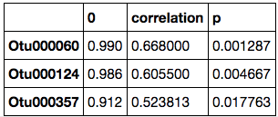
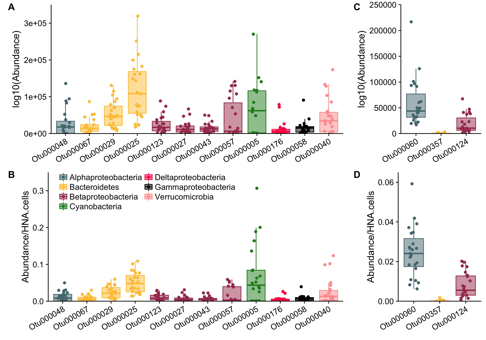

# HNA_LNA_productivity
Investigate composition of HNA/LNA populations and relate them to the productivity of lake Muskegon

## Randomized Lasso

On March 17th, @prubbens performed a randomized lasso in *analysis_prod2.ipynb* that pulled out the following **12** OTUs that are associated with heterotrophic productivity:

The **taxonomy** associated with the above OTUs (from `data/Chloroplasts_removed/nochloro_taxonomy.tsv`) is:  

OTU   | Phylum | Class | Order | Family  |  Genus  | Species  | 
------------- | ------------- | ------------- |------------- |------------- |------------- |------------- |
**Otu000123** | Proteobacteria | Betaproteobacteria | Burkholderiales | betVII | betVII-B | betVII-B1 | 
**Otu000027** | Proteobacteria | Betaproteobacteria | Burkholderiales | betI | betI-B | Rhodo  | 
**Otu000043** | Proteobacteria | Betaproteobacteria | Burkholderiales | betI | betI-A | Lhab-A2 | 
**Otu000057** | Proteobacteria | Betaproteobacteria | Methylophilales | betIV | betIV-A | Unclassified | 
**Otu000176** | Proteobacteria | Deltaproteobacteria | Bdellovibrionales | Bacteriovoracaceae | Peredibacter | Unclassified | 
**Otu000005** | Cyanobacteria | Cyanobacteria | SubsectionI | FamilyI | Unclassified | Unclassified | 
**Otu000048** | Proteobacteria | Alphaproteobacteria | Rhodospirillales | alfVIII | alfVIII_unclassified | Unclassified | 
**Otu000040** | Verrucomicrobia | Verrucomicrobia_unclassified | Verrucomicrobia_unclassified | Verrucomicrobia_unclassified |  Verrucomicrobia_unclassified | Unclassified | 
**Otu000058** | Proteobacteria | Gammaproteobacteria | Methylococcales | gamI | gamI_unclassified | Unclassified | 
**Otu000067** | Bacteroidetes | Flavobacteriia | Flavobacteriales | bacII | bacII-A | Unclassified | 
**Otu000029** | Bacteroidetes | Cytophagia | Cytophagales | bacIII | bacIII-B | Algor | 
**Otu000025** | Bacteroidetes | Cytophagia | Cytophagales | bacIII | bacIII-A | Unclassified | 

                
                
                
                
## CorrFilt

On Wednesday, April 5th @prubbens ran an analysis without the three outliers and with an additional correlational filtering step.  His analysis is in `analysis_prod2_corrfiltering.ipynb` and pulled out the following **3** OTUs that are associated with heterotrophic productivity:

                
                
OTU   | Phylum | Class | Order | Family  |  Genus  | Species  | 
------------- | ------------- | ------------- |------------- |------------- |------------- |------------- |             
**Otu000060** | Bacteria | Proteobacteria | Alphaproteobacteria | Sphingomonadales | alfIV | alfIV_unclassified | Unclassified |   
**Otu000357** | Bacteria | Proteobacteria | Betaproteobacteria | Burkholderiales | betI | betI-B | Rhodo  |   
**Otu000124** | Bacteria | Verrucomicrobia | Opitutae | Opitutales | Opitutaceae | Opitutus | Unclassified |  

                