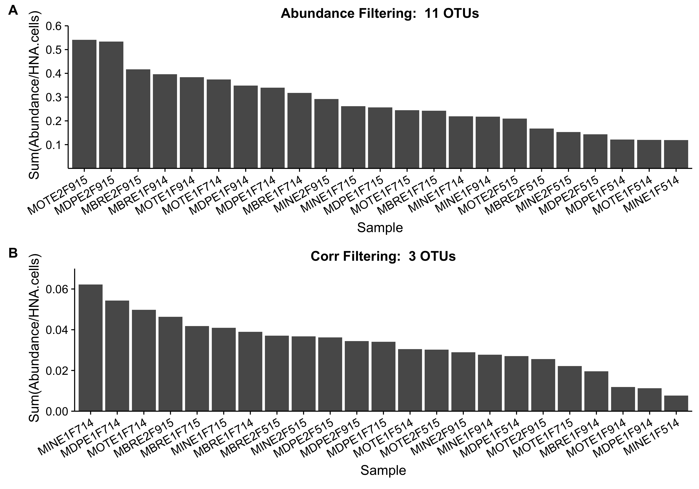
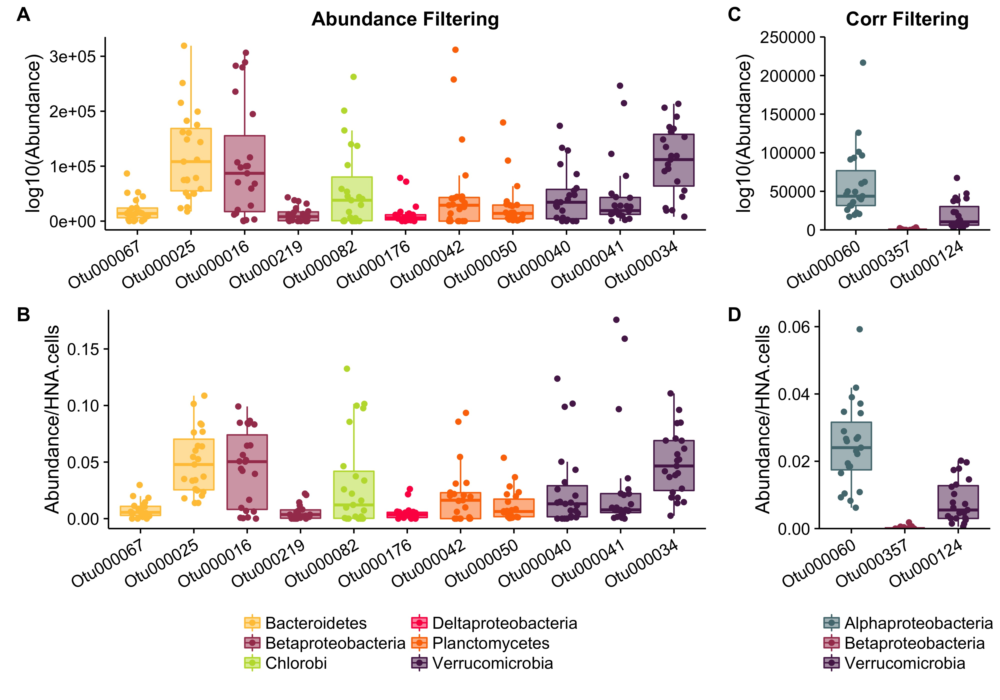
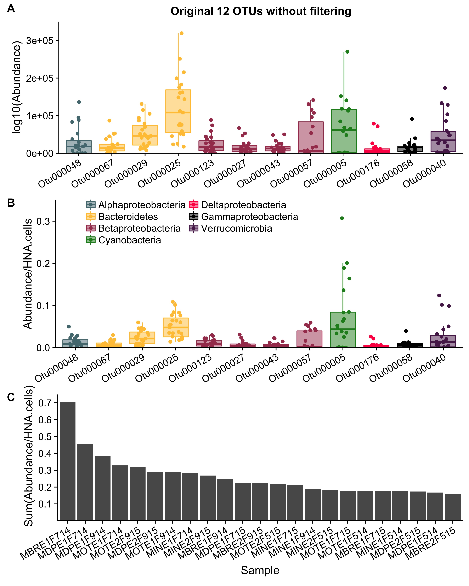

# Link OTUs in the HNA population to Productivity

Investigate composition of HNA/LNA populations and relate them to the productivity of **Muskegon Lake** 

## Abundance Filtering:  11 OTUs
On Wednesday, April 5th @prubbens ran an analysis without the three outliers.  His analysis is in `analysis_prod2_remov_outliers.ipynb` and pulled out the following **11** OTUs that are associated with heterotrophic productivity:

OTU | Phylum | Class | Order | Family  |  Genus  | Species  | 
------------- | ------------- | ------------- |------------- |------------- |------------- |------------- |      
**Otu000016** | Proteobacteria | Betaproteobacteria | Burkholderiales | betII | Pnec | PnecB | 
**Otu000025** | Bacteroidetes | Cytophagia | Cytophagales | bacIII | bacIII-A | Unclassified | 
**Otu000034** | Verrucomicrobia | Opitutae | Opitutae_vadinHA64 | Opitutae_vadinHA64_unclassified | Unclassified | Unclassified | 
**Otu000040** | Verrucomicrobia | Verrucomicrobia_unclassified | Verrucomicrobia_unclassified | Verrucomicrobia_unclassified | Verrucomicrobia_unclassified | Unclassified | 
**Otu000041** | Verrucomicrobia | [Spartobacteria] | [Chthoniobacterales] | verI-B | Xip-B1 | Unclassified | 
**Otu000042** | Planctomycetes | Phycisphaerae | Phycisphaerales | Phycisphaeraceae | CL500-3 | Unclassified | 
**Otu000050** | Planctomycetes | Phycisphaerae | Phycisphaerales | Phycisphaeraceae | CL500-3 | Unclassified | 
**Otu000067** | Bacteroidetes | Flavobacteriia | Flavobacteriales | bacII | bacII-A | Unclassified | 
**Otu000082** | Chlorobi | Chlorobia | Chlorobiales | OPB56 | Unclassified | Unclassified | 
**Otu000176** | Proteobacteria | Deltaproteobacteria | Bdellovibrionales | Bacteriovoracaceae | Peredibacter | Unclassified | 
**Otu000219** | Proteobacteria | Betaproteobacteria | Burkholderiales | betIII | betIII-A | betIII-A1  | 

           
                
## CorrFilt: 3 OTUs

On Wednesday, April 5th @prubbens ran an analysis without the three outliers and with an additional correlational filtering step.  His analysis is in `analysis_prod2_corrfiltering.ipynb` and pulled out the following **3** OTUs that are associated with heterotrophic productivity:

                
                
OTU | Phylum | Class | Order | Family  |  Genus  | Species  | 
------------- | ------------- | ------------- |------------- |------------- |------------- |------------- |             
**Otu000060** | Proteobacteria | Alphaproteobacteria | Sphingomonadales | alfIV | alfIV_unclassified | Unclassified |   
**Otu000357** | Proteobacteria | Betaproteobacteria | Burkholderiales | betI | betI-B | Rhodo  |   
**Otu000124** | Verrucomicrobia | Opitutae | Opitutales | Opitutaceae | Opitutus | Unclassified |  

### Figure 1
    

From the above plot, it is clear that the 11 otus pulled out with the **abundance filtering** randomized lasso makes up a *larger* fraction of the sample HNA pool (Figure A) compared to the 3 OTUs pulled out with the corr filtering (Figure B).

In fact, the difference in the make up of the HNA pool in the abundance filtering versus the corr filtering approach is an order of magnitude!  

### Figure 2

   
        

The OTUs in Figure 2 represent different OTUs than had been pulled out from the model before (see 12 OTUs in the analysis below in Figure 3).  Now there are a few new **Phyla** that were not pulled out before at the absence of others:  

- New Phyla:  
    - *Planctomycetes*  
    - *Chlorobi*
    
- Absent Phyla: 
    - *Alphaproteobacteria*  
    - *Cyanobacteria*  
    - *Gammaproteobacteria*

--------------------------------------------------------------------------------------------------------------
--------------------------------------------------------------------------------------------------------------

## Randomized Lasso

On March 17th, @prubbens performed a randomized lasso in *analysis_prod2.ipynb* that pulled out the following **12** OTUs that are associated with heterotrophic productivity:

The **taxonomy** associated with the above OTUs (from `data/Chloroplasts_removed/nochloro_taxonomy.tsv`) is:  

OTU   | Phylum | Class | Order | Family  |  Genus  | Species  | 
------------- | ------------- | ------------- |------------- |------------- |------------- |------------- |
**Otu000123** | Proteobacteria | Betaproteobacteria | Burkholderiales | betVII | betVII-B | betVII-B1 | 
**Otu000027** | Proteobacteria | Betaproteobacteria | Burkholderiales | betI | betI-B | Rhodo  | 
**Otu000043** | Proteobacteria | Betaproteobacteria | Burkholderiales | betI | betI-A | Lhab-A2 | 
**Otu000057** | Proteobacteria | Betaproteobacteria | Methylophilales | betIV | betIV-A | Unclassified | 
**Otu000176** | Proteobacteria | Deltaproteobacteria | Bdellovibrionales | Bacteriovoracaceae | Peredibacter | Unclassified | 
**Otu000005** | Cyanobacteria | Cyanobacteria | SubsectionI | FamilyI | Unclassified | Unclassified | 
**Otu000048** | Proteobacteria | Alphaproteobacteria | Rhodospirillales | alfVIII | alfVIII_unclassified | Unclassified | 
**Otu000040** | Verrucomicrobia | Verrucomicrobia_unclassified | Verrucomicrobia_unclassified | Verrucomicrobia_unclassified |  Verrucomicrobia_unclassified | Unclassified | 
**Otu000058** | Proteobacteria | Gammaproteobacteria | Methylococcales | gamI | gamI_unclassified | Unclassified | 
**Otu000067** | Bacteroidetes | Flavobacteriia | Flavobacteriales | bacII | bacII-A | Unclassified | 
**Otu000029** | Bacteroidetes | Cytophagia | Cytophagales | bacIII | bacIII-B | Algor | 
**Otu000025** | Bacteroidetes | Cytophagia | Cytophagales | bacIII | bacIII-A | Unclassified | 

                
### Figure 3                
      