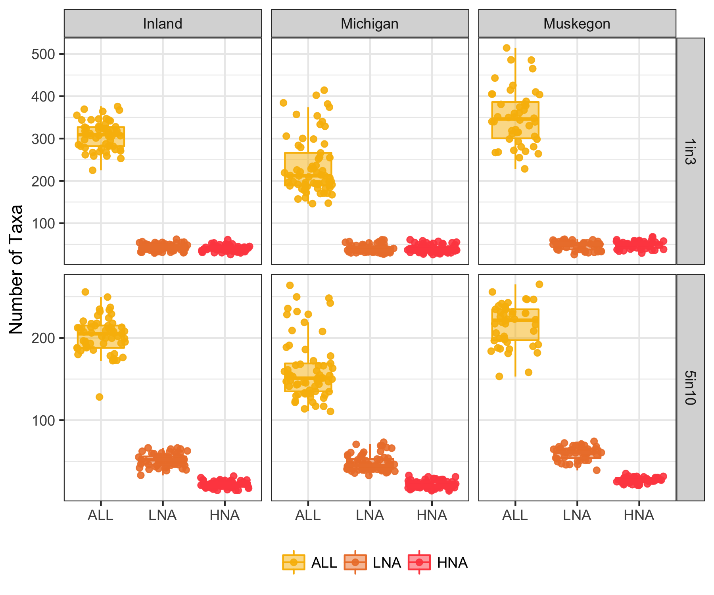
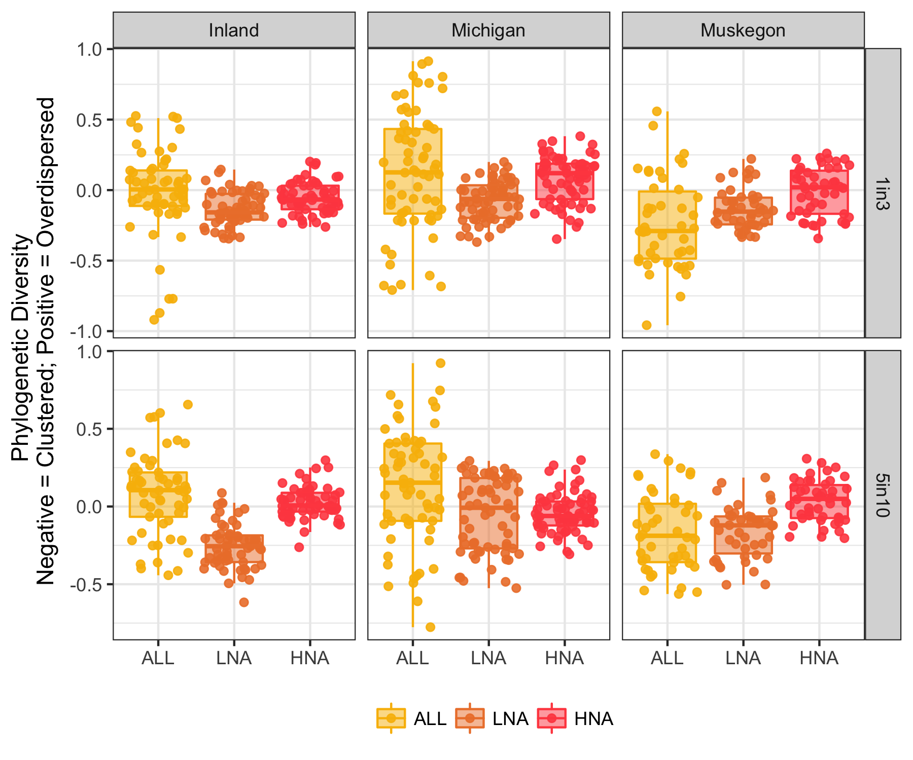
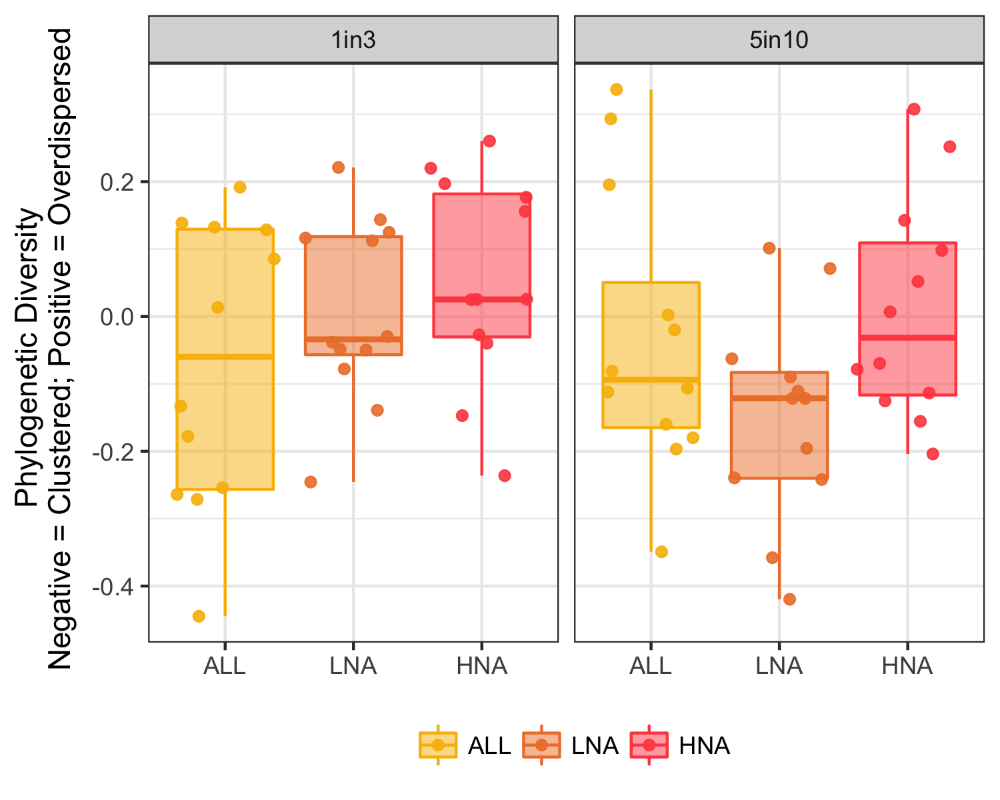

## Date: November 26th

1. Re-created [HNA-LNA-physeq_1in3.RData](HNA-LNA-physeq_1in3.RData) based off of Peter's updates. ([HNA-LNA-physeq_5in10.RData](HNA-LNA-physeq_5in10.RData) stayed the same).  
2. Using code in [make_tuned_phyloseq.R](make_tuned_phyloseq.R), created new phyloseq object [ALL-physeq-for-phylo.RData](ALL-physeq-for-phylo.RData) that has 3 of each samples: all otus, LNA otus, and HNA otus.  
3. [ALL-physeq-for-phylo.RData](ALL-physeq-for-phylo.RData)  was then used to calculate the phylogenetic diversity on UofM flux with code in [calc_phylo_div.R](calc_phylo_div.R).  Two files were written out, including:  

    a.  [unweighted_MPD_1seqs_in_3samps.tsv](unweighted_MPD_1seqs_in_3samps.tsv)
    b.  [unweighted_MPD_5seqs_in_10perc.tsv](unweighted_MPD_5seqs_in_10perc.tsv)
    
4. Finally, performed a brief phylogenetic diversity analysis in [phylo_analysis.R](phylo_analysis.R) in which figures were created and put into the [phylo_analysis_figures](phylo_analysis_figures) folder.  Which has the following three figures:  











## Date: November 13th, 2017

Phylogenetic analysis of 2 types of data found in the two following folders:  

- `5seqs_in_10percent_samples`  
- `1seq_in_3samples`  

This process took several steps including:   

1. Create a file with the OTU names in the two analyses (note that all the OTUs present in `5seqs_in_10percent_samples` are also present in `1seq_in_3samples`).  

2. Run bbmap's `filterbyname.sh` function in the commandline to get the fasta sequences for the respective OTUs in the two types of above analyses. 

        - To do so, run the following code in each of the two folders listed at the top of this file: 
        
        ```
        # In data/Chloroplasts_removed/Nov2017_Filtering/1seq_in_3samples
        ~/bbmap/filterbyname.sh in=../../../fasttree/cut_test.fasta names=OTUnames_1seq_in_3samps.txt out=OTUsubset_1seq_in_3samps.fasta -include t
        
        # In data/Chloroplasts_removed/Nov2017_Filtering/5seqs_in_10percent_samples
        ~/bbmap/filterbyname.sh in=../../../fasttree/cut_test.fasta names=OTUnames_5seqs_in_10perc.txt out=OTUsubset_5seqs_in_10perc.fasta -include t
        ```

3. The above step creates "N" in the place of "-", so we must replace that using the `sed` command: 

      ```
      sed 's/N/-/g' OTUsubset_1seq_in_3samps.fasta > OTUsubset_1seq_in_3samps_rmN.fasta
      # AND 
      sed 's/N/-/g' OTUsubset_5seqs_in_10perc.fasta > OTUsubset_5seqs_in_10perc_rmN.fasta
      ```
Now we have fasta files for the OTUs in each of the analyses and we can create our tree with FastTree!  


