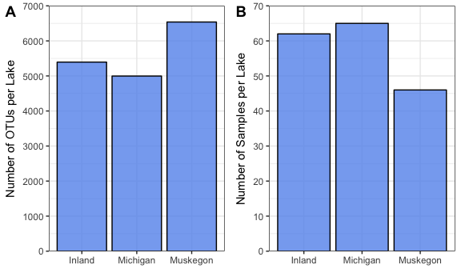
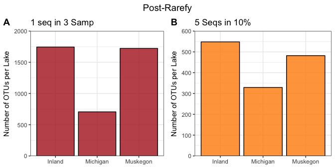

-   [Purpose of this Script](#purpose-of-this-script)
-   [Load Libraries](#load-libraries)
-   [Load Data](#load-data)
-   [Remove Outlier Samples](#remove-outlier-samples)
-   [Remove Chloroplasts](#remove-chloroplasts)
-   [By Lake](#by-lake)
-   [Prevalence Filtering](#prevalence-filtering)
    -   [At least 1 sequence in 3 samples](#at-least-1-sequence-in-3-samples)
    -   [At least 5 sequences in 10 percent of samples](#at-least-5-sequences-in-10-percent-of-samples)
-   [Rarefy for Relative Abundances](#rarefy-for-relative-abundances)
    -   [1in3](#in3)
    -   [5in10](#in10)
-   [Visualize Number of OTUs](#visualize-number-of-otus)
    -   [What are the differences in OTUs between the two filtering methods?](#what-are-the-differences-in-otus-between-the-two-filtering-methods)
-   [Absolute Abundances](#absolute-abundances)
    -   [1in3](#in3-1)
    -   [5in10](#in10-1)
-   [Write files](#write-files)
    -   [Muskegon](#muskegon)
    -   [Michigan](#michigan)
    -   [Inland](#inland)

Purpose of this Script
----------------------

To remove chloroplasts from data and output 6 types of data including:

-   1-3: 1seq3samps: Inland, Lake, MI, Muskegon
-   4-6: 5seq10perc: Inland, Lake, MI, Muskegon

Load Libraries
--------------

``` r
library("ggplot2")    # Pretty Plotting
library("dplyr")      # Data Manipulation
library("phyloseq")   # Easy microbiome analysis
library("cowplot")    # For multiple plotting
```

Load Data
---------

``` r
############## Load in raw data
load("../phyloseq.RData")
physeq.otu@otu_table <- t(physeq.otu@otu_table)

############## Clean up the metadata file
metadata <- read.csv2("../metadata.csv", stringsAsFactors = FALSE)
metadata <- metadata[metadata$Platform == "Accuri",]
metadata$Sample_fcm <- gsub(metadata$Sample_fcm, pattern="_rep.*", replacement="")
metadata <- do.call(rbind,by(metadata, INDICES = factor(metadata$Sample_fcm), 
                             FUN = unique))
metadata$Sample_16S[metadata$Lake=="Inland"] <- gsub(metadata$Sample_16S[metadata$Lake=="Inland"], pattern="-", replacement="")
# ADD THE Lake MI MLB samples to Lake == Muskegon
metadata <- mutate(metadata, Lake = ifelse(Site == "MLB", "Muskegon", Lake))


############## Import counts 
counts <- read.csv2("../count_total_HNALNA.csv", stringsAsFactors = FALSE)
counts$samples[125:188] <- paste0(counts$samples[125:188],"-1")

# Merge metadata 
counts.total <- inner_join(counts, metadata, by=c("samples"="Sample_fcm"))

# replace unnecessary "-"
sample_names(physeq.otu) <- gsub(sample_names(physeq.otu),pattern="-",replacement="")

#remove cDNA
otu_table(physeq.otu) <- otu_table(physeq.otu)[grep(x=sample_names(physeq.otu),pattern="cD.",invert=TRUE), ]

# remove "renamed" tag
sample_names(physeq.otu) <- gsub(sample_names(physeq.otu),pattern=".renamed",replacement="")

### Select the metadata for which there is sequencing data (876 samples at this point)
temp1 <- counts.total 
temp2 <- data.frame(Sample=sample_names(physeq.otu))
temp3 <- semi_join(temp1,temp2,by=c("Sample_16S"="Sample"))
```

    ## Warning: Column `Sample_16S`/`Sample` joining character vector and factor,
    ## coercing into character vector

``` r
rownames(temp3) <- temp3$Sample
sample_data(physeq.otu) <- temp3

# Current phyloseq object
physeq.otu
```

    ## phyloseq-class experiment-level object
    ## otu_table()   OTU Table:         [ 13370 taxa and 175 samples ]
    ## sample_data() Sample Data:       [ 175 samples by 17 sample variables ]
    ## tax_table()   Taxonomy Table:    [ 13370 taxa by 7 taxonomic ranks ]

Remove Outlier Samples
----------------------

``` r
outlier_samples <- c("Z14055F", "Z14003F", "Z14007F", "Z14023F", "Z14011F")

# Function to do 'is not in'
'%!in%' <- function(x,y)!('%in%'(x,y))

# Remove the outliers
physeq.otu.rmoutliers <- subset_samples(physeq.otu, sample_names(physeq.otu) %!in% outlier_samples) %>%
  # Prune out the OTUs that were unique to the outlier samples 
    prune_taxa(taxa_sums(.) > 0, .) 
physeq.otu.rmoutliers
```

    ## phyloseq-class experiment-level object
    ## otu_table()   OTU Table:         [ 9607 taxa and 170 samples ]
    ## sample_data() Sample Data:       [ 170 samples by 17 sample variables ]
    ## tax_table()   Taxonomy Table:    [ 9607 taxa by 7 taxonomic ranks ]

There were 3763 OTUs that were unique to these 4 anoxic hypolimnion samples!

Remove Chloroplasts
-------------------

``` r
no_chloro_physeq <- subset_taxa(physeq.otu, Rank3 != "Chloroplast") %>% # Remove Chloroplasts!
  prune_taxa(taxa_sums(.) > 0, .) 

# Calculate the sequencing depth of each sample
sums <- data.frame(Sample_16S=as.character(names(sample_sums(no_chloro_physeq))),
                   Total_Sequences=sample_sums(no_chloro_physeq), row.names=NULL)
sums_data <- left_join(data.frame(sample_data(no_chloro_physeq)), sums, by = "Sample_16S")
```

    ## Warning: Column `Sample_16S` joining character vector and factor, coercing
    ## into character vector

``` r
row.names(sums_data) <- sums_data$Sample_16S
sample_data(no_chloro_physeq) <- sums_data

# Remove samples with low sequencing depth 
no_chloro_physeq_pruned <- subset_samples(no_chloro_physeq, Total_Sequences > 4700) %>%
  # Now we have removed samples that have 4700 sequences or less 
  prune_taxa(taxa_sums(.) > 0, .)  # Remove OTUs with counts 0 and less

# Phyloseq object with pruned samples and no chloroplasts
no_chloro_physeq_pruned
```

    ## phyloseq-class experiment-level object
    ## otu_table()   OTU Table:         [ 8913 taxa and 173 samples ]
    ## sample_data() Sample Data:       [ 173 samples by 18 sample variables ]
    ## tax_table()   Taxonomy Table:    [ 8913 taxa by 7 taxonomic ranks ]

There were 694 OTUs that were chloroplasts!

By Lake
-------

``` r
# Create a phyloseq object for each environment/lake: Lake MI, Muskegon, Inland Lakes
muskegon_physeq <- subset_samples(no_chloro_physeq_pruned, Lake == "Muskegon") %>%
  prune_taxa(taxa_sums(.) > 0, .) 

michigan_physeq <- subset_samples(no_chloro_physeq_pruned, Lake == "Michigan") %>%
  prune_taxa(taxa_sums(.) > 0, .) 

inland_physeq <- subset_samples(no_chloro_physeq_pruned, Lake == "Inland") %>%
  prune_taxa(taxa_sums(.) > 0, .) 

df <- data.frame(c(ntaxa(muskegon_physeq), ntaxa(michigan_physeq), ntaxa(inland_physeq)),
                 c(nsamples(muskegon_physeq), nsamples(michigan_physeq), nsamples(inland_physeq)),
                 c("Muskegon","Michigan","Inland")) 
colnames(df) <- c("NumOTUs", "NumSamples","Lake")

p1 <- ggplot(df, aes(x = Lake, y = NumOTUs)) + ylab("Number of OTUs per Lake") +
  geom_bar(stat = "identity", fill = "cornflowerblue", color = "black", alpha = 0.8) +
  scale_y_continuous(expand = c(0,0), limits = c(0,7500), breaks = seq(0,7500, by = 1000)) +
  theme_bw() + theme(axis.title.x = element_blank())

p2 <- ggplot(df, aes(x = Lake, y = NumSamples)) + ylab("Number of Samples per Lake") +
  geom_bar(stat = "identity", fill = "cornflowerblue", color = "black", alpha = 0.8) +
  scale_y_continuous(expand = c(0,0), limits = c(0,70), breaks = seq(0,70, by = 10)) +
  theme_bw() + theme(axis.title.x = element_blank())

plotz <- plot_grid(p1, p2, labels = c("A", "B"), nrow = 1, ncol =2)
title <- ggdraw() + draw_label("Pre-Rarefy")

plot_grid(title, plotz, ncol=1, rel_heights=c(0.1, 1)) # rel_heights values control title margins
```



Prevalence Filtering
--------------------

On November 6th we decided to run the analysis 2 ways:

1.  Liberal Cutoff: Remove OTUs that have only one sequence in three samples.
2.  Conservative Cutoff: Remove OTUs that have less than 5 sequences in 10% of samples

From now on, there will be 6 phyloseq objects (instead of 3 for the 3 lake types.

### At least 1 sequence in 3 samples

``` r
######### 1 sequence in at least 3 of the samples 
# Remove OTUs that have only one sequence in three samples 

## Muskegon
musk_filter_1in3 <- 3/nsamples(muskegon_physeq)
muskegon_physeq_1in3 <- filter_taxa(muskegon_physeq, function(x) sum(x > 1) > (musk_filter_1in3*length(x)), TRUE)

## Michigan
mich_filter_1in3 <- 3/nsamples(michigan_physeq)
michigan_physeq_1in3 <- filter_taxa(michigan_physeq, function(x) sum(x > 1) > (mich_filter_1in3*length(x)), TRUE)

## Inland 
inland_filter_1in3 <- 3/nsamples(inland_physeq)
inland_physeq_1in3 <- filter_taxa(inland_physeq, function(x) sum(x > 1) > (inland_filter_1in3*length(x)), TRUE)
```

### At least 5 sequences in 10 percent of samples

``` r
# Remove OTUs that have less than 5 sequences in 10% of samples
filter_value <- 0.10

## Muskegon
muskegon_physeq_5in10 <- filter_taxa(muskegon_physeq, function(x) sum(x > 5) > (filter_value*length(x)), TRUE)

## Michigan
michigan_physeq_5in10 <- filter_taxa(michigan_physeq, function(x) sum(x > 5) > (filter_value*length(x)), TRUE)

## Inland 
inland_physeq_5in10 <- filter_taxa(inland_physeq, function(x) sum(x > 5) > (filter_value*length(x)), TRUE)
```

Rarefy for Relative Abundances
==============================

1in3
----

``` r
# Set the seed for the randomization of rarefy-ing
set.seed(777)

## Muskegon
musk_minlib_1in3 <- min(sample_sums(muskegon_physeq_1in3)) - 1
musk_minlib_1in3 # 8153 is the smallest library size
```

    ## [1] 4678

``` r
# Rarefy to the even depth 
rare_muskegon_physeq_1in3 <- rarefy_even_depth(muskegon_physeq_1in3, sample.size = musk_minlib_1in3, verbose = FALSE, replace = TRUE)
# Sanity Check - Samples all have sample counts of 4760
apply(otu_table(rare_muskegon_physeq_1in3), 1, sum)
```

    ## Fa13.BD.MLB.DN.1 Fa13.BD.MLB.SN.1        MBRE1F714        MBRE1F914 
    ##             4678             4678             4678             4678 
    ##        MBRE1F715        MBRE2F515        MBRE2F915        MBRH1F714 
    ##             4678             4678             4678             4678 
    ##        MBRH1F914        MBRH1F715        MBRH2F515        MBRH2F915 
    ##             4678             4678             4678             4678 
    ##        MDPE1F514        MDPE1F714        MDPE1F914        MDPE1F715 
    ##             4678             4678             4678             4678 
    ##        MDPE2F515        MDPE2F915        MDPH1F714        MDPH1F914 
    ##             4678             4678             4678             4678 
    ##        MDPH1F715        MDPH2F514        MDPH2F515        MDPH2F915 
    ##             4678             4678             4678             4678 
    ##        MINE1F514        MINE1F714        MINE1F914        MINE1F715 
    ##             4678             4678             4678             4678 
    ##        MINE2F515        MINE2F915        MINH1F514        MINH1F714 
    ##             4678             4678             4678             4678 
    ##        MINH1F914        MINH1F715        MINH2F515        MINH2F915 
    ##             4678             4678             4678             4678 
    ##        MLBD2F115        MLBD2F415        MLBD2F515        MLBD2F715 
    ##             4678             4678             4678             4678 
    ##        MLBD2F815        MLBD2F915        MLBS2F115        MLBS2F515 
    ##             4678             4678             4678             4678 
    ##        MLBS2F715        MLBS2F815        MLBS2F915        MOTE1F514 
    ##             4678             4678             4678             4678 
    ##        MOTE1F714        MOTE1F914        MOTE1F715        MOTE2F515 
    ##             4678             4678             4678             4678 
    ##        MOTE2F915        MOTH1F714        MOTH1F914        MOTH1F715 
    ##             4678             4678             4678             4678 
    ##        MOTH1F915        MOTH2F514        MOTH2F515 Sp13.BD.MLB.SN.1 
    ##             4678             4678             4678             4678 
    ## Su13.BD.MLB.DD.1 Su13.BD.MLB.SD.1 
    ##             4678             4678

``` r
### New phyloseq objects with relative abundances
rare_muskegon_physeq_1in3_rel <- transform_sample_counts(rare_muskegon_physeq_1in3, function(x) x/sum(x))
# Sanity Check to make sure all relative abundances are 1
stopifnot(sum(apply(otu_table(rare_muskegon_physeq_1in3_rel), 1, sum)) == nsamples(rare_muskegon_physeq_1in3_rel))
### Replacing NA by "Unclassified"
tax_table(rare_muskegon_physeq_1in3_rel)[is.na(tax_table(rare_muskegon_physeq_1in3_rel))] <- "Unclassified"
# Final Relative Abundance Phyloseq Object for Muskgeon
rare_muskegon_physeq_1in3_rel
```

    ## phyloseq-class experiment-level object
    ## otu_table()   OTU Table:         [ 1723 taxa and 62 samples ]
    ## sample_data() Sample Data:       [ 62 samples by 18 sample variables ]
    ## tax_table()   Taxonomy Table:    [ 1723 taxa by 7 taxonomic ranks ]

``` r
## Michigan
mich_minlib_1in3 <- min(sample_sums(michigan_physeq_1in3)) - 1
mich_minlib_1in3 # 4604 is the smallest library size
```

    ## [1] 5935

``` r
# Rarefy to the even depth 
rare_michigan_physeq_1in3 <- rarefy_even_depth(michigan_physeq_1in3, sample.size = mich_minlib_1in3, verbose = FALSE, replace = TRUE)
# Sanity Check - Samples all have sample counts of 4760
apply(otu_table(rare_michigan_physeq_1in3), 1, sum)
```

    ##            110D2F115            110D2F415            110D2F515 
    ##                 5935                 5935                 5935 
    ##            110D2F715            110D2F815            110D2F915 
    ##                 5935                 5935                 5935 
    ##            110M2F115            110M2F415            110M2F515 
    ##                 5935                 5935                 5935 
    ##            110M2F715            110S2F115            110S2F415 
    ##                 5935                 5935                 5935 
    ##            110S2F515            110S2F715            110S2F915 
    ##                 5935                 5935                 5935 
    ##   Fa13.BD.MM110.DN.1   Fa13.BD.MM110.SD.1   Fa13.BD.MM110.SN.1 
    ##                 5935                 5935                 5935 
    ##    Fa13.BD.MM15.DN.1    Fa13.BD.MM15.SD.1    Fa13.BD.MM15.SN.1 
    ##                 5935                 5935                 5935 
    ##            M15S2F115            M15S2F515            M15S2F715 
    ##                 5935                 5935                 5935 
    ##            M15S2F815            M15S2F915            M45D2F115 
    ##                 5935                 5935                 5935 
    ##            M45D2F415            M45D2F515            M45D2F715 
    ##                 5935                 5935                 5935 
    ##            M45D2F815            M45D2F915            M45S2F415 
    ##                 5935                 5935                 5935 
    ##            M45S2F515            M45S2F715            M45S2F815 
    ##                 5935                 5935                 5935 
    ##            M45S2F915   Sp13.BD.MM110.SD.1   Sp13.BD.MM110.SN.1 
    ##                 5935                 5935                 5935 
    ##    Sp13.BD.MM15.DD.1    Sp13.BD.MM15.SD.1    Sp13.BD.MM15.SN.1 
    ##                 5935                 5935                 5935 
    ## Su13.BD.MM110.DCMD.1   Su13.BD.MM110.DN.1   Su13.BD.MM110.SD.1 
    ##                 5935                 5935                 5935 
    ##   Su13.BD.MM110.SN.1    Su13.BD.MM15.DN.1    Su13.BD.MM15.SD.1 
    ##                 5935                 5935                 5935 
    ##    Su13.BD.MM15.SN.1 
    ##                 5935

``` r
### New phyloseq objects with relative abundances
rare_michigan_physeq_1in3_rel <- transform_sample_counts(rare_michigan_physeq_1in3, function(x) x/sum(x))
# Sanity Check to make sure all relative abundances are 1
stopifnot(sum(apply(otu_table(rare_michigan_physeq_1in3_rel), 1, sum)) == nsamples(rare_michigan_physeq_1in3_rel))
### Replacing NA by "Unclassified"
tax_table(rare_michigan_physeq_1in3_rel)[is.na(tax_table(rare_michigan_physeq_1in3_rel))] <- "Unclassified"
# Final Relative Abundance Phyloseq Object for Michigan
rare_michigan_physeq_1in3_rel
```

    ## phyloseq-class experiment-level object
    ## otu_table()   OTU Table:         [ 706 taxa and 49 samples ]
    ## sample_data() Sample Data:       [ 49 samples by 18 sample variables ]
    ## tax_table()   Taxonomy Table:    [ 706 taxa by 7 taxonomic ranks ]

``` r
## Inland
inland_minlib_1in3 <- min(sample_sums(inland_physeq_1in3)) - 1
inland_minlib_1in3 # 9620 is the smallest library size
```

    ## [1] 9620

``` r
# Rarefy to the even depth 
rare_inland_physeq_1in3 <- rarefy_even_depth(inland_physeq_1in3, sample.size = inland_minlib_1in3, verbose = FALSE, replace = TRUE)
# Sanity Check - Samples all have sample counts of 4760
apply(otu_table(rare_inland_physeq_1in3), 1, sum)
```

    ## Z14001F Z14002F Z14003F Z14004F Z14005F Z14006F Z14007F Z14008F Z14009F 
    ##    9620    9620    9620    9620    9620    9620    9620    9620    9620 
    ## Z14010F Z14011F Z14012F Z14013F Z14014F Z14016F Z14017F Z14018F Z14019F 
    ##    9620    9620    9620    9620    9620    9620    9620    9620    9620 
    ## Z14020F Z14021F Z14022F Z14023F Z14024F Z14025F Z14026F Z14027F Z14028F 
    ##    9620    9620    9620    9620    9620    9620    9620    9620    9620 
    ## Z14029F Z14030F Z14031F Z14032F Z14033F Z14034F Z14035F Z14036F Z14037F 
    ##    9620    9620    9620    9620    9620    9620    9620    9620    9620 
    ## Z14038F Z14039F Z14040F Z14041F Z14042F Z14043F Z14044F Z14045F Z14046F 
    ##    9620    9620    9620    9620    9620    9620    9620    9620    9620 
    ## Z14047F Z14048F Z14050F Z14053F Z14055F Z14057F Z14059F Z14061F Z14063F 
    ##    9620    9620    9620    9620    9620    9620    9620    9620    9620 
    ## Z15065F Z15067F Z15069F Z15071F Z15073F Z15075F Z15077F Z15079F 
    ##    9620    9620    9620    9620    9620    9620    9620    9620

``` r
### New phyloseq objects with relative abundances
rare_inland_physeq_1in3_rel <- transform_sample_counts(rare_inland_physeq_1in3, function(x) x/sum(x))
# Sanity Check to make sure all relative abundances are 1
stopifnot(sum(apply(otu_table(rare_inland_physeq_1in3_rel), 1, sum)) == nsamples(rare_inland_physeq_1in3_rel))
### Replacing NA by "Unclassified"
tax_table(rare_inland_physeq_1in3_rel)[is.na(tax_table(rare_inland_physeq_1in3_rel))] <- "Unclassified"
# Final Relative Abundance Phyloseq Object for Inland
rare_inland_physeq_1in3_rel
```

    ## phyloseq-class experiment-level object
    ## otu_table()   OTU Table:         [ 1745 taxa and 62 samples ]
    ## sample_data() Sample Data:       [ 62 samples by 18 sample variables ]
    ## tax_table()   Taxonomy Table:    [ 1745 taxa by 7 taxonomic ranks ]

5in10
-----

``` r
# Set the seed for the randomization of rarefy-ing
set.seed(777)

###  NOW FOR THE TAXA THAT ARE 5 COUNTS IN AT 10% OF SAMPLES 

## Muskegon
musk_minlib_5in10 <- min(sample_sums(muskegon_physeq_5in10)) - 1
musk_minlib_5in10 # 7885 is the smallest library size 
```

    ## [1] 4491

``` r
# Rarefy to the even depth 
rare_muskegon_physeq_5in10 <- rarefy_even_depth(muskegon_physeq_5in10, sample.size = musk_minlib_5in10, verbose = FALSE, replace = TRUE)
# Sanity Check - Samples all have sample counts of 4760
apply(otu_table(rare_muskegon_physeq_5in10), 1, sum)
```

    ## Fa13.BD.MLB.DN.1 Fa13.BD.MLB.SN.1        MBRE1F714        MBRE1F914 
    ##             4491             4491             4491             4491 
    ##        MBRE1F715        MBRE2F515        MBRE2F915        MBRH1F714 
    ##             4491             4491             4491             4491 
    ##        MBRH1F914        MBRH1F715        MBRH2F515        MBRH2F915 
    ##             4491             4491             4491             4491 
    ##        MDPE1F514        MDPE1F714        MDPE1F914        MDPE1F715 
    ##             4491             4491             4491             4491 
    ##        MDPE2F515        MDPE2F915        MDPH1F714        MDPH1F914 
    ##             4491             4491             4491             4491 
    ##        MDPH1F715        MDPH2F514        MDPH2F515        MDPH2F915 
    ##             4491             4491             4491             4491 
    ##        MINE1F514        MINE1F714        MINE1F914        MINE1F715 
    ##             4491             4491             4491             4491 
    ##        MINE2F515        MINE2F915        MINH1F514        MINH1F714 
    ##             4491             4491             4491             4491 
    ##        MINH1F914        MINH1F715        MINH2F515        MINH2F915 
    ##             4491             4491             4491             4491 
    ##        MLBD2F115        MLBD2F415        MLBD2F515        MLBD2F715 
    ##             4491             4491             4491             4491 
    ##        MLBD2F815        MLBD2F915        MLBS2F115        MLBS2F515 
    ##             4491             4491             4491             4491 
    ##        MLBS2F715        MLBS2F815        MLBS2F915        MOTE1F514 
    ##             4491             4491             4491             4491 
    ##        MOTE1F714        MOTE1F914        MOTE1F715        MOTE2F515 
    ##             4491             4491             4491             4491 
    ##        MOTE2F915        MOTH1F714        MOTH1F914        MOTH1F715 
    ##             4491             4491             4491             4491 
    ##        MOTH1F915        MOTH2F514        MOTH2F515 Sp13.BD.MLB.SN.1 
    ##             4491             4491             4491             4491 
    ## Su13.BD.MLB.DD.1 Su13.BD.MLB.SD.1 
    ##             4491             4491

``` r
### New phyloseq objects with relative abundances
rare_muskegon_physeq_5in10_rel <- transform_sample_counts(rare_muskegon_physeq_5in10, function(x) x/sum(x))
# Sanity Check to make sure all relative abundances are 1
stopifnot(sum(apply(otu_table(rare_muskegon_physeq_5in10_rel), 1, sum)) == nsamples(rare_muskegon_physeq_5in10_rel))
### Replacing NA by "Unclassified"
tax_table(rare_muskegon_physeq_5in10_rel)[is.na(tax_table(rare_muskegon_physeq_5in10_rel))] <- "Unclassified"
# Final Relative Abundance Phyloseq Object 
rare_muskegon_physeq_5in10_rel
```

    ## phyloseq-class experiment-level object
    ## otu_table()   OTU Table:         [ 482 taxa and 62 samples ]
    ## sample_data() Sample Data:       [ 62 samples by 18 sample variables ]
    ## tax_table()   Taxonomy Table:    [ 482 taxa by 7 taxonomic ranks ]

``` r
## Michigan
mich_minlib_5in10 <- min(sample_sums(michigan_physeq_5in10)) - 1
mich_minlib_5in10 # 7885 is the smallest library size 
```

    ## [1] 5724

``` r
# Rarefy to the even depth 
rare_michigan_physeq_5in10 <- rarefy_even_depth(michigan_physeq_5in10, sample.size = mich_minlib_5in10, verbose = FALSE, replace = TRUE)
# Sanity Check - Samples all have sample counts of 4760
apply(otu_table(rare_michigan_physeq_5in10), 1, sum)
```

    ##            110D2F115            110D2F415            110D2F515 
    ##                 5724                 5724                 5724 
    ##            110D2F715            110D2F815            110D2F915 
    ##                 5724                 5724                 5724 
    ##            110M2F115            110M2F415            110M2F515 
    ##                 5724                 5724                 5724 
    ##            110M2F715            110S2F115            110S2F415 
    ##                 5724                 5724                 5724 
    ##            110S2F515            110S2F715            110S2F915 
    ##                 5724                 5724                 5724 
    ##   Fa13.BD.MM110.DN.1   Fa13.BD.MM110.SD.1   Fa13.BD.MM110.SN.1 
    ##                 5724                 5724                 5724 
    ##    Fa13.BD.MM15.DN.1    Fa13.BD.MM15.SD.1    Fa13.BD.MM15.SN.1 
    ##                 5724                 5724                 5724 
    ##            M15S2F115            M15S2F515            M15S2F715 
    ##                 5724                 5724                 5724 
    ##            M15S2F815            M15S2F915            M45D2F115 
    ##                 5724                 5724                 5724 
    ##            M45D2F415            M45D2F515            M45D2F715 
    ##                 5724                 5724                 5724 
    ##            M45D2F815            M45D2F915            M45S2F415 
    ##                 5724                 5724                 5724 
    ##            M45S2F515            M45S2F715            M45S2F815 
    ##                 5724                 5724                 5724 
    ##            M45S2F915   Sp13.BD.MM110.SD.1   Sp13.BD.MM110.SN.1 
    ##                 5724                 5724                 5724 
    ##    Sp13.BD.MM15.DD.1    Sp13.BD.MM15.SD.1    Sp13.BD.MM15.SN.1 
    ##                 5724                 5724                 5724 
    ## Su13.BD.MM110.DCMD.1   Su13.BD.MM110.DN.1   Su13.BD.MM110.SD.1 
    ##                 5724                 5724                 5724 
    ##   Su13.BD.MM110.SN.1    Su13.BD.MM15.DN.1    Su13.BD.MM15.SD.1 
    ##                 5724                 5724                 5724 
    ##    Su13.BD.MM15.SN.1 
    ##                 5724

``` r
### New phyloseq objects with relative abundances
rare_michigan_physeq_5in10_rel <- transform_sample_counts(rare_michigan_physeq_5in10, function(x) x/sum(x))
# Sanity Check to make sure all relative abundances are 1
stopifnot(sum(apply(otu_table(rare_michigan_physeq_5in10_rel), 1, sum)) == nsamples(rare_michigan_physeq_5in10_rel))
### Replacing NA by "Unclassified"
tax_table(rare_michigan_physeq_5in10_rel)[is.na(tax_table(rare_michigan_physeq_5in10_rel))] <- "Unclassified"
# Final Relative Abundance Phyloseq Object 
rare_michigan_physeq_5in10_rel
```

    ## phyloseq-class experiment-level object
    ## otu_table()   OTU Table:         [ 329 taxa and 49 samples ]
    ## sample_data() Sample Data:       [ 49 samples by 18 sample variables ]
    ## tax_table()   Taxonomy Table:    [ 329 taxa by 7 taxonomic ranks ]

``` r
## Inland
inland_minlib_5in10 <- min(sample_sums(inland_physeq_5in10)) - 1
inland_minlib_5in10 # 7885 is the smallest library size 
```

    ## [1] 9037

``` r
# Rarefy to the even depth 
rare_inland_physeq_5in10 <- rarefy_even_depth(inland_physeq_5in10, sample.size = inland_minlib_5in10, verbose = FALSE, replace = TRUE)
# Sanity Check - Samples all have sample counts of 4760
apply(otu_table(rare_inland_physeq_5in10), 1, sum)
```

    ## Z14001F Z14002F Z14003F Z14004F Z14005F Z14006F Z14007F Z14008F Z14009F 
    ##    9037    9037    9037    9037    9037    9037    9037    9037    9037 
    ## Z14010F Z14011F Z14012F Z14013F Z14014F Z14016F Z14017F Z14018F Z14019F 
    ##    9037    9037    9037    9037    9037    9037    9037    9037    9037 
    ## Z14020F Z14021F Z14022F Z14023F Z14024F Z14025F Z14026F Z14027F Z14028F 
    ##    9037    9037    9037    9037    9037    9037    9037    9037    9037 
    ## Z14029F Z14030F Z14031F Z14032F Z14033F Z14034F Z14035F Z14036F Z14037F 
    ##    9037    9037    9037    9037    9037    9037    9037    9037    9037 
    ## Z14038F Z14039F Z14040F Z14041F Z14042F Z14043F Z14044F Z14045F Z14046F 
    ##    9037    9037    9037    9037    9037    9037    9037    9037    9037 
    ## Z14047F Z14048F Z14050F Z14053F Z14055F Z14057F Z14059F Z14061F Z14063F 
    ##    9037    9037    9037    9037    9037    9037    9037    9037    9037 
    ## Z15065F Z15067F Z15069F Z15071F Z15073F Z15075F Z15077F Z15079F 
    ##    9037    9037    9037    9037    9037    9037    9037    9037

``` r
### New phyloseq objects with relative abundances
rare_inland_physeq_5in10_rel <- transform_sample_counts(rare_inland_physeq_5in10, function(x) x/sum(x))
# Sanity Check to make sure all relative abundances are 1
stopifnot(sum(apply(otu_table(rare_inland_physeq_5in10_rel), 1, sum)) == nsamples(rare_inland_physeq_5in10_rel))
### Replacing NA by "Unclassified"
tax_table(rare_inland_physeq_5in10_rel)[is.na(tax_table(rare_inland_physeq_5in10_rel))] <- "Unclassified"
# Final Relative Abundance Phyloseq Object 
rare_inland_physeq_5in10_rel
```

    ## phyloseq-class experiment-level object
    ## otu_table()   OTU Table:         [ 548 taxa and 62 samples ]
    ## sample_data() Sample Data:       [ 62 samples by 18 sample variables ]
    ## tax_table()   Taxonomy Table:    [ 548 taxa by 7 taxonomic ranks ]

Visualize Number of OTUs
========================

What are the differences in OTUs between the two filtering methods?
-------------------------------------------------------------------

``` r
# Visualize 1in3
df_1in3 <- data.frame(c(ntaxa(rare_muskegon_physeq_1in3_rel), ntaxa(rare_michigan_physeq_1in3_rel), ntaxa(rare_inland_physeq_1in3_rel)),
                 c("Muskegon","Michigan","Inland")) 
colnames(df_1in3) <- c("NumOTUs","Lake")
p_1in3 <- ggplot(df_1in3, aes(x = Lake, y = NumOTUs)) + ylab("Number of OTUs per Lake") +
  ggtitle("1 seq in 3 Samp") +
  geom_bar(stat = "identity", fill = "firebrick", color = "black", alpha = 0.8) +
  scale_y_continuous(expand = c(0,0), limits = c(0,2000), breaks = seq(0,2000, by = 500)) +
  theme_bw() + theme(axis.title.x = element_blank())

# Visualize 5in10
df_5in10 <- data.frame(c(ntaxa(rare_muskegon_physeq_5in10_rel), ntaxa(rare_michigan_physeq_5in10_rel), ntaxa(rare_inland_physeq_5in10_rel)),
                 c("Muskegon","Michigan","Inland")) 
colnames(df_5in10) <- c("NumOTUs","Lake")
p_5in10 <- ggplot(df_5in10, aes(x = Lake, y = NumOTUs)) + ylab("Number of OTUs per Lake") +
  ggtitle("5 Seqs in 10%") +
  geom_bar(stat = "identity", fill = "darkorange", color = "black", alpha = 0.8) +
  scale_y_continuous(expand = c(0,0), limits = c(0,600), breaks = seq(0,600, by = 100)) +
  theme_bw() + theme(axis.title.x = element_blank())

plot_numotus <- plot_grid(p_1in3, p_5in10, labels = c("A", "B"), nrow = 1, ncol =2)
title_2 <- ggdraw() + draw_label("Post-Rarefy")

plot_grid(title_2, plot_numotus, ncol=1, rel_heights=c(0.1, 1)) # rel_heights values control title margins
```



Rarefied at the following depths for 1in3:

-   muskegon: 4678
-   michigan: 5935
-   inland: 9620

Rarefied at the following depths for 5in10:

-   muskegon: 4491
-   michigan: 5724
-   inland: 9037

Absolute Abundances
===================

### 1in3

``` r
### New phyloseq object with absolute abundances in cells/mL
rare_muskegon_physeq_1in3_abs <- rare_muskegon_physeq_1in3_rel    # Muskegon
rare_michigan_physeq_1in3_abs <- rare_michigan_physeq_1in3_rel    # Michigan
rare_inland_physeq_1in3_abs <- rare_inland_physeq_1in3_rel        # inland

# Replace the OTU table 
otu_table(rare_muskegon_physeq_1in3_abs) <- 1000*otu_table(rare_muskegon_physeq_1in3_rel)*sample_data(rare_muskegon_physeq_1in3_rel)$Total.cells    # Muskegon
otu_table(rare_michigan_physeq_1in3_abs) <- 1000*otu_table(rare_michigan_physeq_1in3_rel)*sample_data(rare_michigan_physeq_1in3_rel)$Total.cells    # Michigan
otu_table(rare_inland_physeq_1in3_abs) <- 1000*otu_table(rare_inland_physeq_1in3_rel)*sample_data(rare_inland_physeq_1in3_rel)$Total.cells          # inland

### to cells/mL
## Muskegon
sample_data(rare_muskegon_physeq_1in3_rel)[,c(3:8)] <- sample_data(rare_muskegon_physeq_1in3_rel)[,c(3:8)]*1000    # Muskegon
sample_data(rare_muskegon_physeq_1in3_abs)[,c(3:8)] <- sample_data(rare_muskegon_physeq_1in3_abs)[,c(3:8)]*1000    # Muskegon
## Michigan
sample_data(rare_michigan_physeq_1in3_rel)[,c(3:8)] <- sample_data(rare_michigan_physeq_1in3_rel)[,c(3:8)]*1000    # Michigan
sample_data(rare_michigan_physeq_1in3_abs)[,c(3:8)] <- sample_data(rare_michigan_physeq_1in3_abs)[,c(3:8)]*1000    # Michigan
## Inland
sample_data(rare_inland_physeq_1in3_rel)[,c(3:8)] <- sample_data(rare_inland_physeq_1in3_rel)[,c(3:8)]*1000          # inland
sample_data(rare_inland_physeq_1in3_abs)[,c(3:8)] <- sample_data(rare_inland_physeq_1in3_abs)[,c(3:8)]*1000          # inland

# Sanity Check
apply(otu_table(rare_muskegon_physeq_1in3_abs), 1, sum)    # Muskegon
```

    ## Fa13.BD.MLB.DN.1 Fa13.BD.MLB.SN.1        MBRE1F714        MBRE1F914 
    ##          4233418          4454994         10104066          7206483 
    ##        MBRE1F715        MBRE2F515        MBRE2F915        MBRH1F714 
    ##          7420899          4326956          4895228          2684666 
    ##        MBRH1F914        MBRH1F715        MBRH2F515        MBRH2F915 
    ##          3475185          2309542          4833400          2827504 
    ##        MDPE1F514        MDPE1F714        MDPE1F914        MDPE1F715 
    ##          4412738          9365634          7360864          7539905 
    ##        MDPE2F515        MDPE2F915        MDPH1F714        MDPH1F914 
    ##          6095631          5522877          2792914          3348038 
    ##        MDPH1F715        MDPH2F514        MDPH2F515        MDPH2F915 
    ##          2703952          3112909          3070179          4146877 
    ##        MINE1F514        MINE1F714        MINE1F914        MINE1F715 
    ##          5465149         10419622          9447100          8596261 
    ##        MINE2F515        MINE2F915        MINH1F514        MINH1F714 
    ##          7217489          6647632          5416344          8911217 
    ##        MINH1F914        MINH1F715        MINH2F515        MINH2F915 
    ##          8404620          8121098          6695261          6566334 
    ##        MLBD2F115        MLBD2F415        MLBD2F515        MLBD2F715 
    ##          6482023          1797395          6467749          5956479 
    ##        MLBD2F815        MLBD2F915        MLBS2F115        MLBS2F515 
    ##          6064997          8170355          6389493          1216693 
    ##        MLBS2F715        MLBS2F815        MLBS2F915        MOTE1F514 
    ##         10142174          7529909          9430611          4581945 
    ##        MOTE1F714        MOTE1F914        MOTE1F715        MOTE2F515 
    ##         10680409          7020677          7446700          6112362 
    ##        MOTE2F915        MOTH1F714        MOTH1F914        MOTH1F715 
    ##          5694244          4961205          7050810          3892024 
    ##        MOTH1F915        MOTH2F514        MOTH2F515 Sp13.BD.MLB.SN.1 
    ##          5739778          2495231          4166164          3676468 
    ## Su13.BD.MLB.DD.1 Su13.BD.MLB.SD.1 
    ##          7578897         13328625

``` r
apply(otu_table(rare_michigan_physeq_1in3_abs), 1, sum)    # Michigan
```

    ##            110D2F115            110D2F415            110D2F515 
    ##             620420.9             799314.0            1261369.4 
    ##            110D2F715            110D2F815            110D2F915 
    ##             542723.6             548027.9             731931.0 
    ##            110M2F115            110M2F415            110M2F515 
    ##            2035277.2            1154532.4            1236955.4 
    ##            110M2F715            110S2F115            110S2F415 
    ##            1049438.9            1965601.4            1065379.1 
    ##            110S2F515            110S2F715            110S2F915 
    ##             976666.7            1135872.2            1949852.0 
    ##   Fa13.BD.MM110.DN.1   Fa13.BD.MM110.SD.1   Fa13.BD.MM110.SN.1 
    ##             568983.8            2267680.2            2435580.6 
    ##    Fa13.BD.MM15.DN.1    Fa13.BD.MM15.SD.1    Fa13.BD.MM15.SN.1 
    ##            2045095.2            2279051.2            2329065.2 
    ##            M15S2F115            M15S2F515            M15S2F715 
    ##            2281973.2            6426699.1            1604758.2 
    ##            M15S2F815            M15S2F915            M45D2F115 
    ##            2577264.0            1545927.1            1647885.5 
    ##            M45D2F415            M45D2F515            M45D2F715 
    ##            1126724.3            1694259.7             657163.5 
    ##            M45D2F815            M45D2F915            M45S2F415 
    ##             774089.0            1141301.7            1232528.4 
    ##            M45S2F515            M45S2F715            M45S2F815 
    ##            2169417.9            1079869.4            1906475.9 
    ##            M45S2F915   Sp13.BD.MM110.SD.1   Sp13.BD.MM110.SN.1 
    ##            1254145.4            1233601.8            1758473.3 
    ##    Sp13.BD.MM15.DD.1    Sp13.BD.MM15.SD.1    Sp13.BD.MM15.SN.1 
    ##            3019947.4            2713212.2            2757128.1 
    ## Su13.BD.MM110.DCMD.1   Su13.BD.MM110.DN.1   Su13.BD.MM110.SD.1 
    ##            1895526.6             470724.2            1573259.8 
    ##   Su13.BD.MM110.SN.1    Su13.BD.MM15.DN.1    Su13.BD.MM15.SD.1 
    ##            1699761.6            2491911.7            2781922.7 
    ##    Su13.BD.MM15.SN.1 
    ##            2963172.8

``` r
apply(otu_table(rare_inland_physeq_1in3_abs), 1, sum)      # inland
```

    ##  Z14001F  Z14002F  Z14003F  Z14004F  Z14005F  Z14006F  Z14007F  Z14008F 
    ##  8928438  8647456 11221596  8495433  9315749 10015628  8078502 10257458 
    ##  Z14009F  Z14010F  Z14011F  Z14012F  Z14013F  Z14014F  Z14016F  Z14017F 
    ##  8683506  8804249  8050103  9491665  8550068  8640396  8747226  8422137 
    ##  Z14018F  Z14019F  Z14020F  Z14021F  Z14022F  Z14023F  Z14024F  Z14025F 
    ##  8208670  4814442  8307302  5804650  5458831  7900173  5249320  4742688 
    ##  Z14026F  Z14027F  Z14028F  Z14029F  Z14030F  Z14031F  Z14032F  Z14033F 
    ##  4450146  3504815  3967729  7999722  5852385  5005907  5863307  5036317 
    ##  Z14034F  Z14035F  Z14036F  Z14037F  Z14038F  Z14039F  Z14040F  Z14041F 
    ##  5326691  3995836  5413642  5036199  5457856  5129809  5793043  6866122 
    ##  Z14042F  Z14043F  Z14044F  Z14045F  Z14046F  Z14047F  Z14048F  Z14050F 
    ##  6818566  3837710  7309963  5916745  5395203  6305318  5776899  4130725 
    ##  Z14053F  Z14055F  Z14057F  Z14059F  Z14061F  Z14063F  Z15065F  Z15067F 
    ##  3870307  7151123  6199514  5262967  4120768  3795548  1957204  1858278 
    ##  Z15069F  Z15071F  Z15073F  Z15075F  Z15077F  Z15079F 
    ##  2512419  3579879  5534263  5699982  6536194  6556487

### 5in10

``` r
### New phyloseq object with absolute abundances in cells/mL
rare_muskegon_physeq_5in10_abs <- rare_muskegon_physeq_5in10_rel    # Muskegon
rare_michigan_physeq_5in10_abs <- rare_michigan_physeq_5in10_rel    # Michigan
rare_inland_physeq_5in10_abs <- rare_inland_physeq_5in10_rel        # inland

# Replace the OTU table 
otu_table(rare_muskegon_physeq_5in10_abs) <- 1000*otu_table(rare_muskegon_physeq_5in10_rel)*sample_data(rare_muskegon_physeq_5in10_rel)$Total.cells    # Muskegon
otu_table(rare_michigan_physeq_5in10_abs) <- 1000*otu_table(rare_michigan_physeq_5in10_rel)*sample_data(rare_michigan_physeq_5in10_rel)$Total.cells    # Michigan
otu_table(rare_inland_physeq_5in10_abs) <- 1000*otu_table(rare_inland_physeq_5in10_rel)*sample_data(rare_inland_physeq_5in10_rel)$Total.cells          # inland

### to cells/mL
## Muskegon
sample_data(rare_muskegon_physeq_5in10_rel)[,c(3:8)] <- sample_data(rare_muskegon_physeq_5in10_rel)[,c(3:8)]*1000    # Muskegon
sample_data(rare_muskegon_physeq_5in10_abs)[,c(3:8)] <- sample_data(rare_muskegon_physeq_5in10_abs)[,c(3:8)]*1000    # Muskegon
## Michigan
sample_data(rare_michigan_physeq_5in10_rel)[,c(3:8)] <- sample_data(rare_michigan_physeq_5in10_rel)[,c(3:8)]*1000    # Michigan
sample_data(rare_michigan_physeq_5in10_abs)[,c(3:8)] <- sample_data(rare_michigan_physeq_5in10_abs)[,c(3:8)]*1000    # Michigan
## Inland
sample_data(rare_inland_physeq_5in10_rel)[,c(3:8)] <- sample_data(rare_inland_physeq_5in10_rel)[,c(3:8)]*1000          # inland
sample_data(rare_inland_physeq_5in10_abs)[,c(3:8)] <- sample_data(rare_inland_physeq_5in10_abs)[,c(3:8)]*1000          # inland

# Sanity Check
apply(otu_table(rare_muskegon_physeq_5in10_abs), 1, sum)    # Muskegon
```

    ## Fa13.BD.MLB.DN.1 Fa13.BD.MLB.SN.1        MBRE1F714        MBRE1F914 
    ##          4233418          4454994         10104066          7206483 
    ##        MBRE1F715        MBRE2F515        MBRE2F915        MBRH1F714 
    ##          7420899          4326956          4895228          2684666 
    ##        MBRH1F914        MBRH1F715        MBRH2F515        MBRH2F915 
    ##          3475185          2309542          4833400          2827504 
    ##        MDPE1F514        MDPE1F714        MDPE1F914        MDPE1F715 
    ##          4412738          9365634          7360864          7539905 
    ##        MDPE2F515        MDPE2F915        MDPH1F714        MDPH1F914 
    ##          6095631          5522877          2792914          3348038 
    ##        MDPH1F715        MDPH2F514        MDPH2F515        MDPH2F915 
    ##          2703952          3112909          3070179          4146877 
    ##        MINE1F514        MINE1F714        MINE1F914        MINE1F715 
    ##          5465149         10419622          9447100          8596261 
    ##        MINE2F515        MINE2F915        MINH1F514        MINH1F714 
    ##          7217489          6647632          5416344          8911217 
    ##        MINH1F914        MINH1F715        MINH2F515        MINH2F915 
    ##          8404620          8121098          6695261          6566334 
    ##        MLBD2F115        MLBD2F415        MLBD2F515        MLBD2F715 
    ##          6482023          1797395          6467749          5956479 
    ##        MLBD2F815        MLBD2F915        MLBS2F115        MLBS2F515 
    ##          6064997          8170355          6389493          1216693 
    ##        MLBS2F715        MLBS2F815        MLBS2F915        MOTE1F514 
    ##         10142174          7529909          9430611          4581945 
    ##        MOTE1F714        MOTE1F914        MOTE1F715        MOTE2F515 
    ##         10680409          7020677          7446700          6112362 
    ##        MOTE2F915        MOTH1F714        MOTH1F914        MOTH1F715 
    ##          5694244          4961205          7050810          3892024 
    ##        MOTH1F915        MOTH2F514        MOTH2F515 Sp13.BD.MLB.SN.1 
    ##          5739778          2495231          4166164          3676468 
    ## Su13.BD.MLB.DD.1 Su13.BD.MLB.SD.1 
    ##          7578897         13328625

``` r
apply(otu_table(rare_michigan_physeq_5in10_abs), 1, sum)    # Michigan
```

    ##            110D2F115            110D2F415            110D2F515 
    ##             620420.9             799314.0            1261369.4 
    ##            110D2F715            110D2F815            110D2F915 
    ##             542723.6             548027.9             731931.0 
    ##            110M2F115            110M2F415            110M2F515 
    ##            2035277.2            1154532.4            1236955.4 
    ##            110M2F715            110S2F115            110S2F415 
    ##            1049438.9            1965601.4            1065379.1 
    ##            110S2F515            110S2F715            110S2F915 
    ##             976666.7            1135872.2            1949852.0 
    ##   Fa13.BD.MM110.DN.1   Fa13.BD.MM110.SD.1   Fa13.BD.MM110.SN.1 
    ##             568983.8            2267680.2            2435580.6 
    ##    Fa13.BD.MM15.DN.1    Fa13.BD.MM15.SD.1    Fa13.BD.MM15.SN.1 
    ##            2045095.3            2279051.2            2329065.2 
    ##            M15S2F115            M15S2F515            M15S2F715 
    ##            2281973.2            6426699.1            1604758.2 
    ##            M15S2F815            M15S2F915            M45D2F115 
    ##            2577264.0            1545927.1            1647885.5 
    ##            M45D2F415            M45D2F515            M45D2F715 
    ##            1126724.3            1694259.7             657163.5 
    ##            M45D2F815            M45D2F915            M45S2F415 
    ##             774089.0            1141301.7            1232528.4 
    ##            M45S2F515            M45S2F715            M45S2F815 
    ##            2169417.9            1079869.4            1906475.9 
    ##            M45S2F915   Sp13.BD.MM110.SD.1   Sp13.BD.MM110.SN.1 
    ##            1254145.4            1233601.8            1758473.3 
    ##    Sp13.BD.MM15.DD.1    Sp13.BD.MM15.SD.1    Sp13.BD.MM15.SN.1 
    ##            3019947.4            2713212.2            2757128.1 
    ## Su13.BD.MM110.DCMD.1   Su13.BD.MM110.DN.1   Su13.BD.MM110.SD.1 
    ##            1895526.6             470724.2            1573259.8 
    ##   Su13.BD.MM110.SN.1    Su13.BD.MM15.DN.1    Su13.BD.MM15.SD.1 
    ##            1699761.6            2491911.7            2781922.7 
    ##    Su13.BD.MM15.SN.1 
    ##            2963172.8

``` r
apply(otu_table(rare_inland_physeq_5in10_abs), 1, sum)      # inland
```

    ##  Z14001F  Z14002F  Z14003F  Z14004F  Z14005F  Z14006F  Z14007F  Z14008F 
    ##  8928438  8647456 11221596  8495433  9315749 10015628  8078502 10257458 
    ##  Z14009F  Z14010F  Z14011F  Z14012F  Z14013F  Z14014F  Z14016F  Z14017F 
    ##  8683506  8804249  8050103  9491665  8550068  8640396  8747226  8422137 
    ##  Z14018F  Z14019F  Z14020F  Z14021F  Z14022F  Z14023F  Z14024F  Z14025F 
    ##  8208670  4814442  8307302  5804650  5458831  7900173  5249320  4742688 
    ##  Z14026F  Z14027F  Z14028F  Z14029F  Z14030F  Z14031F  Z14032F  Z14033F 
    ##  4450146  3504815  3967729  7999722  5852385  5005907  5863307  5036317 
    ##  Z14034F  Z14035F  Z14036F  Z14037F  Z14038F  Z14039F  Z14040F  Z14041F 
    ##  5326691  3995836  5413642  5036199  5457856  5129809  5793043  6866122 
    ##  Z14042F  Z14043F  Z14044F  Z14045F  Z14046F  Z14047F  Z14048F  Z14050F 
    ##  6818566  3837710  7309963  5916745  5395203  6305318  5776899  4130725 
    ##  Z14053F  Z14055F  Z14057F  Z14059F  Z14061F  Z14063F  Z15065F  Z15067F 
    ##  3870307  7151123  6199514  5262967  4120768  3795548  1957204  1858278 
    ##  Z15069F  Z15071F  Z15073F  Z15075F  Z15077F  Z15079F 
    ##  2512419  3579879  5534263  5699982  6536194  6556487

Write files
===========

Muskegon
--------

``` r
### 1in3: Write the tsv files
    # rare_muskegon_physeq_1in3_rel
    # rare_muskegon_physeq_1in3_abs
write.table(otu_table(rare_muskegon_physeq_1in3_abs), file="ByLake_Filtering/1in3/muskegon/muskegon_absolute_otu_1in3.tsv", row.names=TRUE)
write.table(otu_table(rare_muskegon_physeq_1in3_rel), file="ByLake_Filtering/1in3/muskegon/muskegon_relative_otu_1in3.tsv", row.names=TRUE)
write.table(sample_data(rare_muskegon_physeq_1in3_rel)[,-1], file="ByLake_Filtering/1in3/muskegon/muskegon_sampledata_1in3.tsv", row.names=TRUE)
write.table(tax_table(rare_muskegon_physeq_1in3_rel), file="ByLake_Filtering/1in3/muskegon/muskegon_taxonomy_1in3.tsv", row.names=TRUE)
save(list=c("rare_muskegon_physeq_1in3_rel","rare_muskegon_physeq_1in3_abs"), file=paste0("ByLake_Filtering/1in3/muskegon/muskegon_1in3_physeqs.RData"))
# This above line of code will create a single .RData object and with the 2 following phyloseq objects: 
    # rare_muskegon_physeq_1in3_rel
    # rare_muskegon_physeq_1in3_abs


### 5in10: Write the tsv files
write.table(otu_table(rare_muskegon_physeq_5in10_abs), file="ByLake_Filtering/5in10/muskegon/muskegon_absolute_otu_5in10.tsv", row.names=TRUE)
write.table(otu_table(rare_muskegon_physeq_5in10_rel), file="ByLake_Filtering/5in10/muskegon/muskegon_relative_otu_5in10.tsv", row.names=TRUE)
write.table(sample_data(rare_muskegon_physeq_5in10_rel)[,-1], file="ByLake_Filtering/5in10/muskegon/muskegon_sampledata_5in10.tsv", row.names=TRUE)
write.table(tax_table(rare_muskegon_physeq_5in10_rel), file="ByLake_Filtering/5in10/muskegon/muskegon_taxonomy_5in10.tsv", row.names=TRUE)
save(list=c("rare_muskegon_physeq_5in10_rel","rare_muskegon_physeq_5in10_abs"), file=paste0("ByLake_Filtering/5in10/muskegon/muskegon_5in10_physeqs.RData"))
# This above line of code will create a single .RData object and with the 2 following phyloseq objects: 
    # rare_muskegon_physeq_5in10_rel
    # rare_muskegon_physeq_5in10_abs
```

Michigan
--------

``` r
### 1in3: Write the tsv files
write.table(otu_table(rare_michigan_physeq_1in3_abs), file="ByLake_Filtering/1in3/michigan/michigan_absolute_otu_1in3.tsv", row.names=TRUE)
write.table(otu_table(rare_michigan_physeq_1in3_rel), file="ByLake_Filtering/1in3/michigan/michigan_relative_otu_1in3.tsv", row.names=TRUE)
write.table(sample_data(rare_michigan_physeq_1in3_rel)[,-1], file="ByLake_Filtering/1in3/michigan/michigan_sampledata_1in3.tsv", row.names=TRUE)
write.table(tax_table(rare_michigan_physeq_1in3_rel), file="ByLake_Filtering/1in3/michigan/michigan_taxonomy_1in3.tsv", row.names=TRUE)
save(list=c("rare_michigan_physeq_1in3_rel","rare_michigan_physeq_1in3_abs"), file=paste0("ByLake_Filtering/1in3/michigan/michigan_1in3_physeqs.RData"))
# This above line of code will create a single .RData object and with the 2 following phyloseq objects: 
    # rare_michigan_physeq_1in3_rel
    # rare_michigan_physeq_1in3_abs


### 5in10: Write the tsv files
write.table(otu_table(rare_michigan_physeq_5in10_abs), file="ByLake_Filtering/5in10/michigan/michigan_absolute_otu_5in10.tsv", row.names=TRUE)
write.table(otu_table(rare_michigan_physeq_5in10_rel), file="ByLake_Filtering/5in10/michigan/michigan_relative_otu_5in10.tsv", row.names=TRUE)
write.table(sample_data(rare_michigan_physeq_5in10_rel)[,-1], file="ByLake_Filtering/5in10/michigan/michigan_sampledata_5in10.tsv", row.names=TRUE)
write.table(tax_table(rare_michigan_physeq_5in10_rel), file="ByLake_Filtering/5in10/michigan/michigan_taxonomy_5in10.tsv", row.names=TRUE)
save(list=c("rare_michigan_physeq_5in10_rel","rare_michigan_physeq_5in10_abs"), file=paste0("ByLake_Filtering/5in10/michigan/michigan_5in10_physeqs.RData"))
# This above line of code will create a single .RData object and with the 2 following phyloseq objects: 
    # rare_michigan_physeq_5in10_rel
    # rare_michigan_physeq_5in10_abs
```

Inland
------

``` r
### 1in3: Write the tsv files
write.table(otu_table(rare_inland_physeq_1in3_abs), file="ByLake_Filtering/1in3/inland/inland_absolute_otu_1in3.tsv", row.names=TRUE)
write.table(otu_table(rare_inland_physeq_1in3_rel), file="ByLake_Filtering/1in3/inland/inland_relative_otu_1in3.tsv", row.names=TRUE)
write.table(sample_data(rare_inland_physeq_1in3_rel)[,-1], file="ByLake_Filtering/1in3/inland/inland_sampledata_1in3.tsv", row.names=TRUE)
write.table(tax_table(rare_inland_physeq_1in3_rel), file="ByLake_Filtering/1in3/inland/inland_taxonomy_1in3.tsv", row.names=TRUE)
save(list=c("rare_inland_physeq_1in3_rel","rare_inland_physeq_1in3_abs"), file=paste0("ByLake_Filtering/1in3/inland/inland_1in3_physeqs.RData"))
# This above line of code will create a single .RData object and with the 2 following phyloseq objects: 
    # rare_inland_physeq_1in3_rel
    # rare_inland_physeq_1in3_abs

### 5in10: Write the tsv files
write.table(otu_table(rare_inland_physeq_5in10_abs), file="ByLake_Filtering/5in10/inland/inland_absolute_otu_5in10.tsv", row.names=TRUE)
write.table(otu_table(rare_inland_physeq_5in10_rel), file="ByLake_Filtering/5in10/inland/inland_relative_otu_5in10.tsv", row.names=TRUE)
write.table(sample_data(rare_inland_physeq_5in10_rel)[,-1], file="ByLake_Filtering/5in10/inland/inland_sampledata_5in10.tsv", row.names=TRUE)
write.table(tax_table(rare_inland_physeq_5in10_rel), file="ByLake_Filtering/5in10/inland/inland_taxonomy_5in10.tsv", row.names=TRUE)
save(list=c("rare_inland_physeq_5in10_rel","rare_inland_physeq_5in10_abs"), file=paste0("ByLake_Filtering/5in10/inland/inland_5in10_physeqs.RData"))
# This above line of code will create a single .RData object and with the 2 following phyloseq objects: 
    # rare_inland_physeq_5in10_rel
    # rare_inland_physeq_5in10_abs
```
