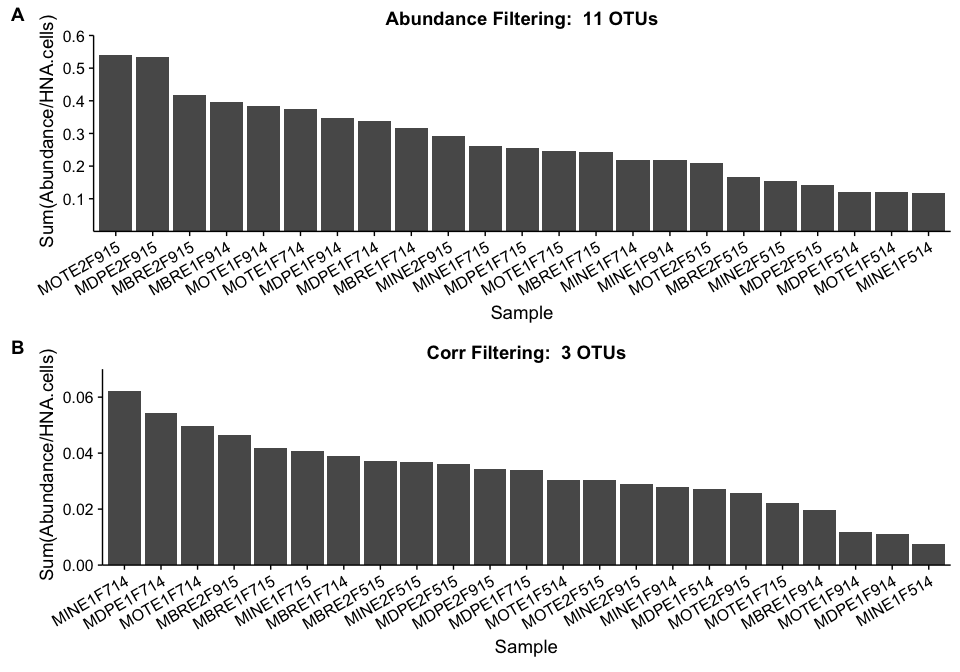
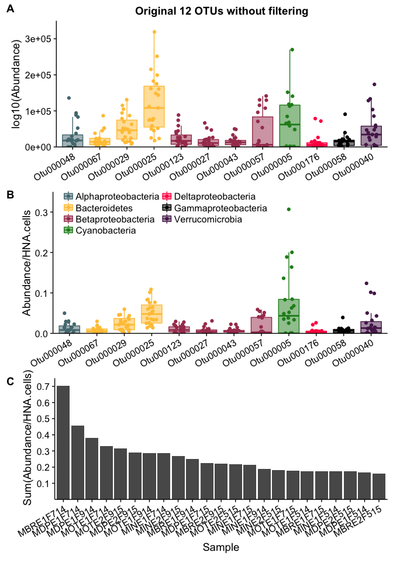

-   [Load the necessary libraries and set colors](#load-the-necessary-libraries-and-set-colors)
-   [Load in the data](#load-in-the-data)
-   [Abundance Filtering: 11 OTUs](#abundance-filtering-11-otus)
-   [Corr Filtering: 3 OTUs](#corr-filtering-3-otus)
    -   [Figure 1](#figure-1)
    -   [Figure 2](#figure-2)
-   [Original 12 OTUs Without filtering](#original-12-otus-without-filtering)
    -   [Figure 3](#figure-3)

### Load the necessary libraries and set colors

``` r
################################# LOAD LIBRARIES ############################################
library(tidyverse)
library(cowplot)

# Set Phylum colors for plotting
colors <- c(
  Alphaproteobacteria = "#547980",  
  Bacteroidetes = "#FFC543", 
  Betaproteobacteria = "#A73E5C", 
  Chlorobi = "#BEDB39",
  Cyanobacteria = "forestgreen", 
  Deltaproteobacteria = "#FF2151", 
  Gammaproteobacteria = "black", 
  Planctomycetes = "#FD7400",
  Verrucomicrobia = "#562258")
```

### Load in the data

``` r
#################################### LOAD DATA ##############################################

# Read in the absolute abundance data 
absolute_otu <- read.table(file="data/Chloroplasts_removed/nochloro_absolute_otu.tsv", header = TRUE) # Absolute OTU abundance table 

# Read in the taxonomy data 
tax <- read.table(file="data/Chloroplasts_removed/nochloro_taxonomy_otu.tsv", header = TRUE) %>%
  tibble::rownames_to_column() %>%
  dplyr::rename(Kingdom = Rank1,
         Phylum = Rank2, 
         Class = Rank3,
         Order = Rank4,
         Family = Rank5,
         Genus = Rank6,
         Species = Rank7,
         OTU = rowname) # Fix the Taxonomy

# Replace the phylum Proteobacteria with the class level
Phylum <- as.character(tax$Phylum)
Class <- as.character(tax$Class)

for  (i in 1:length(Phylum)){ 
  if (Phylum[i] == "Proteobacteria"){
    Phylum[i] <- Class[i]
  } 
}

# Overwrite the Phylum level with the new phylum classification
tax$Phylum <- Phylum # Add the new phylum level data back to phy

# Read in the productivity and flow cytometry data 
productivity <- read.table(file = "data/Chloroplasts_removed/productivity_data.tsv", header = TRUE) # Metadata file
```

Abundance Filtering: 11 OTUs
============================

@prubbens performed an analysis where he removed three outliers from the productivity data on April 5th (*see `analysis_prod2_remov_outliers.ipynb`*), which pulled out **11** otus.

``` r
######################## ABUNDANCE FILTERING RNADOMMIZED LASSO ##############################
########################### COMBINE DATA + PLOT OF 11 OTUS ##################################

# Vector of 11 OTUs pulled out by Peter's randomized lasso model WITH CORRFILTERING
eleven_otus <- c("Otu000040", "Otu000176", "Otu000067", "Otu000025", "Otu000041", "Otu000042", 
                 "Otu000016", "Otu000219", "Otu000050", "Otu000034", "Otu000082")

# What is the taxonomy of these 11 OTUs?
tax %>%
  dplyr::filter(OTU %in% eleven_otus)
```

    ##          OTU  Kingdom              Phylum                        Class                        Order                          Family                        Genus      Species
    ## 1  Otu000016 Bacteria  Betaproteobacteria           Betaproteobacteria              Burkholderiales                           betII                         Pnec        PnecB
    ## 2  Otu000025 Bacteria       Bacteroidetes                   Cytophagia                 Cytophagales                          bacIII                     bacIII-A Unclassified
    ## 3  Otu000034 Bacteria     Verrucomicrobia                     Opitutae           Opitutae_vadinHA64 Opitutae_vadinHA64_unclassified                 Unclassified Unclassified
    ## 4  Otu000040 Bacteria     Verrucomicrobia Verrucomicrobia_unclassified Verrucomicrobia_unclassified    Verrucomicrobia_unclassified Verrucomicrobia_unclassified Unclassified
    ## 5  Otu000041 Bacteria     Verrucomicrobia             [Spartobacteria]         [Chthoniobacterales]                          verI-B                       Xip-B1 Unclassified
    ## 6  Otu000042 Bacteria      Planctomycetes                Phycisphaerae              Phycisphaerales                Phycisphaeraceae                      CL500-3 Unclassified
    ## 7  Otu000050 Bacteria      Planctomycetes                Phycisphaerae              Phycisphaerales                Phycisphaeraceae                      CL500-3 Unclassified
    ## 8  Otu000067 Bacteria       Bacteroidetes               Flavobacteriia             Flavobacteriales                           bacII                      bacII-A Unclassified
    ## 9  Otu000082 Bacteria            Chlorobi                    Chlorobia                 Chlorobiales                           OPB56                 Unclassified Unclassified
    ## 10 Otu000176 Bacteria Deltaproteobacteria          Deltaproteobacteria            Bdellovibrionales              Bacteriovoracaceae                 Peredibacter Unclassified
    ## 11 Otu000219 Bacteria  Betaproteobacteria           Betaproteobacteria              Burkholderiales                          betIII                     betIII-A    betIII-A1

``` r
# Put all the data together into one dataframe with only the important OTUs
abundfilt_data <-  absolute_otu %>%
  dplyr::select(one_of(eleven_otus)) %>%     ### Use only 11 OTUs that Peter pulled out with abundance filtering
  tibble::rownames_to_column() %>%
  dplyr::rename(Sample_16S = rowname) %>%  
  dplyr::left_join(productivity, by = "Sample_16S") %>%
  dplyr::filter(Lake == "Muskegon" & Depth == "Surface") %>%
  dplyr::select(-c(Platform, samples, Lake)) %>%
  mutate(Site = factor(Site, levels = c("MOT", "MDP", "MBR", "MIN"))) %>%
  gather("OTU", "Abs_Abund", 2:12) %>%     #### Gather only columns 2:12
  dplyr::left_join(tax, by = "OTU") %>%
  filter(!is.na(Sample_16S)) %>%
  mutate(OTU_fraction_HNA = Abs_Abund/HNA.cells,
         OTU = factor(OTU, levels = OTU[order(Phylum)]))

# Plot the absolute abundance data 
plot_abundfilt_absabund <-   ggplot(abundfilt_data, aes(x = reorder(OTU, Phylum), y = Abs_Abund, fill = Phylum, color = Phylum)) +
  geom_boxplot(alpha = 0.5, outlier.shape = NA) +
  geom_jitter(width = 0.2) +
  ggtitle("Abundance Filtering") +
  #scale_y_continuous(expand = c(0,0), limits = c(0, 2.5e+5)) +
  scale_color_manual(values = colors) +
  scale_fill_manual(values = colors) +
  ylab("log10(Abundance)") +
  theme(legend.position = "none",
        axis.title.x = element_blank(),
        axis.text.x = element_text(angle = 30, hjust = 1, vjust = 1))

# Plot the fraction of the HNA pool that each OTU is
plot_abundfilt_fracHNA <-   ggplot(abundfilt_data, aes(x = reorder(OTU, Phylum), y = OTU_fraction_HNA, fill = Phylum, color = Phylum)) +
  geom_boxplot(alpha = 0.5, outlier.shape = NA) +
  geom_jitter(width = 0.2) +
  #scale_y_continuous(expand = c(0,0),limits = c(0, 0.2)) +
  scale_color_manual(values = colors) +
  scale_fill_manual(values = colors) +
  ylab("\n Abundance/HNA.cells ") +
  guides(fill = guide_legend(ncol=2),
         color = guide_legend(ncol=2)) +
  theme(legend.position = "bottom", #c(0.26, 0.85),
        legend.direction = "horizontal",
        legend.title = element_blank(),
        axis.title.x = element_blank(),
        axis.text.x = element_text(angle = 30, hjust = 1, vjust = 1)) 

# Combine the plots together 
plot_abundfilt_both <- plot_grid(plot_abundfilt_absabund, plot_abundfilt_fracHNA,
                                labels = c("A", "B"),
                                rel_heights = c(1,1.3),
                                nrow = 2, ncol = 1)


#########################################################################
###### WHAT PROPORTION OF THE HNA POOL IS MADE UP BY THE 3 OTUs?

frac_HNA_stats_abundfilt_data <- abundfilt_data %>%
  dplyr::select(Sample_16S, OTU, OTU_fraction_HNA) %>%
  group_by(Sample_16S) %>%
  summarise(sum_fracHNA = sum(OTU_fraction_HNA), 
            max_fracHNA = max(OTU_fraction_HNA), 
            median_fracHNA = median(OTU_fraction_HNA), 
            mean_fracHNA = mean(OTU_fraction_HNA))

plot_sum_fracHNA_abundfilt <- ggplot(frac_HNA_stats_abundfilt_data, aes(y = sum_fracHNA, x = reorder(Sample_16S, -sum_fracHNA))) +
  geom_bar(stat = "identity") +
  ggtitle("Abundance Filtering:  11 OTUs") +
  scale_y_continuous(expand = c(0,0),limits = c(0, 0.6), breaks = c(0.1, 0.2, 0.3, 0.4, 0.5, 0.6)) +
  ylab("\n Sum(Abundance/HNA.cells)") + xlab("Sample") +
  theme(axis.text.x = element_text(angle = 30, hjust = 1, vjust = 1))
```

Corr Filtering: 3 OTUs
======================

@prubbens performed an analysis on April 5th (*see `analysis_prod2_corrfiltering.ipynb`*), which pulled out **3** otus.

``` r
########################## CORRFILTERING RNADOMMIZED LASSO ##################################
########################### COMBINE DATA + PLOT OF 3 OTUS ###################################

# Vector of 3 OTUs pulled out by Peter's randomized lasso model WITH CORRFILTERING
three_otus <- c("Otu000060", "Otu000124", "Otu000357")

# What is the taxonomy of these three OTUs?
tax %>%
  dplyr::filter(OTU %in% three_otus)
```

    ##         OTU  Kingdom              Phylum               Class            Order      Family              Genus      Species
    ## 1 Otu000060 Bacteria Alphaproteobacteria Alphaproteobacteria Sphingomonadales       alfIV alfIV_unclassified Unclassified
    ## 2 Otu000124 Bacteria     Verrucomicrobia            Opitutae       Opitutales Opitutaceae           Opitutus Unclassified
    ## 3 Otu000357 Bacteria  Betaproteobacteria  Betaproteobacteria  Burkholderiales        betI             betI-B        Rhodo

``` r
# Put all the data together into one dataframe with only the important OTUs
corrfilt_data <-  absolute_otu %>%
  dplyr::select(one_of(three_otus)) %>%     ### Use only 3 OTUs that Peter pulled out with corrfilt
  tibble::rownames_to_column() %>%
  dplyr::rename(Sample_16S = rowname) %>%  
  dplyr::left_join(productivity, by = "Sample_16S") %>%
  dplyr::filter(Lake == "Muskegon" & Depth == "Surface") %>%
  dplyr::select(-c(Platform, samples, Lake)) %>%
  mutate(Site = factor(Site, levels = c("MOT", "MDP", "MBR", "MIN"))) %>%
  gather("OTU", "Abs_Abund", 2:4) %>%     #### Gather only columns 2:4 
  dplyr::left_join(tax, by = "OTU") %>%
  filter(!is.na(Sample_16S)) %>%
  mutate(OTU_fraction_HNA = Abs_Abund/HNA.cells,
         OTU = factor(OTU, levels = OTU[order(Phylum)]))

# Plot the absolute abundance data 
plot_corrfilt_absabund <-   ggplot(corrfilt_data, aes(x = reorder(OTU, Phylum), y = Abs_Abund, fill = Phylum, color = Phylum)) +
  geom_boxplot(alpha = 0.5, outlier.shape = NA) +
  geom_jitter(width = 0.2) +
  ggtitle("Corr Filtering") +
  scale_y_continuous(expand = c(0,0), limits = c(0, 2.5e+5)) +
  scale_color_manual(values = colors) +
  scale_fill_manual(values = colors) +
  ylab("log10(Abundance)") +
  theme(legend.position = "none",
        axis.title.x = element_blank(),
        axis.text.x = element_text(angle = 30, hjust = 1, vjust = 1))

# Plot the fraction of the HNA pool that each OTU is
plot_corrfilt_fracHNA <-   ggplot(corrfilt_data, aes(x = reorder(OTU, Phylum), y = OTU_fraction_HNA, fill = Phylum, color = Phylum)) +
  geom_boxplot(alpha = 0.5, outlier.shape = NA) +
  geom_jitter(width = 0.2) +
  scale_y_continuous(expand = c(0,0),limits = c(0, 0.065)) +
  scale_color_manual(values = colors) +
  scale_fill_manual(values = colors) +
  ylab("\n Abundance/HNA.cells ") +
  guides(fill = guide_legend(ncol=1),
         color = guide_legend(ncol=1)) +
  theme(legend.position = "bottom", #c(0.22, 0.85),
        legend.direction = "horizontal",
        legend.title = element_blank(),
        axis.title.x = element_blank(),
        axis.text.x = element_text(angle = 30, hjust = 1, vjust = 1)) 

# Combine the plots together 
plot_corrfilt_both <- plot_grid(plot_corrfilt_absabund, plot_corrfilt_fracHNA,
                                labels = c("C", "D"),
                                rel_heights = c(1,1.3),
                                nrow = 2, ncol = 1)

#########################################################################
###### WHAT PROPORTION OF THE HNA POOL IS MADE UP BY THE 3 OTUs?

frac_HNA_stats_corrfilt <- corrfilt_data %>%
  dplyr::select(Sample_16S, OTU, OTU_fraction_HNA) %>%
  group_by(Sample_16S) %>%
  summarise(sum_fracHNA = sum(OTU_fraction_HNA), 
            max_fracHNA = max(OTU_fraction_HNA), 
            median_fracHNA = median(OTU_fraction_HNA), 
            mean_fracHNA = mean(OTU_fraction_HNA))

plot_sum_fracHNA_corrfilt <- ggplot(frac_HNA_stats_corrfilt, aes(y = sum_fracHNA, x = reorder(Sample_16S, -sum_fracHNA))) +
  geom_bar(stat = "identity") +
  ggtitle("Corr Filtering:  3 OTUs") +
  scale_y_continuous(expand = c(0,0),limits = c(0, 0.07)) + #, breaks = c(0.1, 0.2, 0.3, 0.4, 0.5, 0.6, 0.7)) +
  ylab("\n Sum(Abundance/HNA.cells)") + xlab("Sample") +
  theme(axis.text.x = element_text(angle = 30, hjust = 1, vjust = 1))
```

Figure 1
--------

``` r
########################## COMBINE BOTH SAMPLE HNA POOL PLOTS ##################################
plot_both_fracHNA <- plot_grid(plot_sum_fracHNA_abundfilt, plot_sum_fracHNA_corrfilt,
                       nrow = 2, ncol = 1,
                       labels = c("A", "B"))
plot_both_fracHNA
```



``` r
# Save the plot to a .jpeg file 
ggsave(plot_both_fracHNA, filename = "Figures/HNA_pool.jpeg", dpi = 400, width = 10, height = 7)
```

From the above plot, it is clear that the 11 otus pulled out with the **abundance filtering** randomized lasso makes up a *larger* fraction of the sample HNA pool (Figure A) compared to the 3 OTUs pulled out with the corr filtering (Figure B).

In fact, the difference in the make up of the HNA pool in the abundance filtering versus the corr filtering approach is an order of magnitude!

Figure 2
--------

``` r
########################## COMBINE BOTH OTU ABUNDANCE PLOTS ##################################
plot_both_abund <- plot_grid(plot_abundfilt_both, plot_corrfilt_both,
                       rel_widths = c(2.5,1),
                       nrow = 1, ncol = 2)
plot_both_abund
```


``` r
# Save the plot to a .jpeg file 
ggsave(plot_both_abund, filename = "Figures/OTU_abundance_plot.jpeg", dpi = 400, width = 10, height = 7)
```

The OTUs in Figure 2 represent different OTUs than had been pulled out from the model before (see 12 OTUs in the analysis below in Figure 3). Now there are a few new **Phyla** that were not pulled out before at the absence of others:

-   New Phyla:
    -   *Planctomycetes*
    -   *Chlorobi*
-   Absent Phyla:
    -   *Alphaproteobacteria*
    -   *Cyanobacteria*
    -   *Gammaproteobacteria*

Original 12 OTUs Without filtering
==================================

``` r
############################# ORIGINAL RANDOMMIZED LASSO ####################################
########################### COMBINE DATA + PLOT OF 12 OTUS ##################################

# Vector of 12 OTUs pulled out by Peter's randomized lasso model
twelve_otus <- c("Otu000123", "Otu000027", "Otu000043", "Otu000057", "Otu000176", "Otu000005", 
          "Otu000048", "Otu000040", "Otu000058", "Otu000067", "Otu000029", "Otu000025")

# Put all the data together into one dataframe with only the important OTUs
data <- absolute_otu %>%
  dplyr::select(one_of(twelve_otus)) %>%  ### ONLY SELECT THE 12 OTUs FROM PETER'S MODEL
  tibble::rownames_to_column() %>%
  dplyr::rename(Sample_16S = rowname) %>%
  dplyr::left_join(productivity, by = "Sample_16S") %>%
  dplyr::filter(Lake == "Muskegon" & Depth == "Surface") %>%
  dplyr::select(-c(Platform, samples, Lake)) %>%
  mutate(Site = factor(Site, levels = c("MOT", "MDP", "MBR", "MIN"))) %>%
  gather("OTU", "Abs_Abund", 2:13) %>%
  dplyr::left_join(tax, by = "OTU") %>%
  filter(!is.na(Sample_16S)) %>%
  mutate(OTU_fraction_HNA = Abs_Abund/HNA.cells,
         OTU = factor(OTU, levels = OTU[order(Phylum)]))

# Plot the absolute abundance data 
plot_absabund <- ggplot(data, aes(x = reorder(OTU, Phylum), y = Abs_Abund, fill = Phylum, color = Phylum)) +
  geom_boxplot(alpha = 0.5, outlier.shape = NA) +
  geom_jitter(width = 0.2) +
  scale_y_continuous(expand = c(0,0), limits = c(0, 3.5e+5)) +
  scale_color_manual(values = colors) +
  scale_fill_manual(values = colors) +
  ylab("log10(Abundance)") +
  theme(legend.position = "none",
        axis.title.x = element_blank(),
        axis.text.x = element_text(angle = 30, hjust = 1, vjust = 1))

# Plot the fraction of the HNA pool that each OTU is
plot_fracHNA <- ggplot(data, aes(x = reorder(OTU, Phylum), y = OTU_fraction_HNA, fill = Phylum, color = Phylum)) +
  geom_boxplot(alpha = 0.5, outlier.shape = NA) +
  geom_jitter(width = 0.2) +
  scale_y_continuous(expand = c(0,0),limits = c(0, 0.35)) +
  scale_color_manual(values = colors) +
  scale_fill_manual(values = colors) +
  ylab("\n Abundance/HNA.cells ") +
  guides(fill = guide_legend(ncol=2),
         color = guide_legend(ncol=2)) +
  theme(legend.position = c(0.33, 0.85),
        legend.direction = "horizontal",
        legend.title = element_blank(),
        axis.title.x = element_blank(),
        axis.text.x = element_text(angle = 30, hjust = 1, vjust = 1)) 

# Combine the plots together 
#plot_both <- plot_grid(plot_absabund, plot_fracHNA,
#          labels = c("A", "B"),
#          nrow = 2, ncol = 1)


#########################################################################
###### WHAT PROPORTION OF THE HNA POOL IS MADE UP BY THE 12 OTUs?

frac_HNA_stats <- data %>%
  dplyr::select(Sample_16S, OTU, OTU_fraction_HNA) %>%
  group_by(Sample_16S) %>%
  summarise(sum_fracHNA = sum(OTU_fraction_HNA), 
            max_fracHNA = max(OTU_fraction_HNA), 
            median_fracHNA = median(OTU_fraction_HNA), 
            mean_fracHNA = mean(OTU_fraction_HNA))


plot_sum_fracHNA <- 
  ggplot(frac_HNA_stats, aes(y = sum_fracHNA, x = reorder(Sample_16S, -sum_fracHNA))) +
  geom_bar(stat = "identity") +
  scale_y_continuous(expand = c(0,0),limits = c(0, 0.75), breaks = c(0.1, 0.2, 0.3, 0.4, 0.5, 0.6, 0.7)) +
  ylab("\n Sum(Abundance/HNA.cells)") + xlab("Sample") +
  theme(axis.text.x = element_text(angle = 30, hjust = 1, vjust = 1))
```

Figure 3
--------

``` r
plot_grid(plot_absabund + ggtitle("Original 12 OTUs without filtering"), 
          plot_fracHNA, 
          plot_sum_fracHNA,
          labels = c("A", "B", "C"),
          nrow = 3, ncol = 1)
```



``` r
ggsave(filename = "Figures/OTU_abundance_12otus.jpeg", dpi = 400, width = 8, height = 10)
```
